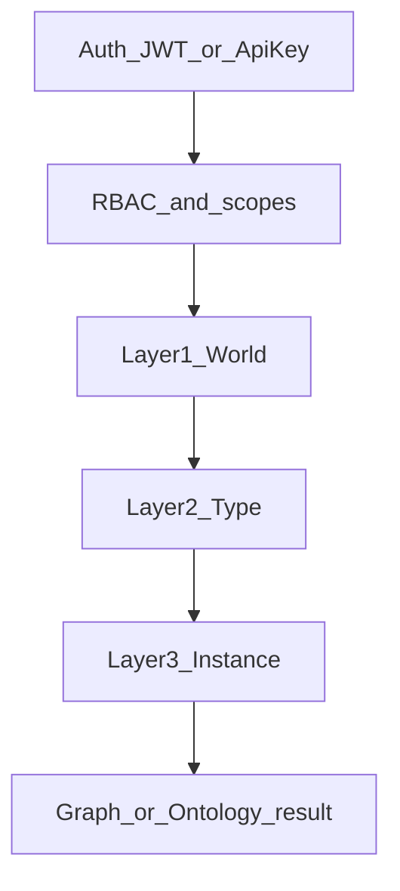

# F11 - Graph API 数据访问策略（SPEC）

> **Architecture Role**：在 **F10 本体与图谱原子服务**（[`F10_ONTOLOGY_AND_GRAPH_API.md`](F10_ONTOLOGY_AND_GRAPH_API.md)）之上，定义 **账号节点**（`type_code=account`）上承载的 **数据范围**（data scope），与现有 **RBAC（permission 字符串）**、**API Key scopes** 组合使用：**最终可见数据 = 能力允许 ∧ 数据策略允许**。本文件为 **设计契约**；实现以 `openapi.json`、图查询层与种子数据为准。

## Goal

- 在账号 **`Node.attributes`** 内用 **固定 JSON schema** 表达 **权限模版**（allow）与 **四类 deny 列表**（deny），不引入通用规则 DSL。
- Graph / Ontology HTTP 在 **统一过滤层** 按 **固定顺序** 判定：**world → type → instance**；与 F10 查询参数（`type_code`、`name_like` 等）**逻辑与（AND）**。
- **`role=admin` 在数据层不设短路**：管理员与普通账号走 **同一套** 过滤代码路径；「宽」来自 **初始 `data_access`**（推荐 **空 `denied_*`** + 宽松模版），而非 `if admin: skip`。
- 区分 **RBAC（能否调用 API）** 与 **数据范围（能看哪些节点/边）**，避免将 `graph.read` 误解为「全库可见」。

## Non-Goals（v1）

- **不引入**可编程过滤引擎、任意表达式树、OPA/Cedar/ReBAC 全量建模（可列 Phase 2）。
- **不替代** PostgreSQL RLS；本策略在 **应用层**（Repository / 查询构造）与 F10 对齐。
- **不**在本 SPEC 中重写 `/accounts` HTTP 契约；账号 CRUD 仍以现有 API SPEC 为准。
- **不**定义「世界包安装」流水线（仍见游戏侧 F03 等）。

## 背景与问题陈述

- F10 要求端点使用 **`ontology.*` / `graph.*`** 等 permission 字符串（见 F10「权限与审计」）。
- 当前 [`APIPrincipal.has_permission`](../../../../backend/app/api/v1/dependencies.py)：**`admin` 角色**对任意 `permission_code` 返回 `True`（能力层短路）；**非 admin** 为 **精确集合匹配**（见 [`PermissionChecker.check_permission`](../../../../backend/app/core/permissions.py) 中 `*` 前缀规则）。
- 即便主体具备 **`graph.read`**，**若不施加数据范围**，仍可能广查 `nodes` 表；F11 补齐 **数据层** 约束。

## 能力层 vs 数据层

| 维度 | 含义 | 典型来源 |
|------|------|----------|
| **能力（RBAC）** | 是否允许调用某类 HTTP 操作（读图、写图、读本体等） | JWT 载荷 / 账号 `attributes.permissions`；API Key `scopes` 与账号 `permissions` 交集（见 [`get_api_principal`](../../../../backend/app/api/v1/dependencies.py)） |
| **数据（F11）** | 在允许调用前提下，**哪些 world / 类型 / 实例** 可返回或可被写入 | 账号 `attributes.data_access`（含模版与 deny） |

**不变式**：对任意读操作，**有效结果 ⊆ 能力允许 ∧ 数据策略允许 ∧ F10 查询条件**。

**与 admin**：**数据层**不因 `role=admin` 跳过过滤；**能力层**仍保留现有 **`admin` 通配**（与 F11 正交）。

## 数据层：不设 admin 短路

- **实现要求**：图实例与（若适用）本体列表的过滤逻辑 **无** `if "admin" in roles: return unfiltered`。
- **管理员「宽」**：通过 **初始 seed / 迁移** 写入 **空 deny 列表**（四类 `denied_*` 均为 `[]`）及 **宽松或空 `permission_template`**（空语义在实现与本文中 **唯一写死**，见下节）。
- **与 RBAC 区分**：`admin` 在 `has_permission` 中的行为属于 **API 能力**；F11 **不复制**该语义到数据层。

## `attributes.data_access` 结构（v1 规范）

顶层建议字段：

| 字段 | 类型 | 说明 |
|------|------|------|
| `version` | `integer` | 策略 schema 版本；**v1 = 1** |
| `permission_template` | `object` | **允许集**（见下）；缺省语义见「无模版」 |
| `denied_world_ids` | `integer[]` | **拒绝**的世界 id（deny 语义） |
| `denied_type_codes` | `string[]` | **拒绝**的节点 `type_code` |
| `denied_relationships_codes` | `string[]` | **拒绝**的关系 `type_code`（与 `relationship_types.type_code` 对齐） |
| `denied_nodes` | `integer[]` | **拒绝**的节点主键 `nodes.id` |

### `permission_template`（允许集）

| 子字段 | 类型 | 说明 |
|--------|------|------|
| `world_ids` | `integer[]` | 允许访问的 **`attributes.world_id`** 落在这些 world 内 |
| `type_codes` | `string[]` | 允许的节点 `type_code`（若与 Layer2 组合使用，语义见「三层顺序」） |
| `relationships_codes` | `string[]` | 允许的关系类型（若与 Layer2 组合使用） |
| `node_ids` | `integer[]` | **可选**显式允许的节点 id（若与 Layer3 组合使用） |
| `exclude_nodes_without_world_id` | `boolean`（可选，默认 `false`） | 为 `true` 时拒绝 **`attributes` 无有效 `world_id`** 的节点；与 **`denied_type_codes`**（如 `account`）组合用于 `user` 类默认 |

**实现侧（v1 后端）**：缺失或无法解析的 `data_access` → **拒绝一切**图/受策略约束的本体列表；单条 GET 对不可见资源返回 **404**。数据过滤 **无** `role=admin` 短路。

**deny 语义**：在「模版允许」的集合上 **再剔除** `denied_*`；若模板为「无」或空，**默认行为**须在实现中**唯一写死**（推荐：**无模版则拒绝一切图数据**，或 **模版必填**；产品选定后不得混用）。

**拼写**：`denied_relationships_codes` 固定，与 `relationship_types.type_code` 一致。

## 三层过滤顺序（强制）

对 **节点**：

1. **Layer 1 — World**：节点 `attributes.world_id`（及实现约定的 world 归属规则）必须 **被模版允许**（若在 v1 要求 world 层），且 **∉ `denied_world_ids`**。  
   - *无 `world_id` 的节点*：若产品将「系统域」定义为无 world，则 **user 默认不可见**；**`type_code=account`** 通常属系统类，由 **Layer 2** 显式拒绝即可。
2. **Layer 2 — Type**：`nodes.type_code` 在模版允许的类型内，且 **∉ `denied_type_codes`**。
3. **Layer 3 — Instance**：`nodes.id` **∉ `denied_nodes`**。

对 **关系**：关系 `type_code` 过 Layer 2（使用 `denied_relationships_codes`）；**源/目标节点** 均需通过各自 Layer 1–3（若一端不可见，则关系不可见或整边拒绝——实现 **择一写死** 并在 ACCEPTANCE 中验证）。

**顺序不变**：**先 world，再 type，再 instance**；不在 v1 引入其他规则类型。

## `user` 角色默认数据范围（产品约束）

- **可访问**：已安装世界在图上的数据（示例：**hicampus** 对应 **`world_id`** 下的节点与关系）；`permission_template.world_ids` **包含**这些 world（或等价：「`attributes.world_id` ∈ 已安装世界集合」）。
- **不可访问**：**与业务世界无绑定关系的系统类图数据**；典型为 **`type_code=account`** 的账号节点；**不得**因「有 `graph.read`」而列出或返回。
- **落地**：**`user` / `campus_user`** 默认 **`denied_type_codes` 含 `account`**（及 SPEC 后续列出的系统 `type_code`）；若模版为宽，**deny** 兜底；若模版为窄，仅允许世界内类型。

**`campus` 种子账号**：数据面默认与 **`user` 基底**一致；可额外收紧（若与 `user` 完全一致，可写「继承 `user` 模版」）。

## 求值总管道（与 RBAC 组合）

- **所有账号**：`rbac` 通过后进入 **L1→L2→L3**；再与 F10 列表过滤 **AND**。
- **无** `role` 分支。

## 强制点（Enforcement Surface）

**必须**在以下路径应用数据策略（与 F10 路径对齐；实现可集中于一层）：

| 区域 | 方法 | 说明 |
|------|------|------|
| `/graph/nodes`、`/graph/nodes/{id}` | GET/POST/PATCH/DELETE | 节点读写 |
| `/graph/relationships`、`* /{id}` | GET/POST/PATCH/DELETE | 关系读写 |
| `/worlds/{world_id}/nodes`、`* /relationships` | * | world 作用域下仍须校验（与 Layer1 一致） |
| `/ontology/*`（若暴露） | GET/POST/… | 是否在 v1 对 **非 admin** 套用类型层策略（与实例区分）— **实现须与 OpenAPI 一致** |

**写路径**：建议与 **读** 一致，避免「不可见却可写」。

## HTTP 与错误语义

- 与 F10 **RFC 9457** 一致；**因数据策略拒绝** 返回 **403** + `application/problem+json`；列表 **不泄露**「因不在 world 内而过滤」等细节（可选泛化 `title`）。

## 审计与运维

- 记录 `account_id`、`data_access.version`、变更 `actor`；API Key 请求记录 **`kid`**，不记录 secret。

## 演进（Phase 2）

- ReBAC、OPA/Cedar、与 F01 trait 查询 **AND** 等，单独 SPEC/里程碑。

## 索引（按 world 过滤，方案 A）

- **`nodes`**：部分 B-tree **`idx_nodes_attributes_world_id_text`**，表达式 **`(attributes->>'world_id')`**，条件 **`WHERE attributes ? 'world_id'`**，与 F11 谓词及 `/worlds/{id}/nodes` 路径对齐；见仓库 [`database_schema.sql`](../../../../backend/db/schemas/database_schema.sql) 与迁移 **`ensure_nodes_world_id_index`**（`db.init_database` / `migrate_report`）。
- 大表建索引后建议 **`ANALYZE nodes`**；生产环境大规模数据可改用运维侧 **`CREATE INDEX CONCURRENTLY`**（迁移脚本内为兼容 `init` 使用普通 `CREATE INDEX IF NOT EXISTS`）。

---

## 附录 A — 种子账号与 role（人工核对）

来源：[`ensure_default_accounts`](../../../../backend/db/seed_data.py)（幂等：若已存在 `name in ('admin','dev','campus')` 的 account 节点则跳过）；类定义见 [`accounts.py`](../../../../backend/app/models/accounts.py)。

| 种子 `name` | 类 | `roles` | `Node.access_level` | 备注 |
|-------------|-----|---------|---------------------|------|
| `admin` | `AdminAccount` | `['admin']` | `admin` | 默认 `permissions`：`user.*`,`campus.*`,`world.*`,`system.*`,`admin.*` |
| `dev` | `DeveloperAccount` | `['dev']` | `developer` | 含 `world.view` 等**非** F10 `graph.*` 字符串 |
| `campus` | `CampusUserAccount` | `['user','campus_user']` | `normal` | 校园扩展 permissions |

**当前状态**：种子写入 `roles`、`permissions` 等，**未**写入 `data_access`；上线 F11 前需 **迁移或脚本** 补全与本文一致的初始 JSON（**禁止**覆盖运营已手工修改的策略，见附录 C）。

---

## 附录 B — F10 permission × 种子账号（矩阵与缺口）

**行**：F10 建议 permission（读类型 / 写类型 / 读图 / 写图）。**列**：种子账号。

| F10 permission | `admin` | `dev` | `campus` |
|----------------|---------|-------|----------|
| `ontology.read` | 是（**能力层**：`admin` 角色短路） | **是**（类默认已含） | **是** |
| `ontology.manage` / `ontology.write` | 是（同上） | **是**（`ontology.write`） | **否** |
| `graph.read` | 是（同上） | **是** | **是** |
| `graph.write` | 是（同上） | **是** | **否** |

**说明**：

- **`world.view` ≠ `graph.read`**（历史说明）：`accounts.py` 已为 **`dev` / `campus`** 默认增补 `graph.read` / `ontology.read`（及 dev 的 `graph.write`/`ontology.write`）；**`UserAccount`** 仍无 `graph.*`，除非产品另行扩展或通过 **API Key**。
- **通配符**：[`PermissionChecker`](../../../../backend/app/core/permissions.py) 中 `user.*` 等 **仅** 匹配同前缀细分（如 `user.*` 匹配 `user.view`），**不** 自动包含 `graph.*` / `ontology.*`。
- **能力 ∩ 数据**：即使未来为 `campus` 增加 `graph.read`，**仍**受 `data_access` 约束（例如仅 hicampus world，且 **`account` 类型仍被 deny**）。

## 附录 C — 初始权限数据优化（落地顺序）

1. **定稿「角色 → 默认 `permissions`」**（能力层）：矩阵评审后更新 [`accounts.py`](../../../../backend/app/models/accounts.py) 或保持代码、仅种子覆盖；**单一真源**与种子一致。
2. **定稿「角色 → 默认 `data_access`」**（数据层）：**admin** — 空 `denied_*` + 宽松模版；**user / campus_user** — world 列表 + **`denied_type_codes` 含 `account`**；**dev** — 产品表（如接近 admin 或按世界开发）。
3. **新库**：`ensure_default_accounts` 创建节点时写入 **`data_access`**。
4. **已存在库**：幂等 `UPDATE`（仅 `type_code=account` 且缺省/缺 `data_access` 时），**不覆盖**已有 `data_access`。
5. **验收**（文档级）：无 `graph.read` → F10 读端点 **403**；有 `graph.read` 且 user 模版 → `GET /graph/nodes?type_code=account` **空集或 403**（与本文 HTTP 语义一致）。

---

## ACCEPTANCE（文档级）

- [ ] 本文档与 F10 权限表、**附录 B 矩阵**交叉评审通过。
- [ ] **三层顺序**与 **四类 deny** 字段名在实现与 OpenAPI 中一致。
- [ ] **无 admin 数据短路**（代码审查可检索 `admin` 与 `skip`/`bypass` 组合）。
- [ ] 种子或迁移后，默认账号 **`attributes`** 含 **`data_access`** 或明确「缺省=拒绝」语义（与实现一致）。

## Implementation backlog（后续 PR）

- 在 `graph` / `ontology` 端点统一加载 `data_access` 并应用过滤。
- 种子与 DB 迁移写入 **`data_access`**；与 **`accounts.py` 权限**修订可并行或分 PR。
- 契约测试：附录 C 验收用例自动化。

## 相关文档

- [`F10_ONTOLOGY_AND_GRAPH_API.md`](F10_ONTOLOGY_AND_GRAPH_API.md) — 原子 API、F10 权限与错误语义
- [`docs/api/SPEC/SPEC.md`](../SPEC.md) — API 总索引
- [`docs/database/SPEC/SPEC.md`](../../../database/SPEC/SPEC.md) — 持久化模型
