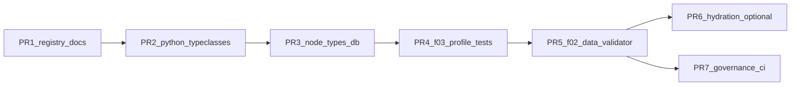

# Typeclass 本体对齐 — 按 PR 拆分的工作计划

> 本文档将 [TYPECLASS_ONTOLOGY_EXEC_PLAN.md](TYPECLASS_ONTOLOGY_EXEC_PLAN.md) 中的阶段 **A～F** 拆成可独立评审、可合并的 **Pull Request** 序列，并标明依赖、范围、验收与回滚要点。  
> 约束 **C-01～C-08** 见执行计划全文，**每个 PR 描述中仅列本 PR 强相关子集**。

## 0. 合并顺序总览



说明：**PR6（运行时 hydration）** 与 **PR7（治理）** 均依赖 **PR5** 完成后的类型口径稳定；PR6、PR7 **可并行**打开，但 PR7 不阻塞功能上线。

| PR | 建议分支名前缀 | 依赖 | 预估体量 |
|----|----------------|------|----------|
| PR-1 | `docs/typeclass-registry` | 无 | 小 |
| PR-2 | `feat/things-typeclasses` | PR-1 已合（建议） | 中 |
| PR-3 | `db/node-types-typeclass-paths` | PR-2 | 中 |
| PR-4 | `feat/graph-profile-type-align` | PR-3 | 中 |
| PR-5 | `feat/f02-type-codes-align` | PR-4 | 中大 |
| PR-6 | `feat/node-hydration-typeclass` | PR-5 | 中（可选） |
| PR-7 | `chore/typeclass-governance` | PR-5 | 小 |

---

## PR-1：类型登记表与命名规范（仅文档）

**对应任务**：A-1、A-2、A-3  

**目标**：建立单一事实来源的「F2 `type_code` ↔ `node_types.type_code` ↔ Python `typeclass` 路径」表，并挂索引。

**范围（In）**

- 新增：`docs/games/hicampus/SPEC/features/F02_ENTITY_TYPE_REGISTRY.md`（或等价文件名；**须落在 `features/`**，符合架构 README SPEC 治理规则）。
- 更新：`docs/games/hicampus/SPEC/features/INDEX.md`、`docs/architecture/README.md` 规范索引；可选在 `F02_WORLD_DATA_PACKAGE.md` 增加「类型登记」链接段落（不复制全文）。

**范围（Out）**

- 不改 Python / SQL / 数据 YAML。

**强相关约束**：C-07（本体为单一事实）、架构 SPEC 目录规则。

**验收清单**

- [ ] 表中每一行含：`f2_package_type_code`、`db_node_type_code`、`python_module_path`、`python_class`、`parent_type_code`（可空）、`notes`。
- [ ] 命名规范段落：`type_code` 蛇形、类名 PascalCase、路径全局可 import。
- [ ] INDEX 与架构 README 可点击跳转。

**合并后风险**：无运行时风险。

---

## PR-2：Python typeclass 层（Evennia Level 3）

**对应任务**：B-1、B-2、B-3  

**目标**：为登记表中已列出的类型提供 **继承 `DefaultObject` 的薄子类**，并保证模块被应用加载路径 **import**（Evennia：未 import 则不可发现）。

**范围（In）**

- 新增目录建议：`backend/app/models/things/`（与执行计划一致；若团队决议放 `games/hicampus/types/`，须在 PR 描述中写明并仍满足 C-05/C-08）。
- 文件示例：`base.py`（`WorldThing` 或等价中间基类）、`terminals.py`、`agents.py`、`zones.py`、`fixtures.py` 等（按登记表拆模块）。
- `backend/app/models/__init__.py`（或等价）**显式 import** 上述模块，避免惰性加载导致路径解析失败。

**范围（Out）**

- 不改 `node_types` SQL（留给 PR-3）。
- 不改 F02 YAML（留给 PR-5）。

**强相关约束**：C-08、C-01；Evennia「类名全局唯一」。

**验收清单**

- [ ] `python -c "from app.models.things... import AccessTerminal"`（示例）成功。
- [ ] 每个具体类文档字符串注明对应 F02 `type_code` 与登记表锚点。
- [ ] 单元测试：`pytest tests/models/...` 最小 smoke（类可实例化或 `disable_auto_sync` 构造不炸），**不强制**连真实 DB。

**合并后风险**：低；未改 DB 时旧种子仍指向 `DefaultObject`，行为与现状一致。

---

## PR-3：`node_types` 本体行与迁移

**对应任务**：C-1、C-2；（C-3 若仅「说明文档」可放本 PR，脚本可放 PR-5 后）

**目标**：使 `node_types` 中相关 `type_code` 的 `typeclass` / `module_path` / `classname` **指向 PR-2 的具体类**；必要时设置 `parent_type_code`。

**范围（In）**

- `backend/db/schemas/database_schema.sql`：`INSERT ... ON CONFLICT DO NOTHING` 或 `UPDATE` 策略（PR 描述中写清：**新增行 vs 修改既有行**，避免双行同语义）。
- `backend/db/schema_migrations.py`：`ensure_graph_seed_ontology` 或独立函数，与 SQL **语义一致**，保证旧库可幂等补齐。

**范围（Out）**

- 不修改 F02 `validator` 白名单（留给 PR-5），但若 PR-3 **仅改 typeclass 字符串、不改 type_code**，可与 PR-4 同周合并。

**强相关约束**：C-01、C-07；合并前 **PR-2 必须在主分支可用**。

**验收清单**

- [ ] 新环境 `init_database` / 迁移后，`SELECT type_code, typeclass FROM node_types WHERE type_code IN (...)` 与登记表一致。
- [ ] 在本地/CI 使用 PostgreSQL 的集成步骤中跑通（可与 PR-4 共用一条 job）。

**回滚**：回退迁移脚本与 SQL 片段；若已 `UPDATE` 生产数据，需准备反向 `UPDATE` 脚本（PR 描述中注明）。

---

## PR-4：F03 `graph_profile` 与种子回归

**对应任务**：E-1、E-2、E-4（部分）

**目标**：`map_node_type` 与登记表 **1:1（或显式别名表）**；种子写入的 `nodes.type_code` 与 `node_types` 一致；测试全绿。

**范围（In）**

- `backend/app/games/hicampus/package/graph_profile.py`：映射字典与注释引用登记表。
- `backend/app/game_engine/graph_seed/pipeline.py`：仅当登记表要求时微调（多数情况仅 profile 变更）。
- `backend/tests/game_engine/test_graph_seed_pipeline.py`、`test_hicampus_data_package.py`：若曾 stub `run_graph_seed`，评估是否在 CI PG job 上跑 **一条**真实种子断言 `type_code` / `node_types` 一致（可与 PR-3 同 pipeline）。

**范围（Out）**

- 不改 F02 数据文件内容（留给 PR-5）；若映射需新 F2 `type_code`，本 PR **仅**在登记表与 profile 中预留，数据在 PR-5 落地。

**强相关约束**：C-04、C-05、C-06。

**验收清单**

- [ ] `pytest tests/game_engine/` 通过。
- [ ] 集成（PostgreSQL）：对 HiCampus 快照或最小 fixture，断言若干 `nodes.type_code` 等于登记表 `db_node_type_code`。

**合并后风险**：若 DB 未更 typeclass（PR-3 未合），本 PR 应 **不合并** 或 feature flag；**推荐顺序：先 PR-3 再 PR-4**。

---

## PR-5：F02 数据与校验对齐

**对应任务**：D-1、D-2、D-3；可选 C-3 数据迁移脚本

**目标**：YAML 中 `type_code` 与登记表一致；`validator` 白名单与登记表同步；F02 测试与 TEST SPEC 更新。

**范围（In）**

- `backend/app/games/hicampus/data/entities/*.yaml`：按登记表拆分/重命名 `type_code`（例如灯、车、家具与 `world_object` 脱钩）。
- `backend/app/games/hicampus/package/validator.py`：`ALLOWED_*` 或等价集合与登记表一致（或从单一生成源导出，若引入脚本需在 PR 说明）。
- `backend/tests/...`、`docs/.../F02_WORLD_DATA_PACKAGE_TEST_SPEC.md`：增量用例。
- **可选**：`backend/scripts/` 或 `db/` 下一次性迁移：旧 `nodes` 上按 `attributes`/`tags` 更新 `type_code`（仅在有生产数据且已评审时合入）。

**强相关约束**：C-03、C-07。

**验收清单**

- [ ] `validate_data_package` / 相关 pytest 全过。
- [ ] `load_game("hicampus")` 在含 PR-3+4 的集成环境中成功（或文档注明依赖）。

**合并后风险**：数据变更最大；建议 **灰度**：先加新 `type_code` 与双读映射，再删旧泛化码（若需可分 PR-5a / PR-5b）。

---

## PR-6（可选）：Node → Python hydration

**对应任务**：E-3  

**前提**：存在或即将建设「从 `Node` 行构造内存对象」的工厂；若项目尚无此路径，本 PR 可 **延后** 或拆为「仅新增工厂接口 + 单测 mock DB」。

**范围（In）**

- 集中工厂：按 `node_types.typeclass` / `module_path` + `classname` **动态 import**；失败回退 `DefaultObject` 并结构化日志（`structlog` / 项目统一日志）。
- 单元测试：合法路径、非法路径、缺失模块。

**范围（Out）**

- 不改动所有调用点（可后续渐进接入）。

**强相关约束**：C-08、Evennia typeclass 路径约定。

---

## PR-7：治理与文档收尾

**对应任务**：F-1、F-2、F-3  

**范围（In）**

- `docs/games/hicampus/SPEC/features/F03_GRAPH_SEED_PIPELINE.md`：增加「类型本体与 typeclass」短节 + 链接登记表与执行计划。
- 可选：`.github/pull_request_template.md` 或 `docs/contributing` 增加 **C-01～C-08** 勾选片段（仅与本特性相关条目）。
- 可选：脚本检查「F2 validator 中出现的实体 `type_code` ⊆ 登记表」（CI 非阻塞或阻塞由团队定）。

**验收清单**

- [ ] 新同学能只读三份文档理清链路：登记表 → 执行计划 → 本 PR 工作计划。

---

## 附录 A：每个 PR 的 PR 描述模板（复制用）

```markdown
## Summary
- …

## Architecture / Constraints
- 遵守 TYPECLASS_ONTOLOGY_EXEC_PLAN C-0x …

## Related docs
- F02_ENTITY_TYPE_REGISTRY.md §…

## Test plan
- [ ] pytest …
- [ ] (optional) PostgreSQL …

## Rollback
- …
```

## 附录 B：与执行计划阶段映射

| 执行计划阶段 | 主要 PR |
|--------------|---------|
| A | PR-1 |
| B | PR-2 |
| C | PR-3（C-3 可选拆到 PR-5） |
| D | PR-5 |
| E | PR-4、PR-6 |
| F | PR-7 |

---

**维护**：登记表（PR-1）变更时，应同步更新本文件中「合并顺序」备注，并在 PR-4/PR-5 中体现差异。
