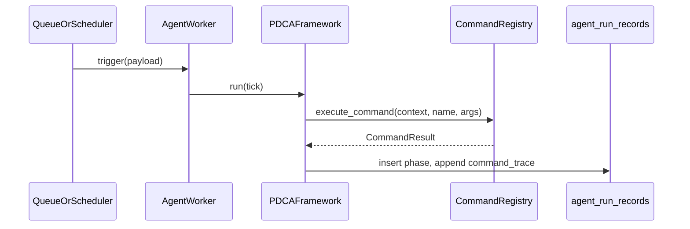

# ADR-F02: Agent Runtime (Python, Command-First)

## Status

Accepted — 2026-04-09

## Context

F02 defines `type_code=npc_agent` as the carrier for intelligent workers and narrative NPCs. Behavior must be auditable, align with existing SSH/HTTP command execution, and respect F11 `data_access` for the **effective principal** (user, service account, or API key).

## Decision

1. **Python execution body** — Agent logic lives in Python classes (`NpcAgent` graph wrapper, `AgentWorker` + `ThinkingFramework`), resolved from `node_types.typeclass` and a small **worker registry** (see `app/game_engine/agent_runtime/registry.py`). No scripts or DSL in `nodes.attributes`.

2. **Command-first writes** — Agents mutate the graph through the **command layer** (`CommandRegistry` + `CommandContext`), not by making F10 Graph API calls the default path. F10 remains for admin/integration.

3. **F10 not the worker main path** — Scheduled or queue-driven workers construct a `CommandContext` whose principal is the bound **service account** (or delegated user), then run registered commands. HTTP Graph routes are not the primary loop.

4. **Memory and runs** — Ephemeral and audit data go to `agent_memory_entries`, `agent_run_records`, and `agent_long_term_memory` (DDL in `database_schema.sql`, migration `ensure_f02_agent_memory_schema`).

## Service principal model

- **`npc_agent` node** identifies the agent instance; **`nodes` of `type_code=account`** (or API key mapped to an account) provide the **F11 principal**.
- Binding is documented as **`attributes.service_account_id`** (node id of the account) or an explicit relationship; the runtime resolves `effective principal` before command execution. This is distinct from RBAC role names and from `agent_role` (`sys_worker` | `narrative_npc`).

## Consequences

- New tables and ORM models must stay in sync with `db/schemas/database_schema.sql`.
- Workers must be testable with **command-triggered** paths (no LLM) for deterministic CI; NL + LLM paths share the same worker invariants.

## Review checklist (PR)

- **F11**: Agent commands use the same `CommandContext` / principal as other commands; no silent admin bypass for graph writes.
- **Secrets**: No API keys or raw URLs in `nodes.attributes` or memory payloads.
- **Cognition**: New behavior goes through `ThinkingFramework` + injected ports, not ad hoc SQL in command handlers.

## Sequence (sys_worker, queue → run record)

