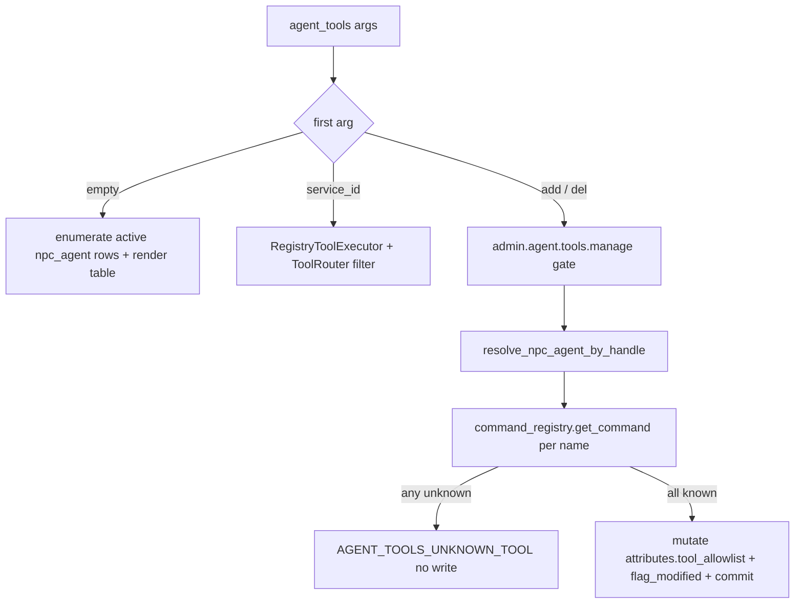

# `agent_tools`

> **Architecture Role**: Agent 工具面查询与维护（SYSTEM）；**默认**按 `npc_agent` 节点逐行列出每个 agent 当前可用的工具集；**可选**附 `service_id` 查询单 agent 的工具列表，或经 `add` / `del` 子命令维护其 `tool_allowlist`。与 [`CMD_agent_capabilities`](CMD_agent_capabilities.md) 的「单 agent 静态能力位」互补。

## Metadata (anchoring)

| Field | Value |
|--------|--------|
| Command | `agent_tools` |
| `CommandType` | SYSTEM |
| Class | `app.commands.agent_commands.AgentToolsCommand` |
| Primary implementation | [`backend/app/commands/agent_commands.py`](../../../../backend/app/commands/agent_commands.py) |
| Locale | `commands.agent_tools`（别名 `agent.tools`） |
| Anchored snapshot | [`../_generated/registry_snapshot.json`](../_generated/registry_snapshot.json) |
| Last reviewed | 2026-04-26 |

## Synopsis

```
agent_tools
agent_tools <service_id>
agent_tools add <service_id> <tool> [<tool>...]
agent_tools del <service_id> <tool> [<tool>...]
```

- **无参**：列出所有可见 `npc_agent`，每个 agent 一行（表格风格，对齐 `world list`）。
- **一参（`service_id`，非保留字）**：返回该 agent 经 `RegistryToolExecutor` + `ToolRouter` 过滤后的工具 id 列表。
- **`add` / `del`**：写 `node.attributes.tool_allowlist`；幂等、原子（任一未知工具 → 整个调用拒绝、不写）。
- 三种形态均需活跃 DB 会话（无参枚举 agent 节点；其它需 `resolve_npc_agent_by_handle`）。

## Implementation contract

### 路由（`execute(context, args)`）

1. `args[0]` 在 `{add, del}` 中 → 走写路径（`_apply_allowlist_change`，见 §子命令权限）。
2. 否则若 `args[0]` 非空 → 单 agent 查询（保留 `tool_allowlist` 过滤路径）。
3. 否则（无参）→ 列出全部活跃 `npc_agent` 行。

无 `db_session` → `database session required`（与现状一致）。

### 子命令权限（参考 [`WorldCommand`](../../../../backend/app/commands/game/world_command.py) 的 `_SUB_PERM`）

| 形态 | 权限 |
|------|------|
| 默认列表（无参） | 沿用 SYSTEM；不额外 gate |
| 单 agent 查询 | 沿用 SYSTEM；不额外 gate |
| `add` / `del` | **`admin.agent.tools.manage`** |

写路径缺权 → `error=AGENT_TOOLS_FORBIDDEN`，message 形如 `Permission denied for agent_tools {action}`。

### 默认列表展示契约（无参）

`message`（多行表，列宽固定，超长以 `…` 截断）；分隔线、`(total=N)` 脚注与 `world list` 同模板：

```
service_id      name                  status        n     tools
-------------------------------------------------------------------------------------
aico            AICO                  idle          11    help, look, time, version, whoami, primer, find, …
helper          Helper                unavailable   0     (none)

(total=2)
```

- 行按 `service_id` 升序（次序键 `name`）。
- `status` 沿用 [`derive_agent_status`](../../../../backend/app/commands/agent_commands.py)（`unavailable` / `idle` / `working`）。
- `tools` 列：与单参 `agent_tools <service_id>` **同一路径**（实现名 `_effective_tools_for_agent`）：`RegistryToolExecutor` + `ToolRouter`，工具上下文为 `command_context_for_npc_agent`，即先取 **策略可见** 的命令面再与白名单求交。无参表与 JSON `message` 中的 `tools` 数组 **一致**（不因「仅与注册主名表求交」而背离）。**空有效集**时列内显示 `(none)`。
- `excluded_by_policy`：在已归一且**已能解析为注册主名** 的 `tool_allowlist` 项中、当前仍被策略挡在有效面之外的名字（便于与库内白名单对账）。见实现 [`_excluded_by_policy_on_allowlist`](../../../../backend/app/commands/agent_commands.py)。

`data` 形态：

```json
{
  "agents": [
    {
      "service_id":"aico",
      "name":"AICO",
      "status":"idle",
      "agent_node_id":42,
      "tool_count":9,
      "tools":["agent", "…"],
      "excluded_by_policy":["find", "primer"]
    }
  ],
  "total": 1
}
```

`tool_allowlist` 为空时与 [`ToolRouter`](../../../../backend/app/game_engine/agent_runtime/tooling.py) 语义一致——**不**按白名单缩小，仅由策略截断（与 `agent_tools <id>` 相同）。

### 单 agent 形态（`agent_tools <service_id>`）

- `message`：`json.dumps({"tools": ids}, ensure_ascii=False)`，其中 `ids` 与上节无参表 `tools` 使用同一 `_effective_tools_for_agent`。
- `data`：`service_id`, `agent_node_id`, `tools`（上同），并含 **`excluded_by_policy`**（上同，便于排障；不改变 `message` JSON 的既有消费方）。

### `add` / `del` 契约

写路径用法：

```
agent_tools add <service_id> <tool> [<tool>...]
agent_tools del <service_id> <tool> [<tool>...]
```

校验顺序与失败处置：

1. 缺 `db_session` → `database session required`。
2. 缺权（无 `admin.agent.tools.manage`）→ `AGENT_TOOLS_FORBIDDEN`。
3. 缺 `<service_id>` 或缺工具 → 用法错误，message 含正确用法。
4. `resolve_npc_agent_by_handle(<service_id>)` 错误透传（如 `unknown agent handle …`）。
5. 解析每个工具：`command_registry.get_command(<name>)` 命中 → 取主名；任一未命中 → `AGENT_TOOLS_UNKNOWN_TOOL`，message 含未知名，**整个调用不写**。
6. 写入：编辑 `node.attributes['tool_allowlist']`（list[str]），去重并保持插入顺序；JSONB 必须 `flag_modified(node, "attributes")` 后 `commit`。
7. 幂等：`add` 已存在 → `unchanged`；`del` 不存在 → `unchanged`。

成功返回：

```json
{
  "service_id":"aico",
  "agent_node_id":42,
  "action":"add",
  "tool_allowlist":["help","look","time","version","whoami","primer","find","describe","agent","agent_capabilities","agent_tools"],
  "added":["look"],
  "removed":[],
  "unchanged":["help"]
}
```

`message` 为**一句可读说明**（i18n `commands.agent_tools.summary.*`），列出本次 **add/del 的 service_id 与工具主名**（如 `add aico find 成功（已更新白名单）` 形态），**不再**使用纯 `+N/未变 N` 计数；幂等时走 `add_noop` / `del_noop` 文案。精确列表仍以 `data.added` / `data.removed` / `data.unchanged` 为准。

### 错误码

| `error` | 触发场景 |
|---------|----------|
| `AGENT_TOOLS_FORBIDDEN` | 写路径缺 `admin.agent.tools.manage` |
| `AGENT_TOOLS_UNKNOWN_TOOL` | `add` / `del` 包含至少一个未知工具名（含未知别名）|
| `AGENT_TOOLS_MISORDERED` | 误用 `agent_tools <service_id> add|del ...`（`add`/`del` 不在首参）；`message` 为 **i18n** `commands.agent_tools.error.misordered_add_del`（含 `expected` 与正序说明） |
| —（success=False, 普通文案） | 缺 `db_session`、其它用法错误、`resolve_npc_agent_by_handle` 失败 |

### 数据流



## i18n

资源键（`commands.agent_tools.*`）：

```
commands.agent_tools.description           # 命令描述（用于 help 与 LLM manifest）
commands.agent_tools.title                 # 默认列表标题
commands.agent_tools.header.service_id     # 列头：service_id
commands.agent_tools.header.name           # 列头：name
commands.agent_tools.header.status         # 列头：status
commands.agent_tools.header.n_tools        # 列头：n
commands.agent_tools.header.tools          # 列头：tools
commands.agent_tools.footer.total          # "(total={n})"
commands.agent_tools.empty                 # 默认列表：无 agent
commands.agent_tools.tools_empty           # 单行 tools 列：空集占位（"(none)"）
commands.agent_tools.error.no_session      # "database session required"
commands.agent_tools.error.forbidden       # "Permission denied for agent_tools {action}"
commands.agent_tools.error.unknown_tool    # "unknown tool: {name}"
commands.agent_tools.error.misordered_add_del  # 误将 add/del 放在第二参时（占位：{expected} {first} {second}）
commands.agent_tools.error.unknown_subcommand # 用法错误
commands.agent_tools.usage.add             # "agent_tools add <service_id> <tool> [<tool>...]"
commands.agent_tools.usage.del             # "agent_tools del <service_id> <tool> [<tool>...]"
commands.agent_tools.summary.add_success  # 仅新增：{sid} {tools}
commands.agent_tools.summary.add_mixed      # 新增+已存在
commands.agent_tools.summary.add_noop        # 全部已存在
commands.agent_tools.summary.del_success  / del_mixed / del_noop
```

## 副作用

- 默认列表 / 单 agent 查询：只读。
- `add` / `del`：写 `Node.attributes.tool_allowlist`（JSONB），随事务 `commit`；不影响已建立的 `ResolvedToolSurface`（其在 worker 创建时一次性冻结，下一次 worker / tick 重建后生效）。

## Tests

- `backend/tests/commands/test_agent_tools_command.py`
- 覆盖：
  1. 默认无参：表格 message + `data.agents` 顺序与字段；空集走 `empty`。
  2. 单 agent：`message` 为 `{"tools":[...]}` JSON；`data` 镜像含 `service_id`、`agent_node_id`、`tools`。
  3. `add`：成功新增 / 已存在 → unchanged；别名归一为主名；未注册工具 → `AGENT_TOOLS_UNKNOWN_TOOL` 不写。
  4. `del`：删除存在项 / 不存在 → unchanged；多工具一次操作。
  5. 权限：写路径无 `admin.agent.tools.manage` → `AGENT_TOOLS_FORBIDDEN`。
  6. 无 DB 会话 → `database session required`。
  7. 无参行内 `tools` / `excluded_by_policy` 与 `agent_tools <service_id>` 的 `data` 一致（同 `_effective_tools_for_agent` 管道）。

## Non-Goals / Roadmap

- 不引入 `--dry-run` / `--force`（必要时后续添加）。
- 不迁移 `agent_tools` 入 `agent` 顶层；F05 路线后续讨论。
- 不动 `agent_capabilities`、AICO 调用面或 `ResolvedToolSurface` 的工作方式；本次仅暴露读/写入口。
