# `describe`

> **Architecture Role**: 只读单节点深描（SYSTEM），与 `find` 同属图检索子系统；**参数与返回的总章**见 [F01_FIND_COMMAND](F01_FIND_COMMAND.md)（与 `find` 分章）。本页落笔 `describe` 自身的 flag 契约（特别是 `-a/--all`）与 `CommandResult.data` 形状。

## Metadata (anchoring)

| Field | Value |
|--------|--------|
| Command | `describe` |
| `CommandType` | SYSTEM |
| Class | `app.commands.graph_inspect_commands.DescribeCommand` |
| Primary implementation | [`backend/app/commands/graph_inspect_commands.py`](../../../../backend/app/commands/graph_inspect_commands.py) |
| Locale | `backend/app/commands/i18n/locales/{zh-CN,en-US}.yaml` → `commands.describe` |
| Anchored snapshot | [`../_generated/registry_snapshot.json`](../_generated/registry_snapshot.json) |
| Last reviewed | 2026-04-26 |

## Synopsis

```
describe <node_id | #<id> | node_name> [-a | --all]
```

- `ex` / `examine` 为注册别名（`describe` 优先生效，`look.class_declared_aliases` 中的 `examine` 不会注册为 `look` 的别名）。
- 位置顺序自由：`describe -a #42` 与 `describe #42 -a` 等价；`--all` 与 `-a` 完全互通。
- 标识符解析沿用 `_resolve_node_by_id_or_name`：支持纯整数 id、`#<id>` 简写、`is_active=True` 节点的精确 `name` 命中。

## Implementation contract

### 参数解析（`_parse_describe_args`）

- 首个非 flag token 作为标识符；允许 `-`/`#` 开头的数字（`-42` 会被当作"标识符 `-42`"；`_resolve_node_by_id_or_name` 再决定是否能解析）。
- `-a` / `--all` 纯布尔 flag，出现一次即置位；顺序无关。
- 多于一个非 flag token → `describe accepts a single <id|#id|name>`。
- 任意未知 flag（长或短）→ `unknown flag: <token>`，与 `find` 语义对齐。

### 渲染策略

| 分区 | 默认（无 `-a`） | `-a` 全量 |
|------|------------------|------------|
| 头部 | `[{id}] {type_code}: {name}` | 同左 |
| `description` | `strip()` 后整段 | 同左 |
| `location_id` / `home_id` | 若存在即渲染 | 同左 |
| 属性块标题 | `attributes (preview):` | `attributes:` |
| 属性键集 | `sorted(keys)[:12]` | `sorted(keys)` 全量 |
| 单值截断 | 长度 > 160 字符：尾部 `...`（保留 157 字符） | 不截断，原值输出 |
| 超出提示 | `  ... (+N more)`（仅当键数 > 12） | 不输出 |
| 出边块标题 | `out-edges (sample):` | `out-edges:` |
| 出边采样 | `_sample_out_edges(limit=8)` | `_sample_out_edges(limit=None)`（全部 `is_active=True`） |
| 出边排序 | `(type_code ASC, id ASC)` | 同左 |

### `CommandResult.data` 契约

- **非 `-a` 路径**（稳定，**不可回归**）：

  ```jsonc
  {
    "id": <int>,
    "type_code": <str>,
    "name": <str>,
    "location_id": <int|null>
  }
  ```

- **`-a` 路径**：在上述 4 字段基础上**追加**：

  ```jsonc
  {
    "attributes": { ... },              // node.attributes 原字典（未截断）
    "out_edges": [
      {
        "type_code": <str>,
        "target_id": <int>,
        "target_type": <str|null>,       // 若 target 节点在库中存在
        "target_name": <str|null>,
        "target_role": <str|null>
      },
      ...
    ]
  }
  ```

  元素顺序与渲染文本一致（`type_code` 升序、`id` 升序）。

### 错误文案（稳定）

- `describe requires an active DB session`（缺 DB 上下文）
- 用法错误：`describe <node_id | #<id> | node_name> [-a | --all]`（空标识符）
- `no active node found for identifier <repr>`（标识符未命中 `is_active=True` 节点）
- `unknown flag: <token>`（未知 flag）
- `describe accepts a single <id|#id|name>`（多位置参数）

## 数据流（`-a` 路径）

```mermaid
flowchart LR
    user["SSH / agent"] --> exec["DescribeCommand.execute"]
    exec --> parser["_parse_describe_args"]
    parser -->|show_all=true, id| resolve["_resolve_node_by_id_or_name"]
    resolve --> render["render attrs (full) + out_edges (full)"]
    render --> edges["_sample_out_edges(limit=None)"]
    edges --> pack["data.attributes + data.out_edges"]
    pack --> result["CommandResult.success_result"]
```



## SSOT 声明

- `find` / `describe` 的协作关系与分工表以 [F01_FIND_COMMAND.md](F01_FIND_COMMAND.md) 为 **SSOT**；本页的 Implementation contract 补充 `describe` **独有**的行为（尤其是 `-a` 分支与 `data` 形状），不与 F01 复述的条款冲突时以 F01 为准。

## Non-Goals / Open Questions

- `-a` 不加权限限制，与 `describe` 本体一致（无 `admin.*` 要求）。
- 不修改 `_resolve_node_by_id_or_name` 的命名规则（后续若引入 `#<account_name>` 等新语法需另起 RFC）。
- **Open Question**：`-a` 不设硬上限；对 `_world_root` / 大建筑等上千条 `connects_to` 节点可能产生非常长的输出。如果未来出现上下文/传输压力，考虑补一条 `_HARD_MAX_EDGES`（与 `find` 的 `commands.find.hard_max_limit` 同路数），并在超限时打印 `(truncated at N)` 提示；当前版本明确选择"用户主动请求 `-a` 即接受长输出"的策略。

## Tests

- `backend/tests/commands/test_graph_inspect_commands.py`
  - 默认预览：`test_describe_default_preview_truncates_attrs_and_edges`
  - `-a` 全量：`test_describe_all_flag_expands_attrs_and_out_edges`
  - 位置顺序自由：`test_describe_all_flag_positional_order_equivalent`
  - 未知 flag：`test_describe_unknown_flag_errors`
  - 多位置参数：`test_describe_multiple_positionals_error`
  - 解析器单测：`test_parse_describe_args_*` 系列
