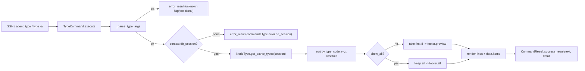

# `type`

> **Architecture Role**: 节点类型只读列表（SYSTEM）。从 `node_types` 表读取 **active** 类型（`status=0`），按 `type_code` 的 **a--z 字母序**（不区分大小写）展示，便于用户与 agent 在 `find -t <type_code>` / `describe` 之前先确认仓库内已注册的类型谱。**不在命令层改写 `description` 原文**；若某条描述为种子/迁移占位语，应通过**更新库表**（或迁移脚本）修正，而非在 `type` 中清洗。

## Metadata (anchoring)

| Field | Value |
|--------|-------|
| Command | `type` |
| `CommandType` | SYSTEM |
| Class | `app.commands.system_commands.TypeCommand` |
| Primary implementation | [`backend/app/commands/system_commands.py`](../../../../backend/app/commands/system_commands.py) |
| Locale | `commands.type` in `backend/app/commands/i18n/locales/{zh-CN,en-US}.yaml` |
| Anchored snapshot | [`../_generated/registry_snapshot.json`](../_generated/registry_snapshot.json) |
| Last reviewed | 2026-04-26 |

## Synopsis

```
type [-a | --all]
```

- 不接受位置参数；唯一旗标为 `-a` / `--all`（互通）。
- `get_usage()` → `type [-a | --all]`。

## Implementation contract

### 参数解析（`_parse_type_args`）

- 空参 → `show_all=False`（默认预览模式）。
- `-a` / `--all` → `show_all=True`，顺序无关、可重复出现（幂等）。
- 任意其他 `-`/`--` 前缀输入 → `unknown flag: <token>` 错误。
- 任意非 flag 位置参数 → `type does not accept positional arguments; use -a/--all to show all`。

### 数据来源

- 通过 [`NodeType.get_active_types(session)`](../../../../backend/app/models/graph.py)（`status=0`）取行；与 [`system_primer_context._format_node_types_annex`](../../../../backend/app/game_engine/agent_runtime/system_primer_context.py) 走同一来源。
- `session` 经 `context.db_session`（SSH/HTTP 链路在创建 `CommandContext` 时已注入）；缺失时返回 `commands.type.error.no_session`，不抛异常。
- DB 异常被吞为 `error.no_session` 文案，并在 `CommandResult.error` 字段记录原始 message，便于日志侧排查。

### 排序与截断

- 排序键：``type_code`` 去空后按 **不区分大小写的 ASCII 字母序**（`str.lower()` 再比），与「首字母 a--z」一致；**不按** `type_name` 排序（`type_name` 常为中英混排，无法稳定对应拉丁 a--z）。
- 默认渲染前 `TypeCommand.DEFAULT_LIMIT = 8` 行；`-a` 渲染全部。
- 不对 `description` 做**应用层**截断或内容改写；`CommandResult.data.items[].description` 为库中 **原样**（可为 `null` 或含任意字符串）。
- 仅对**终端行**的展示做空白折叠判断：`None` 或 `strip()` 后为空时，行上仍打印 `-`（`data` 中仍为原值，例如全空格字符串时行上为 `-`、data 中保留原字段）。

### 行格式

```
[<type_code>]  <type_name>  -  <description or '-'>
```

- `type_code` 缺失时占位为 `-`；`description` 为 `None` / 空白时回落 `-`；`type_name` 缺失时省略中间段，输出 `[<type_code>]  -  <description>`。

### 输出文本结构

```
<title>
========================
[<type_code>]  <type_name>  -  <description>
... (默认 8 行；-a 全量)

<footer>
```

- `title` ← `commands.type.title`。
- `footer` 分两路：
  - 默认：`commands.type.footer.preview`，置入 `{shown}` / `{total}`。
  - `-a`：`commands.type.footer.all`，置入 `{total}`。
- `total == 0` 走 `commands.type.error.empty` 单行返回（success），`data.items` 为空数组。

### `CommandResult.data` 契约

```jsonc
{
  "show_all": <bool>,
  "total": <int>,                 // 全量 active 行数（不受 8 行截断影响）
  "items": [
    {
      "type_code": <str|null>,
      "type_name": <str|null>,
      "description": <str|null>  // 与 `node_types.description` 一致；行上无可见文案时可能仍为 null 或非空字符串
    },
    ...
  ]
}
```

- `items` 与渲染文本严格同序（`type_code` a--z，忽略大小写）。
- `len(items) <= total`；默认模式下 `len(items) == min(total, 8)`，`-a` 模式下 `len(items) == total`。

### 错误形态（稳定）

| 触发 | `success` | `message` 文案 key | `error` |
|------|-----------|---------------------|---------|
| 未知 flag（`--bogus` / `-x` 等） | False | 直接 `unknown flag: <token>`（与 `find` / `describe` 一致，**不**走 i18n） | — |
| 位置参数（`type room`） | False | `type does not accept positional arguments; use -a/--all to show all` | — |
| `db_session` 缺失 | False | `commands.type.error.no_session` | `db_session not available in context` |
| `node_types` 查询异常 | False | `commands.type.error.no_session` | `node_types query failed: <e>` |
| 空 active 集 | True | `commands.type.error.empty` | — |

> 解析层错误文本暂不走 i18n，与既有 `find` / `describe` 保持一致；后续如批量迁移可一并处理。

### 权限

SYSTEM 命令，对所有上下文开放；不读写图、不写 session 状态，纯只读。

## 数据流



## i18n 资源键

```
commands.type.description       # help 列表一行简介
commands.type.title             # 标题（"Node Types" / "节点类型"）
commands.type.footer.preview    # 默认页脚（含 {shown} / {total}）
commands.type.footer.all        # -a 页脚（含 {total}）
commands.type.error.no_session  # context 无 db_session 或查询异常
commands.type.error.empty       # active 集合为空
```

## Non-Goals / Roadmap

- 不引入 `--include-inactive` / `--filter <code>` / `--page` / `--json` 等扩展旗标；后续若有需求再走 RFC。
- 不展示 `parent_type_code` / `schema_definition` / `tags` / `ui_config` 等列；如需深查走 [CMD_describe](CMD_describe.md) 或 REST `/api/v1/ontology/node-types`。
- 不对 `type_name` 做翻译；DB 中现行种子 `type_name` 多为中文（如「房间」「用户」），命令直接透出。
- 不实现「命令内去掉 graph-seed 占位句」等字符串清洗；**数据质量在库层/迁移中维护**。

## 相关

- 总表：[../SPEC.md](../SPEC.md)
- 类型来源：`app.models.graph.NodeType` / `node_types` 表；REST 镜像 `/api/v1/ontology/node-types`
- 与 `find` / `describe` 协作：先 `type` 看仓库已注册类型，再 `find -t <type_code>` 列出节点，最后 `describe <id>` 深查。

## Tests

- `backend/tests/commands/test_type_command.py`
- 关键用例：
  1. 默认按 `type_code` a--z 升序，截断到 8 行（构造 10 行）
  2. `-a` 解除上限并复刻全部
  3. `-a` ↔ `--all` 等价
  4. 未知 flag / 位置参数返回错误
  5. 空集合走 `error.empty`
  6. `db_session=None` 走 `error.no_session`
  7. `data.items` 与可见行同序
  8. zh-CN / en-US 标题与页脚区分
  9. `description` 为 `null` 或 `strip` 后为空时行上为 `-`；`data` 保留库中原始值
  10. `type_name` 与 `type_code` 顺序不一致时仍以 `type_code` 为准
