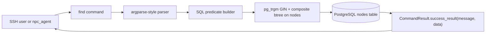

# F01 `find` 命令 SPEC

> **Architecture Role**: `find` 属于**知识与能力层**的图检索命令，面向人类 SSH 用户与 npc_agent（含 AICO）提供 **确定性、只读** 的节点锚定工具。Evennia 对标：`@find` / `locate`。实现锚点：[`backend/app/commands/graph_inspect_commands.py`](../../../../backend/app/commands/graph_inspect_commands.py)。

> **SSOT**: 本文件是 `find` 命令的唯一权威描述。下列文档均以链接方式引用本文件，不再重复描述：
> - [`docs/command/SPEC/SPEC.md`](../SPEC.md)（命令清单）
> - [`docs/models/SPEC/features/F03_AICO_DEFAULT_SYSTEM_ASSISTANT.md`](../../../models/SPEC/features/F03_AICO_DEFAULT_SYSTEM_ASSISTANT.md)（AICO `tool_allowlist`）
> - [`docs/models/SPEC/features/F08_AICO_TOOL_CONTEXT_AND_AGENT_LOOP.md`](../../../models/SPEC/features/F08_AICO_TOOL_CONTEXT_AND_AGENT_LOOP.md)（Tier-3 工具）
> - [`docs/models/SPEC/CAMPUSWORLD_SYSTEM_PRIMER.md`](../../../models/SPEC/CAMPUSWORLD_SYSTEM_PRIMER.md)（Discovery Suite）
> - [`docs/models/SPEC/AICO_TOOL_DESCRIPTION_AUDIT.md`](../../../models/SPEC/AICO_TOOL_DESCRIPTION_AUDIT.md)（Tool description audit）

## Status

- **Version**: v3（SPEC 与实现已同步；§11 的 v2 → v3 迁移已在 `app/commands/graph_inspect_commands.py` 中落地，由 `tests/commands/test_graph_inspect_commands.py` 锁定）。
- **Command type**: `CommandType.SYSTEM`；默认 `command_policies` 行为空（allow-all）。
- **Read-only**: 命令不修改任何 `nodes` / `relationships` 行。
- **Owner**: commands 模块。

## 目录

1. [Synopsis 与命令形态](#1-synopsis-与命令形态)
2. [Arguments（v3 规范）](#2-argumentsv3-规范)
3. [Short-form 迁移（v2 → v3）](#3-short-form-迁移v2--v3)
4. [匹配模型与 AND 组合语义](#4-匹配模型与-and-组合语义)
5. [`--all / -a` 语义（列表全集开关）](#5---all---a-语义列表全集开关)
6. [`CommandResult.data` 契约](#6-commandresultdata-契约)
7. [Examples](#7-examples)
8. [查询性能策略](#8-查询性能策略)
9. [Scope 与 Non-Goals](#9-scope-与-non-goals)
10. [与 `describe` 的分工](#10-与-describe-的分工)
11. [v2 → v3 实现差距](#11-v2--v3-实现差距)
12. [Acceptance Criteria](#12-acceptance-criteria)
13. [Open Questions](#13-open-questions)

## 0. Architecture



`find` **永不**触发写操作，不引用 `attributes` / `trait_mask` / `semantic_embedding` / `structure_embedding`（参见 §9）。

## 1. Synopsis 与命令形态

```
find [positional_query | #<id> | *<account>]
     [--name <text> | -n <text>]
     [--describe <text> | -des <text>]
     [--type <type_code> | -t <type_code>]
     [--in <location_id> | -loc <location_id>]
     [--exact]
     [--startswith]
     [--limit <N> | -l <N>]
     [--all | -a]
```

- 别名（主命令名 `find`）：`@find`、`locate`（Evennia 兼容）。
- 至少需要一个「匹配来源」（positional / `-n` / `-des` / `-t` / `-loc` / `#<id>` / `*<account>`），否则命令返回 `error_result`。
- `positional_query` 与 `--name/-n`、`--describe/-des` **互斥**：同时提供时命令返回 `error_result`（避免「既想 OR 又想 AND」的歧义）。

## 2. Arguments（v3 规范）

| Long          | Short   | Takes value | v2 存在 | v3 语义                                                                                           |
|---------------|---------|-------------|---------|---------------------------------------------------------------------------------------------------|
| positional    | —       | string      | ✓       | 同时匹配 `Node.name` OR `Node.description`（legacy mode，保留）                                    |
| `#<id>`       | —       | int         | ✓       | 主键直查（绕过 ILIKE）                                                                             |
| `*<account>`  | —       | string      | ✓       | 账号名捷径，自动叠加 `-t account`                                                                  |
| `--name`      | `-n`    | string      | **新**  | 仅对 `Node.name` 做 ILIKE；受 `--exact` / `--startswith` 收紧                                      |
| `--describe`  | `-des`  | string      | **新**  | 仅对 `Node.description` 做 ILIKE（`%txt%`），不受 `--exact` / `--startswith` 影响                  |
| `--type`      | `-t`    | string      | ✓       | `Node.type_code = ?` 精确过滤                                                                      |
| `--in`        | `-loc`  | int         | ✓\*     | `Node.location_id = ?`；\*v2 短别名是 `--location`，v3 改为 `-loc`                                 |
| `--exact`     | —       | bool        | ✓       | name 匹配改为 `ILIKE '<pattern>'`（大小写不敏感全段等值）                                          |
| `--startswith`| —       | bool        | ✓       | name 匹配改为 `ILIKE '<pattern>%'`                                                                 |
| `--limit`     | `-l`    | int         | ✓\*     | 返回条数上限，默认 `_DEFAULT_LIMIT=12`，封顶 `_MAX_LIMIT=50`；\*v2 短别名是 `-n`（v3 让位给 `--name`）|
| `--all`       | `-a`    | bool        | **新**  | 绕过 `--limit`，返回完整结果列表；仍受硬上限 `_HARD_MAX_LIMIT=5000` 保护（§5）                      |

约束：

- `--exact` 与 `--startswith` 互斥。
- `--all` 出现时 `--limit/-l` 被忽略（非错误，但 `data.query.limit` 回传用户传入值以便审计）。
- 所有查询隐式附加 `Node.is_active = TRUE`，不可关闭。

## 3. Short-form 迁移（v2 → v3）

本次 v3 规范调整了三处短别名，**破坏性变更**，必须在实现落地时同步更新文档与测试。

| 场景              | v2 行为                               | v3 行为                                     | 迁移建议                                    |
|-------------------|---------------------------------------|---------------------------------------------|---------------------------------------------|
| `-n 20`           | `--limit 20`                          | `--name "20"`（值为字符串）                  | 改写为 `-l 20` 或 `--limit 20`              |
| `--location 35`   | 等价 `--in 35`                        | **移除**；解析为 unknown flag，返回错误      | 改写为 `-loc 35` 或 `--in 35`               |
| `-loc 35`         | unknown flag                          | 等价 `--in 35`                              | 新能力                                      |
| `-l 20`           | unknown flag                          | 等价 `--limit 20`                           | 新能力                                      |

实现层应在参数解析时：

1. 若检测到 `--location`，返回 `error_result("--location has been renamed to --in / -loc in v3")`，便于用户快速发现。
2. 若检测到 `-n <int-literal>` 且无 `--name` 对应值，日志 WARN 并按 `--name` 处理（不再按 `--limit`）；解析永不 silently 切换语义。

## 4. 匹配模型与 AND 组合语义

所有 flag 过滤器在 SQL 层以 **AND** 组合，**不做 OR**。单个 flag 内部的列选择如下：

| Flag 组合                                         | 生成的 WHERE 谓词                                                                |
|---------------------------------------------------|----------------------------------------------------------------------------------|
| positional `foo`                                  | `(name ILIKE '%foo%' OR description ILIKE '%foo%')`                              |
| `-n foo`                                          | `name ILIKE '%foo%'`                                                             |
| `-n foo --exact`                                  | `name ILIKE 'foo'`                                                               |
| `-n foo --startswith`                             | `name ILIKE 'foo%'`                                                              |
| `-des bar`                                        | `description ILIKE '%bar%'`                                                      |
| `-n foo -des bar`                                 | `name ILIKE '%foo%' AND description ILIKE '%bar%'`                               |
| `-t room`                                         | `type_code = 'room'`                                                             |
| `-loc 35`                                         | `location_id = 35`                                                               |
| `find -n "Name" -t "Room" -des "this is" -loc 35` | 全部 AND 叠加；这是 §7 示例 4 的规范用法                                          |
| `#42`                                             | `id = 42`（绕过其他 ILIKE）                                                      |
| `*admin`                                          | `(name ILIKE '%admin%' OR description ILIKE '%admin%') AND type_code = 'account'`（legacy 行为保留）|

排序：`ORDER BY type_code ASC, name ASC`（稳定可复现）。

## 5. `--all / -a` 语义（列表全集开关）

`--all` 只影响**返回条数**，**不改变** `data.results[*]` 的字段形状；per-node 细节仍由 `describe` 承担。

规则：

1. 参数出现即置 `True`；不接受值。
2. 在 `-a` 生效时：SQL 层使用 `LIMIT _HARD_MAX_LIMIT`（默认 `5000`），忽略用户传入的 `--limit/-l`。
3. 若实际行数 `> _HARD_MAX_LIMIT`：
   - `data.results` 只包含前 `_HARD_MAX_LIMIT` 条；
   - `data.total` 仍为真实总数；
   - `data.next_offset = _HARD_MAX_LIMIT`；
   - 人类可读 `message` 头部附加警告 `"... truncated at safety ceiling"`；
   - 建议用户通过更严格的 `-n` / `-t` / `-loc` 过滤缩小范围。
4. 若实际行数 `≤ _HARD_MAX_LIMIT`：`data.next_offset = None`。
5. 向 LLM 暴露的 tool description 必须注明：「`-a` may return up to 5000 rows; only use with narrow filters」——避免 AICO 在宽泛查询上无脑启用 `-a` 导致上下文爆炸。

**Non-goal**：`--all` 不会把 `attributes` / `tags` / `trait_mask` / 向量列塞进 `data.results[*]`。per-node 展开请用 `describe <id> -a`（契约见 [`CMD_describe.md`](CMD_describe.md) §Implementation contract）。

## 6. `CommandResult.data` 契约

成功路径（无论空集或有结果）均返回：

```json
{
  "results": [
    {
      "id": 123,
      "type_code": "room",
      "name": "Atrium",
      "location_id": 35,
      "description": "A wide atrium ..."
    }
  ],
  "total": 1,
  "next_offset": null,
  "query": {
    "text": null,
    "name": "Atr",
    "describe": null,
    "account": null,
    "node_id": null,
    "type_code": "room",
    "in_location": 35,
    "exact": false,
    "startswith": false,
    "limit": 12,
    "all": false
  }
}
```

契约不变式：

- `results[*]` 字段集合是 **封闭的 5 列**：`id`、`type_code`、`name`、`location_id`、`description`。
- `description` 在 `results[*]` 中按 `_DESC_PREVIEW_CHARS=240` 预览截断（与 `--all` 无关）。
- `total = COUNT(*)` 实际匹配总数；`len(results) ≤ total`。
- `next_offset` 仅当 `total > len(results)` 时非 `None`；取值固定为 `len(results)`（为未来的 `--offset` 留 hook）。
- `query` 为纯描述体，回放调用方参数原样（含 v3 新字段 `name` / `describe` / `all`）；LLM 可据此写出等价可复现查询。

## 7. Examples

1. **Legacy positional（v2，保留）**

   `find 广场 --limit 5` → `(name ILIKE '%广场%' OR description ILIKE '%广场%') LIMIT 5`

2. **仅按 name**

   `find -n "Atrium" --exact` → `name ILIKE 'Atrium'`

3. **仅按 description**

   `find -des "multi-purpose hall"` → `description ILIKE '%multi-purpose hall%'`

4. **组合查询（SPEC 标杆）**

   `find -n "Name" -t "Room" -des "this is a room" -loc 35`

   生成：

   ```sql
   SELECT ... FROM nodes
   WHERE is_active
     AND name ILIKE '%Name%'
     AND description ILIKE '%this is a room%'
     AND type_code = 'Room'
     AND location_id = 35
   ORDER BY type_code, name
   LIMIT 12;
   ```

5. **全量列表（`--all`）**

   `find -t room -a` → 绕过 `--limit`，返回该类型所有 active 房间，硬上限 5000。

6. **直查 id（v2 保留）**

   `find #42`

7. **账号快捷方式（v2 保留）**

   `find *admin`

8. **迁移前后对比**

   - v2: `find "grid" -n 5 --location 10` → v3 解析错误（`--location` 已移除；`-n` 现在期望字符串）。
   - v3: `find "grid" -l 5 -loc 10` → 等价 legacy 语义。

## 8. 查询性能策略

### 8.1 已有索引（无需新增）

PostgreSQL 层现有索引（见 [`backend/db/schemas/database_schema.sql`](../../../../backend/db/schemas/database_schema.sql)）完全覆盖 v3 组合查询：

| 索引                                                              | 支撑谓词                              |
|-------------------------------------------------------------------|--------------------------------------|
| `idx_nodes_name_trgm` (GIN `gin_trgm_ops`)                        | `name ILIKE '%...%'` / `'...%'`      |
| `idx_nodes_description_trgm` (GIN `gin_trgm_ops`)                 | `description ILIKE '%...%'`          |
| `idx_nodes_type_active` (btree `type_code, is_active`)            | `type_code = ? AND is_active`        |
| `idx_nodes_location_active` (btree `location_id, is_active`)      | `location_id = ? AND is_active`      |
| `idx_nodes_active` (btree `is_active`)                             | `is_active` 兜底                     |

AND 组合查询（§7 示例 4）会触发 **PostgreSQL BitmapAnd**：先用 trgm GIN 得到候选 tid 集合，再与 `type_code` / `location_id` btree 的 bitmap 交集，最后 recheck。无需新增索引。

### 8.2 参考业界实践

- **pg_trgm 最小前缀长度**：trgm 使用 3-gram，对 ≤ 2 字符的查询会退化为全表扫描。实现层应在 `--startswith` / `--exact` 外，对 positional / `-n` / `-des` 值做 `len(value.strip()) >= 3` 的软检查（少于 3 字符时 WARN 但仍执行），和 Elastic 的「min prefix」建议一致。
- **COUNT 限流**：`q.count()` 在 4M+ rows 的 `nodes` 表上会触发全索引扫描。实现层应：
  1. 默认使用 `SELECT 1 FROM (SELECT ... LIMIT cap+1) t; count()` 估算 `total`；或
  2. 用 `EXISTS` 提前退出；
  3. 当 `--all` 生效时退化为真正 `COUNT(*)`，并在 ≥10 万行时增加一次 `EXPLAIN (BUFFERS)` log 触点。
- **查询计划锁 & 死锁**：命令路径只读 `SELECT`，不会进入「集成测试锁与死锁风险」名单（参见 `docs/testing/SPEC/SPEC.md`），无需事务升级。
- **ILIKE 双列 OR（legacy positional）**：两个 trgm GIN 索引经 `BitmapOr` 合并；成本与单列 ILIKE 相当。
- **时延预算**：p95 ≤ 50 ms（典型 CampusWorld 规模，< 10k active nodes）；`--all` 全量 p95 ≤ 300 ms。超标必须进 open questions 升级。

### 8.3 未来演进 hook（非本 SPEC 范围）

`data.query` 故意保留 `limit` / `all`，为未来 `--offset` / 基于 `id > last_seen` 的 keyset pagination 做准备。任何分页变化必须更新本节与 §6。

## 9. Scope 与 Non-Goals

本命令 **不** 做以下工作（避免 LLM 被 description 误导，见 [`docs/models/SPEC/AICO_TOOL_DESCRIPTION_AUDIT.md`](../../../models/SPEC/AICO_TOOL_DESCRIPTION_AUDIT.md) 对「no hallucination bait」的要求）：

- 基于 `attributes` JSONB 键/值过滤（未来考虑 `find_attr` 独立命令）。
- 基于 `tags` 数组过滤（未来考虑 `find_tag` 独立命令或 `-T <tag>` flag，不在 v3 内）。
- 基于 `trait_mask` 位掩码过滤（见 [`docs/database/SPEC/features/F01_TRAIT_CLASS_MASK_FOR_AGENT.md`](../../../database/SPEC/features/F01_TRAIT_CLASS_MASK_FOR_AGENT.md)；ontology API 已提供）。
- 基于 `semantic_embedding` / `structure_embedding` 的向量召回（LTM 规范 [`docs/models/SPEC/features/F02_LTM_VECTORS_AND_MEMORY_LINKS.md`](../../../models/SPEC/features/F02_LTM_VECTORS_AND_MEMORY_LINKS.md) 是归属领域）。
- 任何 relationship / 多跳图遍历（`describe` 的出边采样是唯一邻居入口）。
- 跨 `is_active = false` 节点的查询（命令契约是「世界中仍存在的节点」）。

## 10. 与 `describe` 的分工

| 维度          | `find`                                 | `describe`                                       |
|---------------|----------------------------------------|--------------------------------------------------|
| 目的          | 把自然语言指代**锚定到节点列表**        | 展开**单个节点**的深度视图                       |
| 返回条数      | 0..N（受 `--limit` / `--all` 控制）    | 固定 1（或错误）                                 |
| 返回字段      | 封闭 5 列（见 §6）                     | `attributes` 预览（≤12 key）+ 出边采样（≤8）；`-a` 展开全量并把 `attributes` / `out_edges` 写入 `data`（见 [`CMD_describe.md`](CMD_describe.md) §Implementation contract） |
| 写操作        | 否                                     | 否                                               |
| 别名          | `@find`、`locate`                      | `examine`、`ex`                                  |
| Evennia 对标  | `@find`                                | `examine`                                        |

典型协作：AICO ReAct 先 `find -n "xxx" -t room -loc 35` 得到候选 id，再对确定目标 `describe #<id>`。

## 11. v2 → v3 实现差距

当前 [`backend/app/commands/graph_inspect_commands.py`](../../../../backend/app/commands/graph_inspect_commands.py) 仅实现 v2。落地 v3 需修改的位点（供后续实现 plan 引用）：

1. `_ParsedFindArgs` 新增槽位：`name`、`describe`、`all`。
2. `_parse_find_args`：
   - 增加 `--name / -n`（参数化）、`--describe / -des`（参数化）、`--all / -a`（布尔）。
   - `--limit` 的短别名从 `-n` 改为 `-l`。
   - `--in` 的长别名 `--location` **删除**，新增短别名 `-loc`；遇到 `--location` 返回明确迁移错误。
   - positional 与 `-n`/`-des` 互斥校验。
3. `_run_find_query`：按 §4 谓词表重写，组合逻辑 = AND；legacy positional 保留 OR。
4. `_render_find_results` / `_empty_find_payload`：
   - `data.query` 新增 `name` / `describe` / `all` 字段。
   - `--all` 路径的 `next_offset` / 警告消息语义（§5 规则 3）。
5. `FindCommand.description` 重新生成（≤240 字符，命中 §8.2 的「no hallucination bait」原则 + 新参数提示）。
6. `FindCommand.get_usage()` / `_get_specific_help()` 与 §1、§7 对齐。
7. 测试文件 `backend/tests/commands/test_graph_inspect_commands.py` 新增：
   - `-n`/`-des`/`-a` 各自路径与 AND 组合路径；
   - `-n` 不再被解析为 `--limit`（regression lock）；
   - `--location` 显式拒绝（迁移护栏）；
   - `-a` 超过 5000 行时的截断和警告消息。
8. `backend/tests/game_engine/test_tool_manifest_descriptions.py`：更新 `find` description 断言同步新 SPEC 短语（含 `-n` / `-des` / `-a` 关键词）。
9. Seed / allowlist / audit 文档：`find` 保留现有 `tool_allowlist` 位置；description 替换后走正常 manifest 流程，无需迁移。

## 12. Acceptance Criteria

本 SPEC 视为「落地可接受」需满足：

- [x] 文档层（本 plan 范围）
  - [x] `docs/command/SPEC/features/F01_FIND_COMMAND.md` 存在且覆盖 §1–§13。
  - [x] `docs/command/SPEC/SPEC.md` 在命令清单中列 `find`/`describe` 并链接本文件。
  - [x] F03 / F08 / PRIMER / AUDIT 对 `find` 的冗长描述被替换为一行 + 链接。
  - [x] 搜索 `find <query | #<id> |` 在上述 4 份文档中仅剩一份（本文件）。
- [x] 实现层（本 plan `f01_find_v3_impl_ee9aafd3` 落地）
  - [x] 单命令 `find -n "Name" -t "Room" -des "this is a room" -loc 35` 经 `_parse_find_args` 返回完整 v3 谓词，`data.query` 亦回传 `name/describe/type_code/in_location`（`tests/commands/test_graph_inspect_commands.py::test_parse_combined_spec_example`、`::test_find_query_descriptor_carries_v3_fields`）。
  - [x] `find -a -t room` 在 `commands.find.hard_max_limit` 被超越时触发「truncated at safety ceiling」头部警告并置 `data.next_offset = hard_max_limit`（`::test_find_all_bypasses_limit`）。
  - [x] `--location`（v3 已移除）返回带迁移提示的错误，`-n <int>` 不再被当作 `--limit`（`::test_parse_rejects_legacy_long_location_flag`、`::test_parse_short_n_is_name_not_limit`）。
  - [ ] p95 时延满足 §8.2 预算（需 seed 数据 + PostgreSQL；留待 §8 的性能回归任务）。

## 13. Open Questions

- 是否为 `-des` 增加 `--exact` / `--startswith` 支持？当前 SPEC 只让其收紧 `name`，`description` 默认子串匹配足以满足典型用法。
- `--all` 的硬上限 `_HARD_MAX_LIMIT` 应设为 `5000` 还是按世界规模自适应（基于 `COUNT(*)` 采样）？
- 是否为 ontology 类查询（`type_code in ('room','account')`）提供 `-t room,account` 的多值语法？本 SPEC 暂不支持。
- 分页 `--offset`/keyset 的落地时机？已留 `data.next_offset` hook。

## Cross-links（反向引用来源）

本文件被以下文档反向链接；维护时请同步更新：

- [`docs/command/SPEC/SPEC.md`](../SPEC.md)
- [`docs/models/SPEC/features/F03_AICO_DEFAULT_SYSTEM_ASSISTANT.md`](../../../models/SPEC/features/F03_AICO_DEFAULT_SYSTEM_ASSISTANT.md)
- [`docs/models/SPEC/features/F08_AICO_TOOL_CONTEXT_AND_AGENT_LOOP.md`](../../../models/SPEC/features/F08_AICO_TOOL_CONTEXT_AND_AGENT_LOOP.md)
- [`docs/models/SPEC/CAMPUSWORLD_SYSTEM_PRIMER.md`](../../../models/SPEC/CAMPUSWORLD_SYSTEM_PRIMER.md)
- [`docs/models/SPEC/AICO_TOOL_DESCRIPTION_AUDIT.md`](../../../models/SPEC/AICO_TOOL_DESCRIPTION_AUDIT.md)
