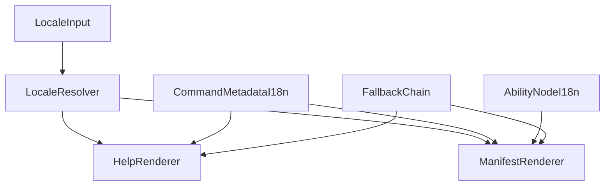

# F02 命令系统国际化与 Agent 友好描述 SPEC

> **Architecture Role**: F02 属于命令域（commands）特性，定义命令描述层的国际化契约与 Agent 友好描述契约。该特性只约束“展示与语义描述”，不改变命令执行标识、授权语义与命令副作用。

> **Status**: Draft v1（规范阶段，未要求本文件内同步实现改造）。

## 1. Goal

F02 目标是为命令系统建立统一、可验证的多语言描述能力，并提升命令描述对 Agent（尤其 tool manifest）的可消费性。

本特性必须满足：

1. 覆盖所有现有命令描述面（`help` 列表、`help <command>`、`usage`、Agent tool manifest 描述）。
2. 规定新增命令的合入门禁：必须提供可用的国际化描述能力（至少默认语言 + 回退链）。
3. 保持命令执行标识稳定（`name`/`aliases` 不本地化）。
4. 明确**命令在数据库图模型中的能力节点**（`type_code=system_command_ability`）与注册表的一一对应及同步、查询优化要求，使语义世界中的「命令即节点」与 i18n 文案在存储层可维护、可校验。

## 2. Non-Goals

- 不国际化命令可执行标识（`name`、`aliases`、工具调用名）。
- 不变更 `command_policies` 授权模型与判定逻辑。
- 不在本特性内重构命令执行框架（`CommandRegistry`、`BaseCommand.execute()`）。
- 不将本特性扩展为“自然语言命令翻译器”。

## 3. Terms & Scope

- **Human-facing description**: 面向终端用户的命令描述与帮助文案（`description`/`usage`/help header 等）。
- **Agent-facing description**: 面向 Agent tool selection 的描述（`llm_hint` 及其回退文本）。
- **Locale**: 文案语言标识，示例：`zh-CN`、`en-US`。
- **Fallback chain**: 当目标语言缺失时的降级顺序，保证始终可渲染。
- **命名继承**：图属性与运行时沿用既有键名 **`llm_hint`** 与多语扩展 **`llm_hint_i18n`**（不更名为 `ai_hint`），以兼容历史实现、种子与现网 `system_command_ability` 行；语义上指「Agent/工具面补充说明」而非特指某一家 LLM 品牌。
- **Command ability node**: 数据库 `nodes` 中 `type_code=system_command_ability` 的节点，代表一条**已注册命令**的语义能力；与 `NodeType` 上该类型定义配合使用（不要求「一命令一 NodeType」，**类型共用、实例分条**）。

## 4. Current Baseline

当前行为（实现现状）：

1. `help` 展示主要来自命令注册表中的命令对象字段（`description`、`get_usage()`）。
2. Agent tool manifest 描述优先读取 `system_command_ability.attributes.llm_hint`，缺失时回退命令描述。
3. 文案来源混杂（中英文并存）且无统一 locale 选择与回退契约。

## 5. Functional Contract

### 5.1 Locale 解析优先级

规范建议优先级（从高到低）：

1. 请求/会话上下文显式 locale（例如 `CommandContext.metadata["locale"]`）。
2. 用户语言偏好（如 `user.language`）。
3. 系统默认 locale（建议 `zh-CN`）。
4. 最终安全回退（legacy 单字符串描述）。

### 5.2 数据契约（命令描述）

命令描述层建议支持以下逻辑字段（结构可落在命令定义或元数据层）：

- `description_i18n: {locale: text}`
- `usage_i18n: {locale: text}`
- `help_i18n: {locale: text}`（可选）

兼容要求：

- 若未提供 `*_i18n`，必须回退到 legacy `description/get_usage`，不可返回空文案。

### 5.3 数据契约（Agent 描述）

Agent 描述与人类描述职责分离：

- 人类路径：`description_i18n` / `usage_i18n`
- Agent 路径：`llm_hint_i18n`（或等价结构）

禁止把 `llm_hint` 直接等同于用户帮助文案，避免“对模型友好但对用户误导”的耦合。

### 5.4 回退策略

推荐固定回退链：

`requested_locale -> default_locale(zh-CN) -> en-US -> legacy description`

约束：

- 任一命令在任一 locale 请求下都必须返回非空描述文本。
- 回退行为必须可审计（日志或 trace 中可区分“命中翻译”与“回退”）。

### 5.5 覆盖与准入门禁

覆盖要求：

- 现有命令描述覆盖率目标为 100%（至少在默认 locale 上完整覆盖）。
- Agent-facing 描述（manifest 入口命令）应达到同等覆盖率目标。

新增命令门禁：

- 新增命令 PR 必须提供 i18n 描述字段（至少默认语言）并通过校验。
- 未满足门禁时，不应合入主干。

### 5.6 向后兼容

- 迁移期允许 legacy 文案回退，但必须有明确时限与清理计划。
- 迁移期间不得破坏已有 `help` 与 Agent manifest 的可用性。

### 5.7 图节点：类型、实例对应与维护优化

语义世界要求「命令在图中可寻址」：在数据库中采用**统一节点类型** `system_command_ability`，**每条注册命令**对应**至多一条**该类型的**活跃**能力节点实例（以业务键对齐，而非用节点 `id` 当命令名）。

**类型与实例：**

- **NodeType / type_code**：全库共用一种能力类型，例如 `system_command_ability`；类实现用于校验与序列化，不在此特性中按命令再拆类型码。
- **实例唯一键**：`attributes.command_name` 必须等于 `CommandRegistry` 中该命令的 `name`（主名），与一条能力节点 1:1 绑定；禁止同一 `command_name` 下并存多条 `is_active=true` 的重复节点。
- **与注册表关系**：**注册表为“存在性”事实源**（哪些命令被注册）；能力节点为**图侧语义镜像**，须在注册表稳定后同步建立或更新；新增命令合入时须满足「注册成功 → 能力节点可同步」的契约（可异步，但需可观测与可修复）。

**属性与 i18n：**

- 能力节点上除现有结构化字段外，应承载 Agent 相关多语材料（如 `llm_hint_i18n` 或与本 SPEC §5.3 等价的键），并与代码侧/迁移脚本约定同一 schema，避免只存在于内存而图中永远缺字段。
- `attributes` 中人类可读长文与 Agent 专段分离，同 §5.3 职责边界。

**同步与优化要求：**

- **幂等**：多次执行同步须得到相同终态（同一 `command_name` 不重复插入）。
- **全量对账**：同步逻辑应以当前 `command_registry.get_all_commands()` 为输入，对遗漏节点做 upsert，对**已注册命令在图中缺失**的缺口可告警或修数据任务。
- **下线性（实现阶段）**：若命令从注册表移除，须定义图中节点是 **软删**、**打 deprecated 标记**还是保留历史行；禁止无声留下与注册表冲突的“幽灵”活跃节点；具体策略在实现任务中定稿，本 SPEC 要求**行为显式、可测**。
- **查询性能**：按 `type_code` + `attributes->>'command_name'`（或已验证的等价索引/约束）在 manifest/ hint 查询路径上保持 **O(1) 行级**查找预期；大表上禁止无 type 前缀的全表扫描式 hint 拉取；实现阶段应复用与现有 `system_command_ability` 查询一致的索引策略。
- **放置与可见性**：能力节点可挂在奇点屋等系统根位（与当前实现一致），不强制与终端用户 `location` 同屏展示；F02 不以此替代 `command_policies` 授权面。

**验收提示（与 §8 一致）：**注册命令数与活跃能力节点数（按 `command_name` 去重后）在稳态下一致，且多语 Agent 字段在图侧可读写。

## 6. Runtime Integration Points

1. **命令 help 渲染层**：按 locale 选择 `description/usage`。
2. **tool manifest 构建层**：按 locale 选择 Agent 描述（优先 `llm_hint_i18n`）。
3. **命令上下文层**：统一携带 locale（推荐使用 `CommandContext.metadata`）。
4. **能力节点同步层**：`system_command_ability` 与注册表 1:1 对齐；多语键、幂等同步、对账与查询优化见 **§5.7**。

## 7. Constraints & Risks

- manifest 描述长度预算有限，翻译文本膨胀可能触发截断。
- worker 级 manifest 缓存可能与“按用户 locale 动态切换”冲突。
- `search_commands` 等依赖 `description` 的行为需明确多语言搜索策略（单语匹配或回退匹配）。
- 图侧能力节点与注册表**漂移**（有命令无节点、有节点无命令、重复 `command_name`）会增加排查成本，需在实现阶段提供**对账**或**体检**任务。

## 8. Acceptance Criteria

- [ ] `help` 与 `help <command>` 在指定 locale 下返回对应语言描述。
- [ ] Agent tool manifest 在指定 locale 下返回对应语言 Agent 描述。
- [ ] 缺失翻译时按回退链稳定回退且不返回空串。
- [ ] 现有命令描述覆盖率达到目标（建议 100%）。
- [ ] 新增命令未提供 i18n 描述时触发门禁失败。
- [ ] 命令名/别名/工具调用名不受本地化影响。
- [ ] `system_command_ability` 在稳态下与已注册命令 **1:1（按 `command_name`）** 对账通过；无重复活跃节点、无应同步却长期缺失的缺口（允许定义修复 SLA）。
- [ ] 图属性中的 Agent 多语字段与 §5.3/§5.7 的 schema 一致，且查询路径满足可接受的查找性能（实现阶段用 explain/集成测 验证）。

## 9. Test Plan

### 9.1 单元测试

- locale 解析优先级测试（context > user > system default > legacy）。
- 文案解析器测试（`description_i18n`/`usage_i18n`/回退链）。
- manifest 描述选择测试（`llm_hint_i18n` 优先级与回退）。

### 9.2 集成测试

- SSH `help` 与 `help <command>` 在 `zh-CN`/`en-US` 下输出差异验证。
- AICO tool manifest 构建在不同 locale 下输出差异验证。
- 门禁检查脚本（扫描命令元数据）在 CI 中可重复执行。
- 在具备 PostgreSQL 的测试环境中：注册表与 `system_command_ability` 行集对账（或迁移后全量对账）测试。

### 9.3 回归测试

- `CommandRegistry` 注册/执行语义保持不变。
- `command_policies` 授权判定保持不变。
- `name`/`aliases`/tool name 语义保持不变。

## 10. Rollout & Migration

1. 定义 i18n 数据契约与解析器（不改命令执行语义）。
2. 批量补齐现有命令描述 i18n（先默认语言，后扩展语言）。
3. 接入 help 与 manifest 两个渲染入口。
4. 上线新增命令 i18n 门禁（lint/CI 检查）。
5. 清理 legacy 回退依赖（在覆盖率达标后进行）。

## 11. Claude Code Best-Practice Alignment

- 先定义可验证契约，再写实现计划（evidence-first）。
- 明确 non-goals，避免把 i18n 目标扩展成命令解析重构。
- 采用最小破坏迁移路径：文案层升级，不改变执行标识与授权模型。
- 所有规则都必须可测试、可在 CI 中自动验证。

## 12. ADR Decision

本版本结论：**暂不新增 ADR**。

理由：

1. F02 当前阶段输出的是命令域文案契约与验收标准，不引入不可逆架构决策。
2. 关键运行时边界（命令执行、授权、命令标识）均保持不变，尚不需要 ADR 级别决策记录。
3. 若后续实现阶段出现“单一描述源权威（命令代码 vs 图节点）”或“manifest 缓存重构”这类跨模块不可逆决策，再补 `ADR-F02`。

## Appendix A: 示例数据形态（规范示意）

```yaml
command_metadata:
  name: "describe"
  description_i18n:
    zh-CN: "查看单个节点的详细信息。"
    en-US: "Inspect one node with structured details."
  usage_i18n:
    zh-CN: "describe <id|name>"
    en-US: "describe <id|name>"
  llm_hint_i18n:
    zh-CN: "用于展开单个节点详情；适合在 find 后调用。"
    en-US: "Use to expand one node after find disambiguation."
```

**图能力节点（示意，与 `type_code=system_command_ability` 一致）：**

```yaml
# nodes.attributes 业务键与多语（字段名以最终实现为准，须与 §5.3/§5.7 对齐）
command_name: "describe" # 与 registry 主名一致
aliases: ["examine", "ex"]
llm_hint_i18n:
  zh-CN: "单节点详细展开，适合 find 之后使用。"
  en-US: "Expand a single node; use after find disambiguation."
# legacy 单键 llm_hint 在迁移期仍可作为回退
```

## Appendix B: 架构关系图


