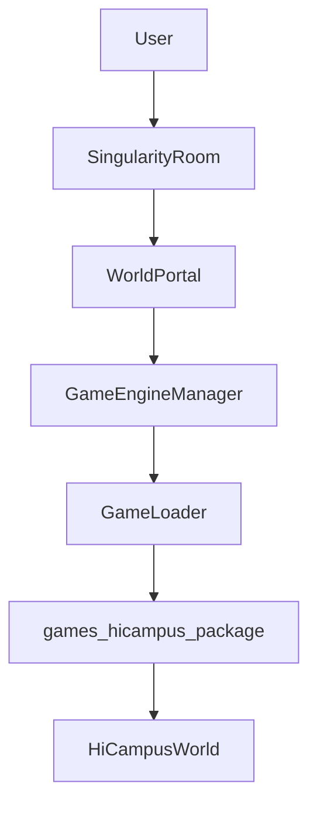
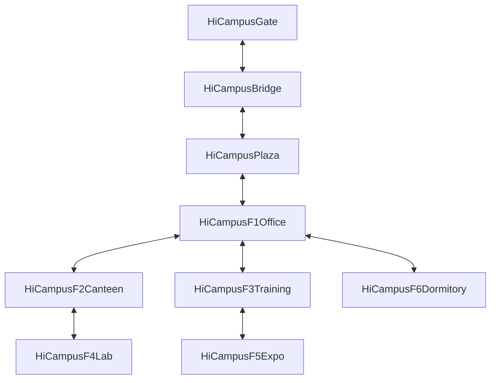
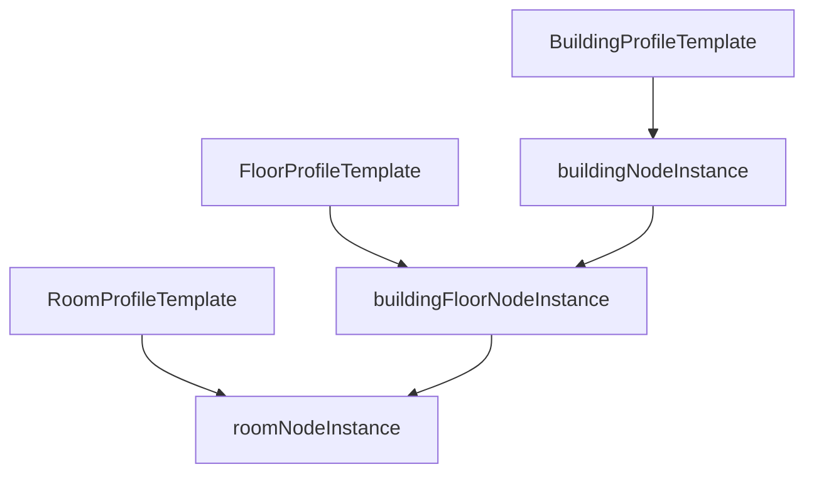
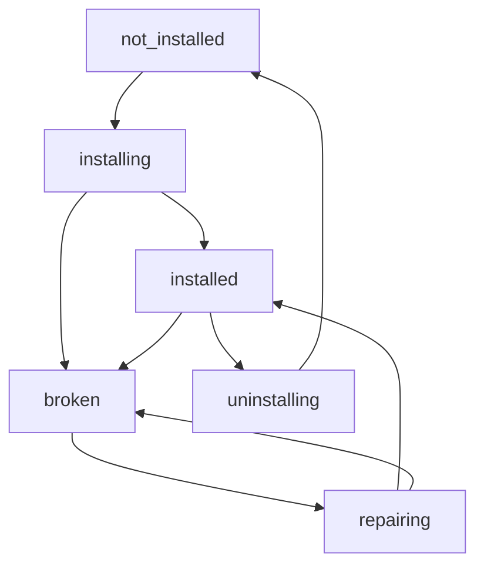

# games/hicampus SPEC

> **Architecture Role**: 本模块是能力服务层中的独立虚拟世界内容包，提供 `HiCampus` 场景定义与初始化规范。它遵循 CampusWorld 的“系统入口与世界内容解耦”原则：系统入口固定在 `SingularityRoom`，世界由 `GameLoader` 发现并加载。

## Module Overview

`games/hicampus/` 定义一个可安装的虚拟现实园区样例世界 `HiCampus`。  
该世界由以下核心空间组成：

- 一个大门（Gate）
- 一个长桥（Bridge）
- 一个中心广场（Central Plaza）
- 六栋建筑（F1~F6）

> 注：CampusWorld 是智慧园区 OS，不是传统游戏；本 SPEC 使用 MUD 术语仅用于表达世界语义和交互模型。

## Current Baseline Constraints

基于当前项目状态，`HiCampus` 需要在以下约束下定义：

1. 数据库最小种子当前主要覆盖账号、根节点（奇点屋）和基础系统对象，不包含完整园区世界样例（见 `backend/db/seed_data.py`）。
2. 世界内容应通过引擎加载器动态发现和加载，不应写死到系统启动主流程（见 `backend/app/game_engine/loader.py` 与 `backend/app/game_engine/manager.py`）。
3. 系统入口必须保持 `SingularityRoom`，`HiCampus` 只负责世界内空间与对象，不定义系统登录入口（与 `games/campus_life` 的边界一致）。

## Entry Boundary (System vs World)

- 系统层（SSH / Session / RootManager）只负责把用户带到 `SingularityRoom`。
- 世界层（`games/hicampus`）只定义世界内部：
  - 空间拓扑（room graph）
  - 建筑与对象语义
  - 世界内出生点与交互规则
- 用户通过“世界入口对象（world portal）”从 `SingularityRoom` 进入 `HiCampus`。



## Evennia Reference Mapping

本 SPEC 参考 Evennia 的三类实践并映射到 CampusWorld：

1. **Room/Exit 对象化**
   - Evennia 中出口是对象，且天然单向；双向通行需要两条出口。
   - 映射：`HiCampus` 拓扑中的每一条双向可达关系在实现层应落为两条有向边。
2. **Typeclass 化扩展**
   - Evennia 通过 typeclass 让行为扩展不依赖数据库结构变更。
   - 映射：CampusWorld 通过 `Node.type_code + typeclass + attributes/tags` 扩展世界对象语义。
3. **属性/标签驱动内容组织**
   - Evennia 使用 attributes/tags 组织对象行为与检索。
   - 映射：`HiCampus` 节点初始化字段统一沉淀在 `attributes`，并用 `tags` 支持检索与展示策略。

参考资料：
- [Evennia Exits](https://www.evennia.com/docs/latest/Components/Exits.html)
- [Evennia Typeclasses](https://evennia.com/docs/latest/Components/Typeclasses.html)

## World Topology Specification

### Spatial Layout

`HiCampus` 的主路径和建筑布局如下（方向语义为世界内标准方位）：

- 大门朝南（`hicampus_gate`）
- 大门向北到长桥（`hicampus_bridge`）
- 长桥向北到中心广场（`hicampus_plaza`）
- 广场正北为 F1（`hicampus_f1_office`）
- F1 西侧为 F2（`hicampus_f2_canteen`）
- F1 东侧为 F3（`hicampus_f3_training`）
- F2 南侧为 F4（`hicampus_f4_lab`）
- F3 南侧为 F5（`hicampus_f5_expo`）
- F1 北侧为 F6（`hicampus_f6_dormitory`）

> 所有上述关系默认定义为“双向可达”，即实现层应包含去程与回程两条有向出口。



### Required Location Nodes

| ID | 名称 | 类型 | 最小说明 |
|---|---|---|---|
| `hicampus_gate` | HiCampus 大门 | room | 世界入口地标，连接奇点屋入口对象 |
| `hicampus_bridge` | HiCampus 长桥 | room | 过渡空间，承接入口流量 |
| `hicampus_plaza` | HiCampus 中心广场 | room | 主枢纽节点，承接主导航 |
| `hicampus_f1_office` | F1 办公楼 | building | 23层办公综合体 |
| `hicampus_f2_canteen` | F2 食堂 | building | 3层餐饮服务建筑 |
| `hicampus_f3_training` | F3 培训中心 | building | 6层培训与会议建筑 |
| `hicampus_f4_lab` | F4 实验室 | building | 7层实验研发建筑 |
| `hicampus_f5_expo` | F5 展厅 | building | 3层展示与活动建筑 |
| `hicampus_f6_dormitory` | F6 宿舍 | building | 9层居住配套建筑 |

## Building Initialization Specification

以下建筑初始化描述以“高科技公司研发与办公园区”为场景基线，强调数字化办公、智能运维与研发协同。

### F1 - 办公楼（23层）

- 建筑定位：园区行政与运营中枢
- 楼层建议：
  - `1F-2F`：接待大厅、访客中心、安保前台
  - `3F-8F`：研发办公区（人事、财务、运营）
  - `9F-18F`：研发办公区
  - `19F-22F`：管理层与会议中心
  - `23F`：战略指挥与全景会议区
- 关键服务点：前台、访客闸机、会议预约终端、公告屏
- 建议标签：`building`, `office`, `admin`, `f1`

### F2 - 食堂（3层）

- 建筑定位：餐饮供给与社交用餐
- 楼层建议：
  - `1F`：大众窗口、快餐、自助取餐
  - `2F`：风味餐区与团体用餐区
  - `3F`：教工餐厅与后勤管理区
- 关键服务点：点餐终端、营养信息屏、高峰分流引导
- 建议标签：`building`, `canteen`, `dining`, `f2`

### F3 - 培训中心（6层）

- 建筑定位：培训、认证、学术活动
- 楼层建议：
  - `1F`：接待与课程服务台
  - `2F-4F`：标准培训教室与机房
  - `5F`：研讨室与项目工作坊
  - `6F`：报告厅与路演空间
- 关键服务点：课程签到终端、排课看板、设备借还点
- 建议标签：`building`, `training`, `education`, `f3`

### F4 - 实验室（7层）

- 建筑定位：实验、研发、测试验证
- 楼层建议：
  - `1F`：安全培训与样品收发
  - `2F-5F`：专题实验区（按学科/项目分区）
  - `6F`：联合研发区与测试区
  - `7F`：高等级设备间与监控中心
- 关键服务点：门禁控制点、实验预约终端、设备台账终端
- 建议标签：`building`, `lab`, `research`, `f4`

### F5 - 展厅（3层）

- 建筑定位：成果展示、来访接待、活动发布
- 楼层建议：
  - `1F`：常设展区与访客导览
  - `2F`：专题展区与互动体验区
  - `3F`：发布厅与小型活动空间
- 关键服务点：数字导览屏、展项交互终端、访客反馈台
- 建议标签：`building`, `expo`, `showcase`, `f5`

### F6 - 宿舍（9层）

- 建筑定位：居住与生活配套
- 楼层建议：
  - `1F`：门厅、值班室、生活服务点
  - `2F-8F`：标准住宿楼层
  - `9F`：公共活动与自习共享空间
- 关键服务点：门禁与访客登记、报修终端、公告栏
- 建议标签：`building`, `dormitory`, `residential`, `f6`

## Building Initial Descriptions (MUD Style)

以下文案用于建筑节点初始化时的 `display_name`、`short_desc`、`look_desc`。  
风格目标：可读、可感知、可交互提示，符合 MUD 中 `look` 的叙事习惯。

### F1 - 办公楼（`hicampus_f1_office`）

- `display_name`: `F1 大楼（总部办公中枢）`
- `short_desc`: `镜面玻璃与金属立面勾勒出总部轮廓，AI访客闸机与全息导览台在门厅同步运行。`
- `look_desc`:
  `你站在 F1 总部办公中枢的大堂入口。挑高中庭上方悬浮着实时运营看板，展示各研发线进度、算力占用与会议排程。前台已被智能接待台取代，访客通过人脸与临时凭证自动核验进入；西侧是高速分区电梯，东侧通往协同会议区与沉浸式战情室。这里没有喧闹，只有稳定流动的数据与高效的执行节奏。`
- `ambient_hints`:
  - `大厅上空的状态屏刷新“今日研发里程碑完成率”。`
  - `门禁终端发出轻微提示音，访客流程已自动通过。`

### F2 - 食堂（`hicampus_f2_canteen`）

- `display_name`: `F2 食堂（智能餐饮中心）`
- `short_desc`: `数字菜单墙与无感支付通道并列展开，餐线运转像一条稳定的服务流水线。`
- `look_desc`:
  `你来到 F2 智能餐饮中心。入口右侧的营养推荐屏根据工牌角色与时段给出套餐建议，取餐区采用动态分流屏引导队列，后厨状态以可视化面板实时公开。二层是主题餐区与轻社交空间，三层为安静用餐区和小型交流包间。这里不仅提供补给，更像研发团队在高压节奏中的短暂停靠站。`
- `ambient_hints`:
  - `你闻到现制咖啡和热餐混合的香气。`
  - `导引屏提示“当前排队预计 2 分钟”。`

### F3 - 培训中心（`hicampus_f3_training`）

- `display_name`: `F3 培训中心（学习与认证中心）`
- `short_desc`: `整面交互课程墙在你面前展开，技能路径、认证进度与实训排期一目了然。`
- `look_desc`:
  `你站在 F3 学习与认证中心大厅。课程服务台已与企业学习平台打通，员工可在终端一键预约训练营、技术认证和跨团队分享。二至四层分布标准培训教室与实操机房，五层是项目复盘与工作坊空间，六层设有发布级报告厅。这里的每一次签到都对应能力图谱的一次更新。`
- `ambient_hints`:
  - `课程墙弹出“新晋升路径已解锁”的提示。`
  - `签到闸机亮起绿色光带，记录已同步到学习系统。`

### F4 - 实验室（`hicampus_f4_lab`）

- `display_name`: `F4 实验室（研发验证中心）`
- `short_desc`: `多级门禁后方是安静而精密的实验走廊，设备状态屏持续滚动关键指标。`
- `look_desc`:
  `你进入 F4 研发验证中心入口区。安全看板显示今日风险等级与准入规则，样品流转柜、设备预约台和实验日志终端形成标准化闭环。二至五层分布各类专项实验区，六层是跨团队联合验证平台，七层为高等级设备与监控中心。这里的每一步操作都可追溯、可审计、可复现。`
- `ambient_hints`:
  - `系统提示“本时段实验室环境参数稳定”。`
  - `远处传来自动机械臂完成归位的轻响。`

### F5 - 展厅（`hicampus_f5_expo`）

- `display_name`: `F5 展厅（技术体验与品牌中心）`
- `short_desc`: `沉浸式光幕与交互展台依次点亮，技术叙事从入口就开始展开。`
- `look_desc`:
  `你步入 F5 技术体验与品牌中心。入口主屏以实时数据展示公司核心产品运行态势，常设展区呈现关键技术演进，互动区可直接体验原型能力与场景模拟。二层是主题巡展区，三层为发布与路演空间。这里既是对外窗口，也是团队向未来对齐愿景的现场。`
- `ambient_hints`:
  - `导览系统提示“产品演示将在 5 分钟后开始”。`
  - `靠近展台时，全息说明自动切换到当前语言。`

### F6 - 宿舍（`hicampus_f6_dormitory`）

- `display_name`: `F6 宿舍（人才公寓）`
- `short_desc`: `门厅采用无接触门禁与智能管家终端，空间安静而有秩序。`
- `look_desc`:
  `你来到 F6 人才公寓一层。访客登记、报修工单和生活服务已汇聚到同一块智能管家屏；电梯厅旁的电子公告实时更新通勤班车、园区活动和夜间服务信息。二至八层为标准居住单元，九层设置共享休闲与自习空间。这里是高强度研发节奏之后，团队恢复与连接的缓冲区。`
- `ambient_hints`:
  - `管家终端提示“你有一条新的生活服务通知”。`
  - `楼层指示屏显示“共享空间当前占用率 37%”。`

## Decoupled Description Model (Building/Floor/Room)

为支持图数据节点实例化，描述层必须与实例层解耦。  
同一套描述模板可复用于批量生成 `building`、`building_floor`、`room` 三类节点。

### Layered Content Units

1. **BuildingProfile（楼栋模板）**
   - 描述建筑身份与全局语义，不包含具体房间细节。
2. **FloorProfile（楼层模板）**
   - 描述楼层功能分区与公共氛围，不绑定具体房间实例 ID。
3. **RoomProfile（房间模板）**
   - 描述房间用途、可交互点、访问策略，供实例化时批量复制。



### Template Data Contract

#### BuildingProfile

```json
{
  "template_type": "building_profile",
  "world_id": "hicampus",
  "building_code": "F1",
  "display_name": "F1 大楼（总部办公中枢）",
  "short_desc": "镜面玻璃与金属立面勾勒出总部轮廓。",
  "look_desc": "......",
  "floors_total": 23,
  "zone_tags": ["building", "office", "f1"]
}
```

#### FloorProfile

```json
{
  "template_type": "floor_profile",
  "world_id": "hicampus",
  "building_code": "F1",
  "floor_no": 5,
  "floor_zone_type": "office",
  "display_name": "F1-5F 研发办公层",
  "short_desc": "安静的开放工位与协作岛并列分布。",
  "look_desc": "......",
  "recommended_room_templates": ["open_workspace", "focus_pod", "meeting_room_m"]
}
```

#### RoomProfile

```json
{
  "template_type": "room_profile",
  "template_code": "meeting_room_m",
  "room_type": "meeting_room",
  "display_name": "中型会议室",
  "short_desc": "弧形屏幕与远程会议终端已就绪。",
  "look_desc": "......",
  "interaction_points": ["screen_terminal", "booking_panel"],
  "access_policy": "employee_or_invited"
}
```

## Floor and Room Specifications

以下为 V1 可直接落地的“楼层分区 + 典型房间”清单。  
说明：不要求 V1 一次性创建全部房间实例，但每层至少应有一个“公共走廊节点 + 1~3 个功能房间节点”。

### F1 办公楼（23层）

- `1F`: 总部大堂层
  - 房间：`f1_1f_reception_lobby`、`f1_1f_visitor_checkin`、`f1_1f_security_hub`
- `2F`: 客户与品牌接待层
  - 房间：`f1_2f_client_center`、`f1_2f_show_meeting_room`
- `3F-8F`: 职能与运营办公层
  - 房间模板：`open_workspace`、`focus_room`、`ops_war_corner`、`meeting_room_s`
- `9F-18F`: 研发办公层
  - 房间模板：`engineering_workspace`、`daily_standup_area`、`architecture_room`
- `19F-22F`: 管理与决策层
  - 房间模板：`executive_office`、`strategy_meeting_room`、`board_room`
- `23F`: 战情与全景会议层
  - 房间：`f1_23f_command_center`、`f1_23f_panorama_room`

### F2 食堂（3层）

- `1F`: 快速供餐层
  - 房间：`f2_1f_fast_line`、`f2_1f_coffee_bar`、`f2_1f_self_checkout`
- `2F`: 主题餐饮层
  - 房间：`f2_2f_flavor_hall`、`f2_2f_social_tables`
- `3F`: 安静用餐与小型交流层
  - 房间：`f2_3f_quiet_dining`、`f2_3f_team_lunch_room`

### F3 培训中心（6层）

- `1F`: 学习服务层
  - 房间：`f3_1f_learning_desk`、`f3_1f_checkin_gate`
- `2F-4F`: 教室与实操层
  - 房间模板：`training_room_std`、`hands_on_lab`、`exam_room`
- `5F`: 工作坊层
  - 房间：`f3_5f_workshop_a`、`f3_5f_retro_room`
- `6F`: 报告发布层
  - 房间：`f3_6f_auditorium`、`f3_6f_speaker_ready_room`

### F4 实验室（7层）

- `1F`: 安全与收发层
  - 房间：`f4_1f_safety_briefing`、`f4_1f_sample_receiving`
- `2F-5F`: 专项实验层
  - 房间模板：`experiment_room`、`instrument_room`、`buffer_storage`
- `6F`: 联合验证层
  - 房间：`f4_6f_joint_validation_lab`、`f4_6f_debug_room`
- `7F`: 高等级设备与监控层
  - 房间：`f4_7f_core_device_room`、`f4_7f_monitor_center`

### F5 展厅（3层）

- `1F`: 常设展层
  - 房间：`f5_1f_permanent_gallery`、`f5_1f_visitor_guide_desk`
- `2F`: 专题体验层
  - 房间：`f5_2f_theme_zone`、`f5_2f_interaction_lab`
- `3F`: 发布活动层
  - 房间：`f5_3f_launch_stage`、`f5_3f_media_briefing_room`

### F6 人才公寓（9层）

- `1F`: 公寓服务层
  - 房间：`f6_1f_resident_lobby`、`f6_1f_property_service_desk`
- `2F-8F`: 居住层
  - 房间模板：`residential_unit`、`shared_pantry`、`laundry_point`
- `9F`: 共享活动层
  - 房间：`f6_9f_study_lounge`、`f6_9f_recreation_space`

## Room Description Templates (MUD Style)

以下模板用于批量创建房间实例，实例化时仅替换建筑/楼层/房间名与少量业务字段。

- `open_workspace`
  - `short_desc`: `成排工位与协作屏构成开放办公区，键盘声与低声讨论交织。`
  - `look_desc`: `你来到开放办公区。桌面终端显示各项目看板，墙上的节奏屏标记着当天目标。这里强调协同与响应速度，任何问题都能在几分钟内找到对应负责人。`
- `meeting_room_s`
  - `short_desc`: `一间紧凑的会议室，预约状态灯显示“空闲”。`
  - `look_desc`: `你进入小型会议室。圆桌中央嵌入无线投屏面板，墙面白板保留着上一轮方案推演的关键箭头。适合站会、快速评审和技术对齐。`
- `engineering_workspace`
  - `short_desc`: `多屏开发工位沿窗排开，状态灯按分支环境显示不同颜色。`
  - `look_desc`: `你站在研发工位区。远端协作屏实时同步提交记录和构建状态，桌边的设备扩展坞连接着调试终端。这里是代码与系统行为被反复验证的地方。`
- `experiment_room`
  - `short_desc`: `实验台整齐排列，安全灯条在设备上方缓慢闪烁。`
  - `look_desc`: `你进入实验间。每台设备旁都挂有电子操作卡和追溯码，环境监测面板显示温湿度与风险阈值。任何实验动作都被系统记录并可回放审计。`
- `training_room_std`
  - `short_desc`: `标准培训教室内，讲台终端已连接课程平台。`
  - `look_desc`: `你来到标准培训室。前排交互屏可实时收集学员反馈，后排桌面配有实操接口。这里用于新员工训练、技术认证和跨团队知识同步。`
- `residential_unit`
  - `short_desc`: `紧凑而整洁的居住单元，门侧屏显示空气与能耗状态。`
  - `look_desc`: `你进入居住单元。窗边有一张可升降工作桌，墙面终端可一键连接园区服务。这里提供研发人员在高强度节奏后的稳定休整空间。`

## Suggested type_code Catalog

以下为 `HiCampus` 初始化建议的 `type_code`，用于统一实例创建、查询与展示策略。  
原则：先复用已有通用类型；新增类型采用“语义明确、稳定可扩展”的命名。

### Core World Types

| type_code | 用途 | 说明 |
|---|---|---|
| `world` | 世界根节点 | `HiCampus` 世界主节点（可复用现有） |
| `room` | 通用空间节点 | 大门/长桥/广场/走廊等（可复用现有） |
| `building` | 楼栋节点 | F1~F6 楼栋实例（可复用现有） |
| `building_floor` | 楼层节点 | F1-1F、F4-6F 等楼层实例（建议启用） |

### Suggested Room Subtypes (recommended new)

| type_code | 对应空间 | 示例 |
|---|---|---|
| `office_room` | 办公功能房间 | `open_workspace`, `executive_office` |
| `meeting_room` | 会议房间 | `meeting_room_s`, `board_room` |
| `training_room` | 培训房间 | `training_room_std`, `exam_room` |
| `lab_room` | 实验房间 | `experiment_room`, `instrument_room` |
| `expo_room` | 展陈房间 | `permanent_gallery`, `theme_zone` |
| `residential_room` | 居住房间 | `residential_unit` |
| `service_room` | 服务保障房间 | `property_service_desk`, `security_hub` |

### Interaction/Facility Types (optional)

| type_code | 用途 | 示例对象 |
|---|---|---|
| `world_portal` | 世界入口对象 | `world_portal_hicampus` |
| `access_terminal` | 门禁/登记终端 | `visitor_checkin_terminal` |
| `display_terminal` | 信息展示终端 | `ops_dashboard_screen` |
| `service_terminal` | 生活/报修/预约终端 | `property_service_terminal` |

### Naming Convention Recommendations

- 世界级节点：`hicampus_*` 前缀，例如 `hicampus_plaza`
- 楼层节点：`f{building}_{floor}f_*`，例如 `f1_23f_command_center`
- 房间节点：`f{building}_{floor}f_{room_slug}`，例如 `f4_6f_joint_validation_lab`
- type_code 命名：小写蛇形，优先语义名词，避免业务阶段词（如 `temp_room`）

### type_code Default Visibility/Lock Mapping

以下映射用于初始化 `Node.attributes.presentation_domains` 与 `Node.attributes.access_locks`。

| type_code | presentation_domains | access_locks（建议默认） | 说明 |
|---|---|---|---|
| `world` | `["system"]` | `{"view":"all()","interact":"perm(world.enter)"}` | 世界元信息通常不在房间内直接展示 |
| `room` | `["room"]` | `{"view":"all()","interact":"all()"}` | 通用空间节点 |
| `building` | `["room"]` | `{"view":"all()","interact":"all()"}` | 楼栋入口可见可进入 |
| `building_floor` | `["room"]` | `{"view":"all()","interact":"perm(world.floor.enter)"}` | 楼层可按策略限制进入 |
| `office_room` | `["room"]` | `{"view":"all()","interact":"perm(office.access)"}` | 办公区建议权限化 |
| `meeting_room` | `["room"]` | `{"view":"all()","interact":"perm(meeting.access)"}` | 会议室可叠加预约检查 |
| `training_room` | `["room"]` | `{"view":"all()","interact":"perm(training.access)"}` | 培训室可按课程开放 |
| `lab_room` | `["room"]` | `{"view":"all()","interact":"perm(lab.access)"}` | 实验室默认更严格 |
| `expo_room` | `["room"]` | `{"view":"all()","interact":"all()"}` | 展陈空间通常开放 |
| `residential_room` | `["room"]` | `{"view":"perm(resident)","interact":"perm(resident)"}` | 居住区默认受限 |
| `service_room` | `["room"]` | `{"view":"all()","interact":"perm(service.access)"}` | 服务空间按岗位权限 |
| `world_portal` | `["room"]` | `{"view":"all()","interact":"all()"}` | 奇点屋入口对象 |
| `access_terminal` | `["room"]` | `{"view":"all()","interact":"perm(access.terminal.use)"}` | 门禁/登记终端 |
| `display_terminal` | `["room"]` | `{"view":"all()","interact":"all()"}` | 展示终端可读为主 |
| `service_terminal` | `["room"]` | `{"view":"all()","interact":"perm(service.terminal.use)"}` | 报修/服务终端 |

> 注：上述 `perm(...)` 为策略表达示例，实际权限点需与命令策略系统统一命名。

## Suggested Relationship Types for Graph Seeding

为保持世界、楼栋、楼层、房间的层级与导航一致性，建议在 seed 阶段统一使用以下关系语义。

| rel_type_code | source -> target | 含义 | 是否有向 |
|---|---|---|---|
| `contains` | world/building/floor -> child node | 层级包含关系 | 是 |
| `located_in` | room/object -> parent space | 所在关系（contains 的逆向表达） | 是 |
| `connects_to` | room -> room | 可通行连接（出口） | 是 |
| `has_entry` | building -> entry room | 楼栋入口绑定 | 是 |
| `served_by` | room -> terminal/service node | 空间被服务节点支撑 | 是 |
| `adjacent_to` | room <-> room | 语义相邻关系（非必然可通行） | 否（可双向建边） |

### Relationship Usage Rules

- 导航只依赖 `connects_to`，不要用 `adjacent_to` 代替可通行关系。
- 若需要双向移动，必须创建两条 `connects_to`（A->B 与 B->A）。
- 层级树推荐：`world -> building -> building_floor -> room`，对应连续 `contains`。
- 若系统要求快速回溯父节点，可同时写入 `located_in`，避免运行时反查。

## Minimal Data Contract (for Seed/Loader)

`HiCampus` 中每个核心节点建议具备以下最小属性（写入 `Node.attributes`）：

```json
{
  "world_id": "hicampus",
  "display_name": "HiCampus F1 办公楼",
  "entity_kind": "room_or_building",
  "zone_type": "gate|bridge|plaza|building",
  "building_code": "F1",
  "floors": 23,
  "entry_policy": "public",
  "navigation_weight": 1,
  "presentation_domains": ["room"],
  "access_locks": {"view": "all()", "interact": "all()"}
}
```

说明：
- `gate/bridge/plaza` 节点可省略 `building_code` 与 `floors`。
- `F1~F6` 必须声明 `building_code` 与 `floors`，且楼层数分别为 `23/3/6/7/3/9`。

## Decoupling and Installability Specification

### Pluggable World Package

`HiCampus` 作为可安装世界，应满足：

1. 包结构符合 `GameLoader` 发现规则（目录存在 `__init__.py` 和 `game.py`）。
2. 世界对外暴露统一实例获取入口（如 `get_game_instance`）。
3. 生命周期遵循 `initialize_game -> start -> stop -> get_game_info`。
4. 支持 `load/unload/reload`，不要求修改系统入口代码。

### Independent Data Directory (Mandatory)

`HiCampus` 数据必须采用独立目录承载，不与系统初始化 seed 混用。  
即：`backend/db/seed_data.py` 只保留“系统最小可运行集”，不直接包含 `HiCampus` 楼栋/楼层/房间实例数据。

建议目录结构：

```text
backend/app/games/hicampus/
  ├── __init__.py
  ├── game.py
  ├── data/
  │   ├── world.yaml
  │   ├── buildings.yaml
  │   ├── floors.yaml
  │   ├── rooms.yaml
  │   └── relationships.yaml
  └── loader.py
```

约束规则：

1. `HiCampus` world 数据文件只放在 `games/hicampus/data/`（或同级独立目录），禁止拷贝到全局 seed。
2. 世界安装/卸载只影响 `HiCampus` 自身数据，不影响 `seed_minimal` 执行结果。
3. `seed_minimal` 不创建 `HiCampus` 内容节点；`HiCampus` 节点由其专属 loader 在安装或首次加载时创建。
4. `HiCampus` 的版本升级通过自身数据目录迁移（world-scoped migration）完成，不走全局初始 seed 脚本。

### World Installation Command Specification

为支持“按世界安装/卸载/修复”，建议新增管理员命令族：`world`。  
该命令族仅操作指定世界，不修改全局 seed 数据。

#### Command Set

| 命令 | 说明 | 典型结果 |
|---|---|---|
| `world list` | 列出可发现世界及安装状态 | 显示 `hicampus: installed|not_installed|broken` |
| `world install <world_id>` | 安装指定世界（创建节点与关系） | `installed world hicampus` |
| `world uninstall <world_id>` | 卸载指定世界（删除/停用世界节点） | `uninstalled world hicampus` |
| `world reload <world_id>` | 重新加载世界包与运行时对象 | `reloaded world hicampus` |
| `world status <world_id>` | 查看世界状态与数据健康 | 显示版本、节点数、关系数、数据目录校验 |
| `world repair <world_id>` | 基于独立数据目录修复缺失节点/关系 | `repaired world hicampus` |
| `world validate <world_id>` | 校验拓扑与必需节点完整性 | 输出通过/失败项清单 |

#### Syntax Rules

```text
world list
world install <world_id> [--from <path>] [--force]
world uninstall <world_id> [--keep-data]
world reload <world_id>
world status <world_id> [--verbose]
world repair <world_id> [--dry-run]
world validate <world_id> [--strict]
```

语法约束：

1. `<world_id>` 必须是小写字母、数字、下划线组合（示例：`hicampus`）。
2. `--from <path>` 仅允许指向世界独立目录，不允许指向全局 seed 文件。
3. `--force` 仅用于覆盖“已安装但不一致”状态，必须写审计日志。
4. `--dry-run` 不落库，只输出将执行的修复动作清单。

#### Permission Requirements

| 命令 | 最低权限建议 |
|---|---|
| `world list` | `admin.world.read` |
| `world status` | `admin.world.read` |
| `world validate` | `admin.world.read` |
| `world install` | `admin.world.install` |
| `world reload` | `admin.world.reload` |
| `world repair` | `admin.world.repair` |
| `world uninstall` | `admin.world.uninstall` |

#### State Machine



状态定义：

- `not_installed`: 世界包可发现但未创建数据实例
- `installed`: 世界数据完整且可进入
- `broken`: 世界包存在但数据不完整或校验失败
- `installing/uninstalling/repairing`: 过程态，仅在命令执行期间出现

#### Output Contract (Terminal)

成功输出建议格式：

```text
[OK] world.install
world_id: hicampus
status: installed
nodes_created: 286
relationships_created: 544
version: 1.0.0
```

失败输出建议格式：

```text
[ERROR] world.install
world_id: hicampus
error_code: WORLD_DATA_INVALID
message: required file rooms.yaml missing
hint: run `world repair hicampus --dry-run`
```

#### Error Codes (recommended)

| error_code | 含义 |
|---|---|
| `WORLD_NOT_FOUND` | 目标世界包不可发现 |
| `WORLD_ALREADY_INSTALLED` | 安装命令命中已安装世界 |
| `WORLD_NOT_INSTALLED` | 卸载/重载/修复命中未安装世界 |
| `WORLD_DATA_UNAVAILABLE` | 独立数据目录不存在或不可读 |
| `WORLD_DATA_INVALID` | 数据文件结构或必填字段不合法 |
| `WORLD_TOPOLOGY_INVALID` | 必需节点/关系缺失或方向错误 |
| `WORLD_PERMISSION_DENIED` | 当前用户权限不足 |
| `WORLD_BUSY` | 世界处于安装/卸载/修复过程态 |
| `WORLD_INTERNAL_ERROR` | 未分类内部错误 |

#### HiCampus Install Validation Baseline

执行 `world validate hicampus --strict` 时，至少检查：

1. 核心节点存在：`hicampus_gate`、`hicampus_bridge`、`hicampus_plaza`、`hicampus_f1~f6_*`
2. 楼层总数与配置一致：`23/3/6/7/3/9`
3. 双向通行关系完整：所有主路径连接均有 A->B 与 B->A
4. 世界入口可达：从奇点屋入口对象可进入 `hicampus_gate`
5. 数据来源校验：节点来源标记为 `games/hicampus/data/*`，非全局 seed

#### Audit and Idempotency

- `world install hicampus` 必须幂等：重复执行不生成重复核心节点。
- `world uninstall hicampus` 应支持软卸载（`is_active=false`）或硬卸载（二选一并在实现中固定）。
- 所有写命令记录审计字段：`operator`, `world_id`, `action`, `timestamp`, `summary`。

### Entry Through SingularityRoom

- `SingularityRoom` 只负责承载入口对象（如 `world_portal_hicampus`）。
- 进入动作触发“加载并切换到 HiCampus 世界出生点”的流程。
- 世界默认出生点建议设为 `hicampus_gate`，用于形成“入口 -> 过桥 -> 广场 -> 功能区”的认知路径。

### Failure/Degradation

- 若 `HiCampus` 包未安装：入口对象应提示“世界未安装”，并保留在奇点屋。
- 若加载失败：入口对象应返回可读错误并记录日志，不中断 SSH 会话。
- 若世界内目标节点缺失：回退到 `hicampus_gate` 或返回奇点屋（按系统策略二选一，必须一致）。
- 若 `HiCampus` 独立数据目录缺失或损坏：入口对象返回“world data unavailable”，并提示管理员执行世界级修复/重装。

## User Stories

1. 用户在奇点屋通过世界入口进入 `HiCampus`，出生在大门并可继续探索。
2. 用户可沿“长桥 -> 中心广场 -> 各建筑”进行连续移动，且路径可逆。
3. 用户可感知 6 栋建筑的差异化语义（办公/食堂/培训/实验/展厅/宿舍）。
4. 管理员可卸载 `HiCampus` 而不影响系统入口层运行。

## Acceptance Criteria

- [ ] `HiCampus` 内容包可被 `GameLoader.discover_games()` 发现。
- [ ] `HiCampus` 内容包可被 `load_game("hicampus")` 成功加载并启动。
- [ ] `HiCampus` 数据来源于独立目录，未写入全局 `seed_data.py`。
- [ ] 从奇点屋可通过入口对象进入 `HiCampus`。
- [ ] 世界中存在 9 个核心节点（Gate/Bridge/Plaza/F1~F6）。
- [ ] 拓扑关系符合方位约束（含你定义的 F1-F6 相对关系）。
- [ ] 每条双向可达关系在实现层有两条有向出口/边。
- [ ] 六栋建筑楼层数准确：F1=23, F2=3, F3=6, F4=7, F5=3, F6=9。
- [ ] 卸载 `HiCampus` 后，不影响奇点屋与其他世界入口使用。
- [ ] 未安装或加载失败时，交互可降级且会话不崩溃。
- [ ] `seed_minimal` 在无 `HiCampus` 数据时仍可独立成功执行。

## Design Decisions

1. **先定义样例世界 SPEC，再落实现代码**：降低数据模型与入口流程耦合风险。
2. **中心广场作为主枢纽**：简化导航心智并利于后续扩展更多建筑。
3. **建筑分层只定义语义，不强行一次性建完所有子房间**：满足 YAGNI，先保障骨架可运行。
4. **奇点屋固定系统边界**：维持系统稳定入口，支持未来挂载多个虚拟世界。
5. **世界数据目录独立**：避免业务场景数据污染系统 seed，确保世界可插拔与可回滚。

## Open Questions

- [ ] `HiCampus` 初始安装是“开箱自动发现”还是“管理员显式启用”？
- [ ] 世界入口权限是否允许匿名/访客访问，还是需登录后授权？
- [ ] 建筑内部子房间（如 F4 具体实验室）是否在 V1 一并初始化？
- [ ] 多世界并存时，用户会话跨世界状态（背包/任务）如何隔离？

## Feature Decomposition (Implementation Backlog)

基于本 SPEC，建议将开发拆解为可独立交付的特性集合。  
每个特性均可单独测试、单独回归，并可按优先级逐步上线。

### F01 - World Package Runtime（虚拟世界包运行时）

- **目标**: 让 `HiCampus` 作为独立 world package 被发现、加载、卸载、重载。
- **边界**:
  - 覆盖 `GameLoader` 与 `games/hicampus/*` 的运行时契约
  - 不触碰 `seed_minimal` 最小系统种子语义
- **主要产物**:
  - `games/hicampus` 包入口与生命周期实现约束
  - 世界状态对象与运行时注册信息
- **验收重点**:
  - `discover/load/unload/reload` 行为稳定
  - 世界异常不影响系统主入口

### F02 - World Data Package（独立世界数据包）

- **目标**: 将 `HiCampus` 数据完全托管到独立目录，不与全局 seed 混用。
- **边界**:
  - `games/hicampus/data/*` 的 schema 与版本化策略
  - world-scoped migration，不进入全局 init seed
- **主要产物**:
  - `world/buildings/floors/rooms/relationships` 数据文件规范
  - 数据版本号与变更记录策略
- **验收重点**:
  - `seed_minimal` 在无 HiCampus 数据时可独立成功
  - 独立数据目录缺失时可降级并返回明确错误

### F03 - Graph Seeding Pipeline（图实例化流水线）

- **目标**: 基于 Building/Floor/Room 模板批量生成图节点与关系。
- **边界**:
  - 只负责实例创建与幂等更新
  - 不负责命令交互与入口路由逻辑
- **主要产物**:
  - 模板解析器（BuildingProfile/FloorProfile/RoomProfile）
  - 节点/关系写入器（`type_code` 与 `rel_type_code` 映射）
- **验收重点**:
  - 重复执行不产生重复核心节点
  - 楼层与房间数量符合配置且可追溯来源

### F04 - World Management Commands（系统命令特性）

- **目标**: 提供世界级运维命令 `world`（安装、卸载、修复、校验、状态）。
- **边界**:
  - 命令层、权限校验、输出契约、错误码
  - 不直接绑定具体世界业务细节（可复用到其他世界）
- **主要产物**:
  - `world list/install/uninstall/reload/status/repair/validate` 命令实现
  - 权限点与审计日志落地
- **验收重点**:
  - 命令输出符合 SPEC 契约
  - 错误码一致且可操作（含 `--dry-run`、`--force`）

### F05 - World Entry Integration（奇点屋入口集成）

- **目标**: 在奇点屋提供统一世界入口对象，支持进入 `HiCampus`。
- **边界**:
  - 入口对象语义与跳转逻辑
  - 不改变 SSH 登录流程本身
- **主要产物**:
  - `world_portal_hicampus` 入口对象规范
  - 进入世界时的 fallback 策略（数据缺失/加载失败）
- **验收重点**:
  - 从奇点屋可达 `hicampus_gate`
  - 失败时回退策略稳定、会话不中断

### F06 - Topology Validation & Repair（拓扑校验与修复）

- **目标**: 保证世界拓扑、双向边、核心节点、楼层数据长期一致。
- **边界**:
  - 校验器与修复器逻辑
  - 不负责 UI 展示
- **主要产物**:
  - 严格校验规则集（strict mode）
  - 自动修复策略与修复报告
- **验收重点**:
  - 能识别并修复缺失边、错向边、缺失核心节点
  - 修复过程可审计且支持 dry-run

### F07 - MUD Description Content Pack（描述内容包）

- **目标**: 将楼栋/楼层/房间描述从代码中抽离，形成可迭代内容资产。
- **边界**:
  - 文案模板与多层描述策略（brief/short/look/ambient）
  - 不耦合具体命令执行代码
- **主要产物**:
  - 房间描述模板库（MUD 风格）
  - 内容版本管理与回滚策略
- **验收重点**:
  - 描述可批量应用到节点实例
  - 文案升级不影响图结构与关系稳定性

### F08 - Observability & Audit（观测与审计）

- **目标**: 让世界安装、进入、失败、修复全流程可追踪。
- **边界**:
  - 日志事件与审计字段规范
  - 不扩展业务命令范围
- **主要产物**:
  - world 管理事件日志（install/uninstall/repair/validate）
  - 用户进入世界行为日志（portal enter / fallback）
- **验收重点**:
  - 关键路径有统一 event name 和字段
  - 可按 `world_id` 快速排障

## Suggested Delivery Order

推荐按以下顺序分期，确保每阶段都可独立验收：

1. `F01 + F02`: 先打通世界包与独立数据目录
2. `F03`: 再完成模板到图实例化流水线
3. `F05`: 接入奇点屋入口，形成端到端可进入路径
4. `F04 + F06`: 上线系统运维命令与校验修复能力
5. `F07 + F08`: 完成内容资产化和观测审计闭环

## Milestone Mapping

- **M1 (可进入)**: `F01/F02/F03/F05`
  - 目标：能安装并进入 HiCampus，具备最小可用世界。
- **M2 (可运维)**: `F04/F06`
  - 目标：世界可通过系统命令管理并自动校验修复。
- **M3 (可演进)**: `F07/F08`
  - 目标：描述与数据可独立迭代，且全链路可观测。

## Feature Documents (Parallel Delivery)

并行开发请以以下独立特性文档为准：

- `docs/games/hicampus/SPEC/features/F01_WORLD_PACKAGE_RUNTIME.md`
- `docs/games/hicampus/SPEC/features/F02_WORLD_DATA_PACKAGE.md`
- `docs/games/hicampus/SPEC/features/F03_GRAPH_SEED_PIPELINE.md`
- `docs/games/hicampus/SPEC/features/F04_WORLD_MANAGEMENT_COMMANDS.md`
- `docs/games/hicampus/SPEC/features/F05_WORLD_ENTRY_INTEGRATION.md`
- `docs/games/hicampus/SPEC/features/F06_TOPOLOGY_VALIDATE_REPAIR.md`
- `docs/games/hicampus/SPEC/features/F07_MUD_DESCRIPTION_CONTENT_PACK.md`
- `docs/games/hicampus/SPEC/features/F08_OBSERVABILITY_AUDIT.md`
- 索引：`docs/games/hicampus/SPEC/features/INDEX.md`
