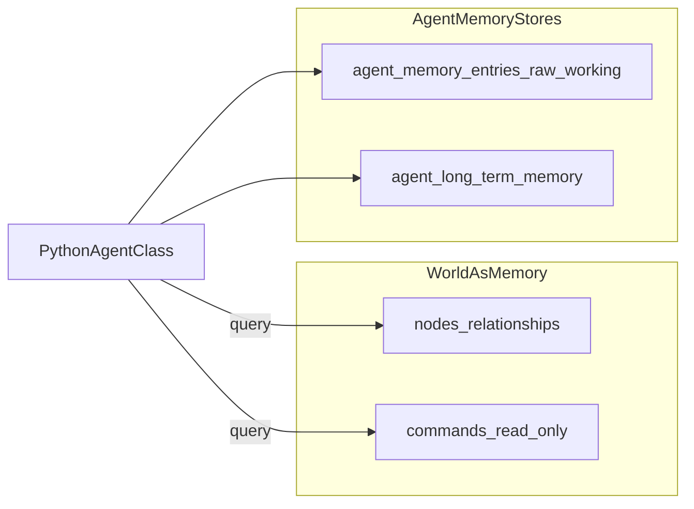

# F02 — Intelligent Agent Service（`npc_agent` 扩展）SPEC

> **For agentic workers:** 实现本 SPEC 时请与 [`docs/command/SPEC/SPEC.md`](../../../command/SPEC/SPEC.md)、[`F01`](../../../database/SPEC/features/F01_TRAIT_CLASS_MASK_FOR_AGENT.md)、[`F10`](../../../api/SPEC/features/F10_ONTOLOGY_AND_GRAPH_API.md)、[`F11`](../../../api/SPEC/features/F11_DATA_ACCESS_POLICY_FOR_GRAPH_API.md) 交叉评审；DDL 变更需走 `schema_migrations.py`。

**文档状态：RC — 2026-04-09**（与实现里程碑对齐；定稿时改为 Accepted）

**Changelog：** 2026-04-09 — 与 ADR-F02-*（Agent 运行时、记忆晋升、PDCA 认知）及 Phase B/C 首版实现对齐。

**Architecture Role：** 在知识本体中，将 **`type_code=npc_agent`** 的节点定义为可配置的 **智能体服务**（及叙事 NPC）载体：通过 **思维模型**、**命令/工具** 与 **独立记忆/运行表** 表达「类用户 Actor」的自主行为能力；**默认**经 **命令系统** 读写本体，语义世界（图），与 F10 Graph API 解耦。

---

## 1. Goal

- 用 **单一节点类型** `npc_agent`（Python：[`NpcAgent`](../../../../backend/app/models/things/agents.py)）承载 **智能体服务** 与 **叙事 NPC**，通过 **`agent_role`** 等静态字段区分。
- 为内置与第三方Agent（如知识采集、 知识维护、 知识反哺、 自主具身控制、 物理设备巡检、 能效优化管理等等）提供 **可评审的 JSON Schema**（类型层 + 实例静态配置）。
- **记忆与处理过程**不写入 `nodes.attributes` 大字段，而写入 **独立关系表**（见 §9）。
- **默认**拟人化通过 **[命令接口](../../../../backend/app/api/v1/endpoints/command.py)**（SSH 与 `POST /api/v1/command/execute` **同源语义**）完成 **查知识、造实例、建关系、执行策略**；降低 Agent 后端对「直接拼 LLM + REST」的心智负担（见 §5、§6）。

## 2. Non-Goals（v1）

- 不在本 SPEC 中规定 **通用 LLM 网关** 实现细节（仅 `model_config` 形状与引用）。
- 不替代 **世界包安装 / graph seed** 流水线（见 HiCampus F03）。
- 不要求 v1 即实现 **向量记忆**；可作为 Phase 2（与「记忆分层、长期维护」逻辑可并行演进）。
- **自然语言** 不是唯一输入形态：Agent 可将任务意图转为计划，在计划中调用命令、MCP 或外部 API 使用工具；**CampusWorld 系统内部**默认 **内置命令** + 结构化 `args` + 注册表。
- 不在 v1 强制绑定某一外部 **记忆向量库** 实现；可参考 OpenClaw 等公开模式做 **逻辑分层**，物理存储以本 SPEC DDL 为准。

---

## 3. Agent 本体定义

### 3.0 与 CampusWorld Agent 四层架构的对照（F09）

全局 **L1–L4** 定义、双视角图示及与 F06/F07/F08 的边界见 [**F09 — CampusWorld Agent 四层架构**](F09_CAMPUSWORLD_AGENT_ARCHITECTURE_FOUR_LAYERS.md)（规范真源）。与本 SPEC 的 **粗略对应**：

| F09 层 | 与 F02 的常见对应 |
|--------|-------------------|
| **L1** 类型与数据 | 图 `nodes` / `relationships`、NodeType、本体规则与策略客体 |
| **L2** 命令工具 | **命令优先**、注册表、`RegistryToolExecutor` / `tool_allowlist`（见 §4–§6） |
| **L3** Agent 思考模型 | **思维模型**（如 PDCA）、`ThinkingFramework` / Worker 运行时（§9 `agent_run_records.phase`） |
| **L4** 经验 Skill | 语义世界可引用的 **经验/剧本**（命令或注入）；**不是** F07 **LTM** 的同义词（LTM 经 `memory_context` 注入 tick，见 F09 §5） |

**Agent（本 SPEC 语义）** 指：由 **一种或多种思维模型**（如 **PDCA**：Plan–Do–Check–Act）驱动的程序；根据 **外部输入**（消息、文件、命令、自然语言描述）与/或 **内在目标/意图**（静态声明于配置）在授权边界内 **自主循环**（感知 → 决策 → 行动 → 记录）。

| 概念 | 说明 |
|------|------|
| **思维模型** | 在类型或实例配置中显式声明，不同子 Agent 类型可能有不同的思维模型，一个 Agent 类型也可提供思维模型列表可选（如 `cognition.framework: "PDCA"`）；各阶段映射到 **命令调用、工具调用、检查点**（写入 `agent_run_records`，见 §9.2）。 |
| **输入与意图** | **输入**：`triggers` / `subscriptions` / 人工命令 也可根据意图通过命令取得输入，如：根据意图取得需要处理的房间或设备等。**意图**：`goals[]`、`intention_profile_ref`（静态或版本化引用 ID）。 |
| **自主性** | 在 `enabled` 与策略允许范围内运行；**非**无监督强 AI；需 **停机/禁用**（`enabled=false`）与 **人工介入** 钩子（命令或配置）。 |
| **LLM（可选）** | `decision_mode` 含 `llm` 时，可用 `model_config` 指向 provider；**非必需**。 |
| **无 LLM 路径** | `decision_mode: rules`（或 `semantic`）：仅依据 **图中节点/边**、**本体规则**（`node_types.inferred_rules` 等）与 **确定性策略** 分支，不调用大模型。 |

### 3.1 运行时与代码映射（Python 执行体）

- **实现语言**：Agent **执行体** 为 **Python**，与现有 [`NpcAgent`](../../../../backend/app/models/things/agents.py)、[`CommandRegistry`](../../../../backend/app/commands/registry.py)（若存在）及命令系统一致。
- **逻辑归属**：具体业务逻辑（思维模型阶段推进、解析输入、调用命令/工具、读写记忆表、写 `agent_run_records`）实现在 **对应 Python 类** 中（例如扩展 `NpcAgent`、或 `AgentWorker` / `*Runtime` 子类，由 **`node_types.typeclass`** 与运行时注册表解析）；**不在** `nodes.attributes` 内嵌脚本或 DSL。
- **调度链**：外部触发（队列、定时、命令）→ 装载/构造 **已注册 Python 类实例** → 在 **`CommandContext`** 下执行（**服务主体** 为绑定的账号 principal，见 [`F11`](../../../api/SPEC/features/F11_DATA_ACCESS_POLICY_FOR_GRAPH_API.md)）→ 默认仍经 **命令层** 写图，与 §6 不变式一致。命令发现见 [`registry.py`](../../../../backend/app/commands/registry.py)。

---

## 4. 用户式 Actor 与「工具 / 命令优先」

**定位：** `npc_agent`（尤其 `agent_role=sys_worker`）在架构上类比 **系统内的真实用户**。**`agent_role`**（图节点 **静态字段**）与账号 **RBAC 角色 / `permissions`**（JWT、账号节点 `attributes`）是不同概念：服务实例应绑定 **专用服务账号** 或委派策略，数据范围受 **F11 `data_access`** 约束（见 F11）。

**接单**、有稳定 **做事模式**（思维模型）、有 **自己的记忆**（独立表，含原始与长期分层，见 §9），在授权内通过 **命令与工具** 改变世界。

| 行为 | 说明 |
|------|------|
| **接任务** | 与 `triggers`、`command` 参数、队列消息对齐。 |
| **做事模式** | 与 `cognition` / PDCA 阶段及 `agent_run_records.phase` 对齐。 |
| **记忆** | **原始/会话** → `agent_memory_entries`（`kind` 含 `raw`）；**长期策展** → `agent_long_term_memory`（§9）；不在 `attributes` 堆长文本。 |
| **查知识、控制设备** | 通过 **命令**（如 `look`、注册表中的查询类命令及未来 `graph` 只读封装命令）访问语义世界和通过语义世界提供的能力控制物理实体。 |
| **造实例、建关系、执行策略** | 通过 **命令** 及其内部调用的 **工具**（注册在命令或引擎侧），**不**要求 Agent 设计者直接操作 F10 路径与 HTTP 动词矩阵。 |

**设计立场（相对 F10 Graph API）：**

- **人类与 Agent 共用命令语言**，审计与权限与现有命令上下文一致（见 [`CommandContext`](../../../../backend/app/commands/base.py) 体系）。
- **F10** 面向 **管理 UI、集成、契约测试**；**Agent 行为建模** 以 **命令 + 工具** 为第一性接口，**降低设计与运维心智负担**。
- 详见 §6 对比表。

### 4.1 任务接单契约（Task System 接续点）

**Task System** 在独立模块 [`docs/task/SPEC/`](../../../task/SPEC/SPEC.md) 中以 `type_code=task` 节点 + 独立关系表组承载用户/Agent 协作任务。`npc_agent` 与任务系统的接续完全复用 §7 的既有静态字段，**无需** 在本 SPEC 引入新属性：

- **订阅池家族**：实例 `subscription_bindings[].queue_name` 取值约定为 `task.pool.<scope_tag>`，其中 `<scope_tag>` 与任务节点 `attributes.pool_tags` 中的某项匹配；池视图为"无 active executor 行 + selector 家族过滤 + F11 数据范围"的并集（详见 [task F02](../../../task/SPEC/features/F02_TASK_POOL_AND_CLAIM_PROTOCOL.md)）。
- **认领工具白名单**：`tool_allowlist` 含 `command.task.list / command.task.claim / command.task.show / command.task.complete`（最小集合）；其余命令按业务需要追加。
- **服务账号绑定**：自主接单时 `effective principal` 为 `npc_agent.attributes.service_account_id` 指向的账号节点；与 [F11 `data_access`](../../../api/SPEC/features/F11_DATA_ACCESS_POLICY_FOR_GRAPH_API.md) 一致。
- **PDCA 与 task_runs 关联**：Agent 在 `do` 阶段产生的命令调用经 `task_state_machine.transition` 写入 `task_runs / task_state_transitions`；`agent_run_records.correlation_id` 与 `task_runs.correlation_id` 应同源（由 `CommandContext` 注入）。
- **记忆边界**：Agent 执行期细粒度观测仍写 `agent_memory_entries(kind=raw)`；任务侧只记**审计级**事件（见 [task F04 §7](../../../task/SPEC/features/F04_TASK_RELATIONAL_SUBSTRATE_AND_OBSERVABILITY.md#7-与-agent-记忆的边界)），避免双写长文本。

> 本节仅描述对接锚点；任务节点本体、状态机、可见性矩阵、I1–I6 不变式等规范以 task SPEC 为真源。

---

## 5. 术语

| 术语 | 含义 |
|------|------|
| **`npc_agent`** | **图** `type_code`；图种子见 [`graph_seed_node_types.yaml`](../../../../backend/db/ontology/graph_seed_node_types.yaml)。 |
| **`NpcAgent`** | Python 包装类，[`things/agents.py`](../../../../backend/app/models/things/agents.py)。 |
| **`agent_role`** | 实例静态字段：`sys_worker`（系统智能体服务 worker）\| `narrative_npc`（叙事向 NPC）。 |
| **命令主体** | 执行命令时的 **principal**（用户账号、服务账号或 API Key 映射）；决定 **权限与 F11 数据范围**。 |
| **`decision_mode`** | `llm` \| `rules` \| `hybrid`（见 §7.2）。 |

---

## 6. 不变式与 Command vs F10 Graph API

### 6.1 不变式

1. **`type_code` 唯一**：智能体服务不新增 `type_code: agent`；统一 **`npc_agent`**。
2. **实例 `attributes` 仅静态配置**：不得将 **记忆正文、长对话、完整运行日志** 写入 `attributes`（允许短指针如 `last_run_id` 若产品需要，须在属性辞典登记）。
3. **写图默认路径**：**Command 层** → 注册命令 → 图持久化；**不**将「服务 Agent 直接调用 `PATCH /graph/nodes`」作为常规设计（运维/集成白名单由部署策略定义，须在运行手册写明）。
4. **能力与工具枚举**：通过 **命令**（或 `command/execute` 约定载荷）查询/加载；静态 schema 仅 **白名单与引用 ID**。
5. **F11**：任何写图须满足 **主体** 的 `data_access` 与 RBAC（见 [`F11`](../../../api/SPEC/features/F11_DATA_ACCESS_POLICY_FOR_GRAPH_API.md)）。

### 6.2 Command vs Graph API

| 维度 | **命令（SSH / `POST /command/execute`）** | **F10 Graph REST** |
|------|-------------------------------------------|---------------------|
| **心智模型** | 「做什么业务动作」；与 **工具优先** 一致 | 「对哪张资源 CRUD」 |
| **审计** | 命令名 + 参数，易对齐 **类用户** 叙事 | Route + body，适合集成与 OpenAPI |
| **权限/F11** | 与现有 `CommandContext` 装饰器一致 | 每路由 `graph.*` + `data_access` |
| **适用** | **Agent 运行时、运维、SSH** | **管理端、外部 ESB、自动化测试** |

**产品立场：** 内置 **worker 类 Agent** 默认 **Command 写图**；Graph API **不**作为 Agent 行为规格的第一接口。

---

## 7. 属性辞典 — `node_types`（`npc_agent` 类型层扩展）

以下属性注册在 **`node_types.schema_definition.properties`**（与现有 [`NODE_TYPES_SCHEMA`](../../../ontology/NODE_TYPES_SCHEMA.md) 约定一致：`value_kind`、`mutability` 等与 `type` 并列）。**实现时**应合并进 [`graph_seed_node_types.yaml`](../../../../backend/db/ontology/graph_seed_node_types.yaml) 的 `npc_agent` 块（Phase B）。

### 7.1 类型层属性表

| 属性名 | 类型 | 必填 | 含义 | 默认值 | 备注 |
|--------|------|------|------|--------|------|
| `cognition_models` | array | 否 | 支持的思维模型列表；每项描述 **框架名、版本、阶段** | `[]` | 至少一项时建议包含 `framework: PDCA` 的条目 |
| `cognition_models[].framework` | string | 是 | 思维框架标识 | — | 枚举建议：`PDCA`、`OODA`（扩展需文档化） |
| `cognition_models[].version` | string | 否 | 框架版本标签 | `"1"` | |
| `cognition_models[].steps` | array | 否 | 阶段名顺序 | PDCA：`["plan","do","check","act"]` | 映射到运行记录 `phase` |
| `cognition_models[].description` | string | 否 | 人类可读说明 | — | |
| `default_triggers` | array | 否 | 默认可用触发器模板 | `[]` | 实例可 override |
| `default_triggers[].kind` | string | 是 | `schedule` \| `queue` \| `command` \| `file_watch` \| `NLP` | — | |
| `default_triggers[].config` | object | 是 | 触发参数（cron、队列名、路径等） | — | **不含密钥** |
| `default_subscriptions` | array | 否 | 默认队列/主题订阅模板 | `[]` | |
| `default_subscriptions[].queue_name` | string | 条件 | 消息队列逻辑名 | — | 与消息中间件绑定在实现层 |
| `default_subscriptions[].message_format_version` | string | 否 | 载荷 schema 版本 | `"1"` | |
| `input_schema` | object | 否 | JSON Schema：实例级 **输入** 形状 | — | 用于校验命令/消息载荷 |
| `output_schema` | object | 否 | JSON Schema：**输出/效果声明**（含写图意图的声明性描述） | — | 非 HTTP 响应体，而是 **效果契约** |
| `supported_decision_modes` | array | 否 | 允许的决策模式 | `["rules","llm","hybrid"]` | 实例 `decision_mode` 须 ∈ 此列表 |
| `tool_categories` | array | 否 | 允许的工具大类（与命令注册表/工具注册 id 对齐） | `[]` | 如：`graph_read`、`graph_write`、`iot_ingest` |
| `default_model_config` | object | 否 | 默认 LLM 配置模板（**无密钥**） | — | 见 §7.3 |
| `agent_kind` | string | 否 | **保留** 图种子已有字段 | — | 与 `agent_role` 并存时：**实例以 `agent_role` 为准** |

**错误配置：** `supported_decision_modes` 为空且实例声明 `decision_mode: llm` → 校验失败；`cognition_models` 为空且 `decision_mode` 需阶段化运行 → 实现应拒绝启动或降级为 `rules`。

**LLM + PDCA 分阶段 Prompt（与类型层 `cognition_models[].steps` 对齐）：** 系统级默认与合并优先级见 [**F03**](F03_AICO_DEFAULT_SYSTEM_ASSISTANT.md) **§5.5–5.6**（`system_prompt`、`phase_prompts`、`FrameworkRunContext`）；实例级非密钥覆盖见 F03 **`prompt_overrides`**。不在本表重复列字段，以免与 F03 漂移。

### 7.2 `model_config`（类型默认与实例覆盖）

| 字段 | 类型 | 含义 |
|------|------|------|
| `provider` | string | 如 `openai_compatible`、`local`、`none` |
| `endpoint_ref` | string | 配置键引用，**不**写 URL 明文入图 |
| `credentials_ref` | string | Secret 引用 |
| `model_name` | string | 模型 id |
| `temperature` | number | 采样参数 |
| `extra` | object | 提供商特定参数 |

当 `provider` 为 `none` 或 `decision_mode: rules` 时，**不得**要求 `credentials_ref`。

### 7.3 与 F01 的关系

- **`trait_class` / `trait_mask`** 仍按 F01 由类型表继承；**不在** mask 中编码 PDCA 或 LLM 配置。
- 参考常量：[`trait_mask.NPC_AGENT`](../../../../backend/app/constants/trait_mask.py)。

---

## 8. 属性辞典 — 实例 `nodes.attributes`（仅静态）

**约束：** 仅 **静态** 配置；**禁止** `memory_log`、`chat_history` 等大字段。

**与 F11：** 执行命令时的 **effective principal**（用户、服务账号、API Key）决定 **能力 + 数据范围**；`agent_role=sys_worker` 的节点通常对应 **服务账号** 或明确委派关系，须在部署文档中说明与 **`nodes.id` 的绑定**。

| 属性名 | 类型 | 必填 | 含义 | 默认值 |
|--------|------|------|------|--------|
| `agent_role` | string | **是** | `sys_worker` \| `narrative_npc` | — |
| `enabled` | boolean | 否 | 是否调度 | `true` |
| `service_id` | string | 条件 | 服务实例稳定 id（队列/监控用） | `uuid` 生成 |
| `decision_mode` | string | 是 | `llm` \| `rules` \| `hybrid` | `rules` |
| `cognition_profile_ref` | string | 否 | 选用类型层 `cognition_models[]` 的键或索引 | 默认第一项 |
| `goals` | array | 否 | 静态目标 id 或短描述 | `[]` |
| `intention_profile_ref` | string | 否 | 意图配置版本引用 | — |
| `trigger_overrides` | object | 否 | 覆盖 `default_triggers` | — |
| `subscription_bindings` | array | 否 | 绑定到环境真实队列名 | — |
| `model_config_ref` | string | 否 | 指向密钥保管的 **配置段** | — |
| `model_config` | object | 否 | **内联**模型配置（与 ref 二选一，仍禁止内嵌密钥） | — |
| `tool_allowlist` | array | 否 | 工具 id 白名单 | 继承类型 `tool_categories` |
| `version` | string | 否 | 本实例配置版本 | `"1"` |
| `activity` / `mood` | string | 否 | **保留** `NpcAgent` 展示用 | — |

**叙事 NPC** 可省略 `service_id`、`subscription_bindings`；**服务 worker**（`sys_worker`）建议必填 `service_id`。

---

## 9. 记忆分层、关系表与记忆来源（DDL 草案 — Phase B）

记忆与运行记录 **不**存于 `nodes.attributes`。

### 9.0 记忆分层与业界参考（抽象）

| 层级 | 含义 | CampusWorld 映射 |
|------|------|-------------------|
| **原始 / 会话级** | 高频、细粒度、接近「当日志」的观测与中间步骤 | `agent_memory_entries`，`kind` 含 **`raw`**（原始）与 **`working`** 等 |
| **长期 / 策展** | 经摘要、去重、晋升后的稳定事实、偏好、可复用结论 | 表 **`agent_long_term_memory`**（见 §9.3）；可选 **晋升** 自 `raw` → 长期 |
| **维护** | 压缩、衰减、晋升策略、（Phase 2）向量检索 | 独立 **长期记忆维护** 任务或 worker；v1 可 **仅追加 + 定时清理** |

公开项目 **OpenClaw** 等采用 **会话日志 vs 长期 MEMORY 文件**、压缩与按需检索等模式；本 SPEC **借鉴其分层思想**，**不**绑定具体文件布局或第三方库。可参考：[OpenClaw Memory 概念](https://docs.openclaw.ai/concepts/memory)（若链接变更以官方为准）、社区综述（自行检索 *OpenClaw memory architecture*）。



### 9.0.1 记忆来源（内化 vs 外化）

| 来源 | 说明 |
|------|------|
| **内化记忆** | 写入 `agent_memory_entries` / `agent_long_term_memory` 的条目。 |
| **外化记忆（世界即记忆）** | **不复制** 全图：当前世界状态以 **`nodes` / `relationships`** 为准；Agent 通过 **`look`、只读命令、（策略允许的）F10 GET** 查询获得。 |
| **混合** | 长期表可存 **`graph_node_id` / `relationship_id` 引用** + 短摘要；**详情以图为准**（与 F01 图本体一致）。 |

**原则：** 凡 **可通过命令或图只读 API 稳定复现** 的信息，**不必** 重复入库为长文本；仅在需要 **跨会话摘要、离线审计、或 LLM 上下文裁剪** 时写入长期层。

### 9.1 `agent_memory_entries`

| 列 | 类型 | 说明 |
|----|------|------|
| `id` | BIGSERIAL PK | |
| `agent_node_id` | BIGINT FK → `nodes(id)` | 必须 `type_code='npc_agent'`（应用层校验） |
| `session_id` | UUID | 可选；会话聚类 |
| `kind` | VARCHAR(32) | **`raw`**（原始）\| `working` \| `episodic` \| `audit` |
| `payload` | JSONB | 记忆切片；**不**存完整图 |
| `created_at` | TIMESTAMPTZ | 默认 `now()` |

**索引：** `(agent_node_id, created_at DESC)`；可选 `(kind, agent_node_id)`。

### 9.2 `agent_run_records`

| 列 | 类型 | 说明 |
|----|------|------|
| `id` | BIGSERIAL PK | |
| `agent_node_id` | BIGINT FK → `nodes(id)` | |
| `run_id` | UUID | 单次运行 id |
| `correlation_id` | TEXT | 与外部工单/消息 id 对齐 |
| `phase` | VARCHAR(32) | 如 `plan`/`do`/`check`/`act` |
| `command_trace` | JSONB | `[{ "command": "...", "args": [...] }]` |
| `status` | VARCHAR(32) | `running`/`success`/`failed` |
| `graph_ops_summary` | JSONB | 受影响 `node_id`/`rel_id` 摘要，非全量快照 |
| `started_at` / `ended_at` | TIMESTAMPTZ | |

### 9.3 `agent_long_term_memory`（长期 / 策展）

| 列 | 类型 | 说明 |
|----|------|------|
| `id` | BIGSERIAL PK | |
| `agent_node_id` | BIGINT FK → `nodes(id)` | |
| `summary` | TEXT | 人类可读摘要（可 LLM 生成后人工修订策略由产品定） |
| `payload` | JSONB | 结构化事实、偏好、标签等；**不**存完整图 |
| `source_memory_entry_id` | BIGINT NULL FK → `agent_memory_entries(id)` | 可选；自哪条 **raw/working** 晋升 |
| `graph_node_id` | BIGINT NULL | 可选；外化引用 **图节点**（详情以图为准） |
| `relationship_id` | BIGINT NULL | 可选；外化引用 **语义边** |
| `version` | INT | 行版本或修订计数（可选） |
| `created_at` / `updated_at` | TIMESTAMPTZ | |

**索引：** `(agent_node_id, updated_at DESC)`；可选 `(graph_node_id)`。

**说明（§9 共性）：** 正式表名、分区、保留与 **长期记忆维护**（压缩、晋升、衰减）策略由 **实现 PR** 定稿；本 SPEC 为逻辑模型。向量检索 **可为 Phase 2**。

---

## 10. 命令与工具发现（契约草案）

- **列举能力**：约定命令如 `agent capabilities <service_id>` 或 `execute` 载荷 `{ "verb": "agent.capabilities", "service_id": "..." }`（**实现时**二选一并登记 OpenAPI/命令帮助）。
- **列举工具**：`agent tools ...`，返回 **工具 id**、**来源**（命令内置 / LLM tool / 外部插件）。
- **执行**：一律经 **`CommandRegistry`**，与 [`command/SPEC`](../../../command/SPEC/SPEC.md) 一致。

---

## 11. 业界类比（简）

- **Evennia**：**Typeclass** ≈ `node_types.typeclass` + Python 类；**Attributes** ≈ `nodes.attributes`；**Script** ≈ 后台调度循环写 `agent_run_records`。
- **Palantir / Ontology 实践**：**对象类型** ≈ 图类型；**操作审计** ≈ `agent_run_records` + 命令日志；强调 **可追溯** 与 **责任主体**。

---

## 12. 样例附录

### 样例 A — 类型层 `schema_definition` 片段（`npc_agent` 扩展草案）

```json
{
  "type": "object",
  "title": "npc_agent extended (F02 draft)",
  "properties": {
    "cognition_models": {
      "type": "array",
      "value_kind": "static",
      "mutability": "ontology_managed",
      "items": {
        "type": "object",
        "properties": {
          "framework": { "type": "string", "enum": ["PDCA", "OODA"] },
          "version": { "type": "string" },
          "steps": { "type": "array", "items": { "type": "string" } }
        }
      }
    },
    "supported_decision_modes": {
      "type": "array",
      "items": { "type": "string", "enum": ["llm", "rules", "hybrid"] }
    },
    "tool_categories": {
      "type": "array",
      "items": { "type": "string" }
    },
    "default_model_config": {
      "type": "object",
      "properties": {
        "provider": { "type": "string" },
        "model_name": { "type": "string" }
      }
    }
  }
}
```

### 样例 B — 服务 Worker 实例 `attributes`（静态）

```json
{
  "agent_role": "sys_worker",
  "enabled": true,
  "service_id": "knowledge-collector-hicampus-01",
  "decision_mode": "rules",
  "cognition_profile_ref": "pdca_v1",
  "goals": ["keep_device_snapshot_fresh", "apply_maintenance_lockout"],
  "subscription_bindings": [
    { "queue_name": "iot.telemetry.hicampus", "message_format_version": "1" },
    { "queue_name": "maintenance.tickets", "message_format_version": "1" }
  ],
  "tool_allowlist": ["graph.query_devices", "graph.patch_device_state", "command.look"],
  "version": "2026-04-09"
}
```

### 样例 C — PDCA + LLM（伪代码）

```
# Plan: agent 拉取队列消息 -> model_config 调用 LLM 生成「计划步骤」列表 -> 写入 agent_run_records phase=plan
# Do:  对每个步骤调用注册命令 graph.patch_device_state ...
# Check: 规则校验 + 可选 LLM 复核 -> phase=check
# Act:  提交或回滚 -> phase=act；全程 command_trace 记入 agent_run_records
```

（具体命令名 **占位**，实现 PR 替换为真实注册名。）

### 样例 D — 无 LLM（规则 + 图）

**输入：** 工单 id `T-1001`（来自队列载荷）。  
**规则：** 若 `ticket.severity >= high` 则目标设备 `attributes.operational=false`。  
**动作：** 经命令 `graph.patch_device_state`（占位）更新 `nodes`；**无** `model_config` 调用。

### 样例 E — 混合（可选）

- **Do**：规则路径；**Check**：LLM 仅生成自然语言摘要写入 `agent_memory_entries.kind=audit`。

### 样例 F — 类用户行为链
1. **接任务**：队列消息到达 `subscription_bindings[0]`。  
2. **查知识**：命令 `look` 或专用 `graph.describe_room`（占位）解析当前房间与设备。  
3. **造实例/建关系**：命令封装创建告警边或更新关系（占位）。  
4. **记录**：插入 `agent_run_records` + 必要 `agent_memory_entries`。

---

## 13. 分阶段实现

| 阶段 | 内容 |
|------|------|
| **Phase A** | 本 SPEC 评审定稿；更新 `graph_seed` 与文档。 |
| **Phase B** | `agent_memory_entries`（含 `kind=raw`）/ `agent_run_records` / **`agent_long_term_memory`** DDL + 迁移；`npc_agent` schema 合入 YAML；长期记忆 **维护** 任务（最小：晋升与清理策略）。 |
| **Phase C** | Python 执行体与命令 worker 运行时、F11 服务主体绑定、观测指标；可选向量检索。 |

---

## 14. ACCEPTANCE（文档级）

- [ ] 评审通过：**不变式**、**Command 默认写图**、**记忆独立表**（含 **原始 vs 长期** 分层）。
- [ ] `agent_role`（`sys_worker` / `narrative_npc`）与叙事/服务区分无歧义；与 **RBAC/F11 主体** 表述不混淆。
- [ ] **Python 执行体**：逻辑落在 **类实现**，与 §3.1 一致。
- [ ] 样例 A–F 与属性辞典 **键名一致**。
- [ ] **记忆来源**：内化表 vs **世界/命令查询** 边界在评审中确认。
- [ ] 与 F01/F10/F11 **无冲突**（若冲突以评审结论修订本 SPEC）。

---

## 15. 相关文档

- **扩展设计（Phase 2）：** 语义向量检索与长期记忆条目间关联 — [`F02_LTM_VECTORS_AND_MEMORY_LINKS.md`](F02_LTM_VECTORS_AND_MEMORY_LINKS.md)
- [`docs/models/SPEC/SPEC.md`](../SPEC.md)
- [`docs/command/SPEC/SPEC.md`](../../../command/SPEC/SPEC.md)
- [`F01`](../../../database/SPEC/features/F01_TRAIT_CLASS_MASK_FOR_AGENT.md)
- [`F10`](../../../api/SPEC/features/F10_ONTOLOGY_AND_GRAPH_API.md)
- [`F11`](../../../api/SPEC/features/F11_DATA_ACCESS_POLICY_FOR_GRAPH_API.md)
