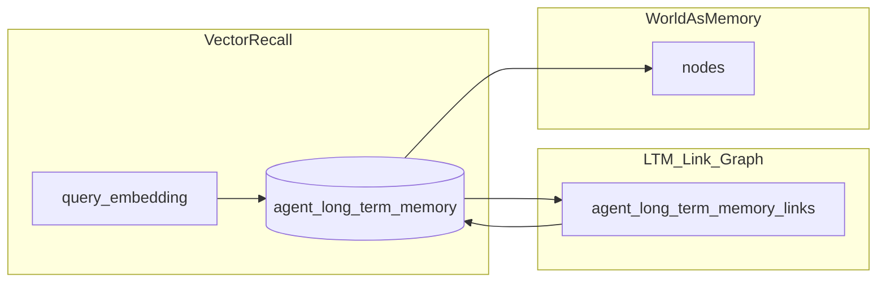

# F02 扩展设计 — 语义向量检索与长期记忆关联

> **状态：设计草案 — 核心 DDL / 迁移 / 检索服务已落地（2026-04-12）；embedding 回填仍可由异步任务接入真实模型。**  
> **依赖：** [`F02_INTELLIGENT_AGENT_SERVICE_TYPE.md`](F02_INTELLIGENT_AGENT_SERVICE_TYPE.md) §9、`pgvector`、PostgreSQL  
> **目标：** 在不大改 F02 核心语义的前提下，补充 **语义向量查询**，以及 **长期记忆条目之间的显式相关性**，支持「压缩存储 + 向量召回 + 关联扩展」。

---

## 1. 背景与原则

| 能力 | 说明 |
|------|------|
| **语义向量查询** | 在「同一 agent」范围内，对 LTM（及可选 raw）做 **近似最近邻**，与关键词 / JSONB 过滤组合使用。 |
| **记忆间相关性** | 长期记忆不是孤立行：例如「楼栋巡检结论」与「该楼某设备批次结论」应可建模 **显式边**，便于图式遍历与上下文扩展。 |

**原则（与 F02 §9.0.1 一致）**

- **详情仍以图为准**：向量与链接是 **检索与推理辅助**，不替代 `nodes` / `relationships`。
- **agent 隔离**：所有检索与关联 **必须** 带 `agent_node_id`（或等价作用域），避免跨 agent 泄漏。
- **渐进落地**：向量与链接表可作为 **Phase 2** DDL，与 v1 无向量部署共存（迁移幂等）。

---

## 2. 语义向量 — 数据模型

### 2.1 列级方案（推荐用于 LTM 主路径）

在 **`agent_long_term_memory`** 上增加可选向量列，与现有 `summary` / `payload` 对齐：嵌入对象优先为 **summary + payload 关键字段** 的拼接文本经 embedding 模型得到。

| 列 | 类型 | 说明 |
|----|------|------|
| `embedding` | `vector(1536)` NULL | 与项目 `nodes.semantic_embedding` 维度对齐时可复用同一模型与运维；若采用其他维度，单独约定并建索引。 |
| `embedding_model` | `VARCHAR(64)` NULL | 模型标识，避免混用不可比向量。 |
| `embedding_updated_at` | `TIMESTAMPTZ` NULL | 便于失效重算。 |

**索引（PostgreSQL + pgvector）**

- `CREATE INDEX ... ON agent_long_term_memory USING hnsw (embedding vector_cosine_ops) WHERE embedding IS NOT NULL;`  
  或 `ivfflat`（数据量较小时可延后）。
- **部分索引条件** 建议带 `agent_node_id` 无法直接进 HNSW 多维过滤的典型写法：  
  - 查询时 **先** `WHERE agent_node_id = :aid` **再** 在结果集上做向量排序（数据量极大时再考虑分区 / 每 agent 子索引等进阶方案）；或  
  - 使用 **条件表达式索引** 仅适用于「agent 数少、单 agent 行数极大」的部署（按需）。

**是否给 `agent_memory_entries` 加向量**

- **可选**：高频 raw 需要「按语义捞旧会话」时，可增加 `embedding` 或拆 **独立扩展表**（见 2.2），避免 raw 表爆炸行上重复建大索引成本。

### 2.2 扩展表方案（可选，解耦大表）

**表名：`agent_memory_embeddings`**

| 列 | 说明 |
|----|------|
| `id` | BIGSERIAL PK |
| `agent_node_id` | FK → `nodes(id)` ON DELETE CASCADE |
| `target_domain` | `ltm` \| `raw` |
| `target_id` | 对应 `agent_long_term_memory.id` 或 `agent_memory_entries.id` |
| `embedding` | vector |
| `model` | 模型 id |
| `created_at` | — |

**优点**：原表保持窄；**缺点**：JOIN 多一步。适合 raw/LTM 都要向量且写入频率差异大时。

**推荐**：**LTM 列级 embedding** + 若 raw 也要语义检索，再引入 **`agent_memory_embeddings`**，避免两处同时改宽表。

### 2.3 写入与更新策略

| 时机 | 行为 |
|------|------|
| **插入 LTM** | 默认不阻塞：行写入后异步任务计算 `embedding` 回填。 |
| **summary/payload 变更** | 使 `embedding` 失效或触发重算（`embedding_updated_at`）。 |
| **晋升自 raw** | 晋升生成 LTM 行后，对 LTM 文本做 embedding；raw 侧是否保留向量由产品定。 |

### 2.4 查询语义

```text
给定 agent_node_id + 查询向量 q（或查询文本经同一模型嵌入）：
  SELECT id, summary, payload, graph_node_id, ...
  FROM agent_long_term_memory
  WHERE agent_node_id = :aid AND embedding IS NOT NULL
  ORDER BY embedding <=> q
  LIMIT k;
```

可与 **`updated_at` 时间衰减**、**payload JSONB** 条件、`graph_node_id` 过滤 **组合**（先过滤再向量，或向量后再过滤，由优化器与数据分布决定）。

---

## 3. 长期记忆之间的相关性 — 数据模型

### 3.1 专用关联表（推荐）

新建 **`agent_long_term_memory_links`**，显式表达 **LTM ↔ LTM** 的有向或对称关系，便于约束与遍历。

| 列 | 类型 | 说明 |
|----|------|------|
| `id` | BIGSERIAL PK | |
| `agent_node_id` | INTEGER NOT NULL FK → `nodes(id)` ON DELETE CASCADE | 与两端 LTM 的 agent 一致；写入时 **应用层校验** `source`/`target` 两行同属该 agent。 |
| `source_ltm_id` | BIGINT NOT NULL FK → `agent_long_term_memory(id)` ON DELETE CASCADE | |
| `target_ltm_id` | BIGINT NOT NULL FK → `agent_long_term_memory(id)` ON DELETE CASCADE | |
| `link_type` | VARCHAR(64) NOT NULL | 枚举示例：`same_building`、`follow_up`、`supersedes`、`related_fact`、`derived_from` |
| `weight` | REAL NULL DEFAULT 1.0 | 可选：相关强度 |
| `payload` | JSONB NOT NULL DEFAULT '{}'::jsonb | 扩展：说明、置信度、外部工单号等 |
| `created_at` | TIMESTAMPTZ | |

**约束**

- `CHECK (source_ltm_id <> target_ltm_id)`
- 可选 `UNIQUE (source_ltm_id, target_ltm_id, link_type)` 避免重复边（无向语义可用两条反向边或约定 `link_type` + 单向存储策略）。

**索引**

- `(agent_node_id, source_ltm_id)`、`(agent_node_id, target_ltm_id)` 便于邻接表扩展。
- 若需「某条 LTM 的所有出边/入边」，上述两索引覆盖。

### 3.2 与图本体 `relationships` 的关系

- **默认不**把每条 LTM 映射成 `nodes` 上的图节点（避免类型爆炸）。
- 若未来需要 **与楼宇/设备图节点统一推理**，可通过 LTM 已有列 **`graph_node_id`** 与图上的节点对齐；**LTM 之间的逻辑关系** 仍建议放在 **`agent_long_term_memory_links`**，避免与业务语义边混淆。

### 3.3 典型用例

- **楼栋巡检** LTM A 与 **设备批次** LTM B：`link_type=same_building` 或 `related_fact`。
- **新版本替代旧结论**：`supersedes`（可配合 `version` 列）。

---

## 4. 向量检索与关联图的联合查询（概念）

1. **向量召回 Top-K** LTM 行（限定 `agent_node_id`）。
2. 对每条命中 id，**沿 `agent_long_term_memory_links` 扩展 1～2 跳**（BFS），合并去重，形成 **上下文包** 供 LLM 或规则引擎使用。
3. 对关键 `graph_node_id` 再经 **命令 / F10 只读** 拉取图详情（外化记忆）。



---

## 5. DDL / 迁移 / 应用层要点（实施清单）

| 项 | 说明 |
|----|------|
| **DDL** | `ALTER TABLE agent_long_term_memory ADD COLUMN embedding ...`；新建 `agent_long_term_memory_links`；扩展表可选。 |
| **迁移** | `schema_migrations.py` 幂等；已有库 `embedding` 全 NULL 可接受。 |
| **ORM** | `AgentLongTermMemory` 增加列；新增 `AgentLongTermMemoryLink` 模型。 |
| **服务** | `MemoryRetrievalService`：embed 查询句、KNN、link 扩展、F11 读权限校验。 |
| **观测** | 记录 `embedding_model`、延迟、召回条数、扩展跳数。 |

---

## 6. 风险与缓解

| 风险 | 缓解 |
|------|------|
| 向量维度与模型混用 | 必填 `embedding_model`；查询前校验。 |
| 单表数据量极大导致 KNN 慢 | 分区、`ivfflat` 参数调优、或「先时间窗口再向量」。 |
| 关联图环路 | 遍历设 `max_depth`、visited 集合。 |
| 跨 agent 误连 | FK + 写入时校验两端 `agent_node_id` 一致。 |

---

## 7. 与 F02 主 SPEC 的关系

本文档为 **F02 §9 的扩展设计**；定稿后可：

- 将 §2–§3 摘要并入 [`F02_INTELLIGENT_AGENT_SERVICE_TYPE.md`](F02_INTELLIGENT_AGENT_SERVICE_TYPE.md) 的 §9 附录，或  
- 保持独立文件，在 F02 文首 **Related** 中链接本文。

**Non-Goals（本文仍不规定）**

- 通用 LLM 网关、embedding 服务的具体厂商 API。  
- 向量与链接的 UI/管理后台。

---

## 8. 修订记录

| 日期 | 说明 |
|------|------|
| 2026-04-12 | 初稿：向量列 / 扩展表、LTM 链接表、查询与风险。 |
| 2026-04-12 | 实施：`database_schema.sql` LTM 列 + `agent_long_term_memory_links`；`ensure_f02_ltm_semantic_extension`；ORM；`app/services/ltm_semantic_retrieval.py`；`tests/services/test_ltm_semantic_retrieval.py`。 |
