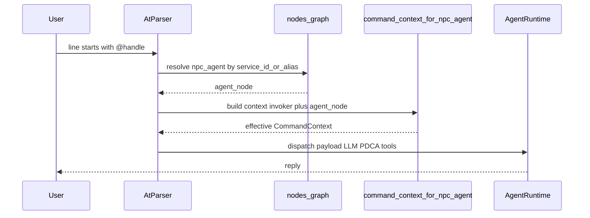

# F04 — `@` 与智能体（Agent）交互命令特性 SPEC

> **Architecture Role：** 定义用户如何通过 **`@<handle>`** 与 **`type_code=npc_agent`** 实例发起会话（自然语言或实现约定的载荷）。**不**规定各 Agent 内部 LLM/PDCA 实现细节（见 F02）；**默认系统助手 AICO** 的图配置见 [**F03**](F03_AICO_DEFAULT_SYSTEM_ASSISTANT.md)。

**文档状态：Draft — 待人工审核**

**交叉引用：** [`F02`](F02_INTELLIGENT_AGENT_SERVICE_TYPE.md)、[`F03`](F03_AICO_DEFAULT_SYSTEM_ASSISTANT.md)（`service_id=aico`）、[`F11`](../../../api/SPEC/features/F11_DATA_ACCESS_POLICY_FOR_GRAPH_API.md)、[`F01`](../../../database/SPEC/features/F01_TRAIT_CLASS_MASK_FOR_AGENT.md)（若涉及呈现过滤）。

**实现锚点（非 exhaustive）：** [`npc_agent_resolve.py`](../../../../backend/app/commands/npc_agent_resolve.py)（**`resolve_npc_agent_by_handle`**：`service_id` / **`handle_aliases`**、歧义、`enabled`）、[`at_agent_dispatch.py`](../../../../backend/app/commands/at_agent_dispatch.py)（**`try_dispatch_at_line`**）、[`protocols/ssh_handler.py`](../../../../backend/app/protocols/ssh_handler.py) / [`protocols/http_handler.py`](../../../../backend/app/protocols/http_handler.py)（`@` 行优先于注册表解析）、[`agent_commands.py`](../../../../backend/app/commands/agent_commands.py)（**`aico`** 等注册表命令；与 `@` 共用 resolver 与 [`npc_agent_nlp.py`](../../../../backend/app/commands/npc_agent_nlp.py) 中的 **`run_npc_agent_nlp_tick`**）、[`shell_words.py`](../../../../backend/app/commands/shell_words.py)、[`registry.py`](../../../../backend/app/commands/registry.py)、[`agent_command_context.py`](../../../../backend/app/commands/agent_command_context.py)、[`policy_store.py`](../../../../backend/app/commands/policy_store.py)（`command_policies`）。

**与 `help`：** `help` 为注册表命令；**`@` 不是注册表首词**，在协议层先经 `try_dispatch_at_line`。**鉴权**与注册表命令 **`aico`** 对齐（`authorize_command(aico)`）。详见附录「与 help 的类比」。

---

## 1. Goal

- 提供 **统一、可扩展** 的 **命令面**交互：**`@<handle>`** 表示「与某个 Agent 实例对话/下发输入」，**适用于当前及后续所有** 已注册的 `npc_agent`（不限于 AICO）。
- **可用性**：与 **`help`** **同级** — 用户在 **任意当前房间、任意世界上下文** 均可使用（**不**要求与目标 Agent **同 `location_id`**，**不**要求先回到奇点屋）。
- **路由**：`<handle>` 解析到 **唯一**图节点后，使用该实例的 **`service_account_id`**（若存在）构造 **有效主体**（[`command_context_for_npc_agent`](../../../../backend/app/commands/agent_command_context.py)），再进入 Agent 运行时（LLM + PDCA / 工具调用等实现里程碑）。

## 2. Non-Goals

- 不定义 **自然语言理解**、**多轮会话状态机** 的完整 UX（可由产品另文规定）。
- 不替代 **F10 Graph API** 的管理面契约。
- 不在本 SPEC 中固定 **唯一** 顶层命令名（如是否提供无 `@` 的 `aico` 简写）；允许实现二选一或并存，见 §4。

## 3. 术语

| 术语 | 含义 |
|------|------|
| **`handle`** | 用户输入中与 **`service_id`**（及可选 **别名**，见类型层 schema）匹配的 **短标识**，用于查找 `npc_agent` 节点。 |
| **`payload`** | `handle` 之后的 **剩余命令行**，通常为自然语言；实现可约定前缀子命令。 |
| **有效主体** | `CommandContext` 中权限与 F11 `data_access` 所依据的 **账号/API 映射**（见 F02/F11）。 |

## 4. 语法与分词

### 4.1 推荐形式

```text
@<handle> <payload>
```

- **`<handle>`**：建议 `[a-z0-9][a-z0-9._-]*`（大小写策略：实现可 **normalize 为小写** 再查找）。
- **`<payload>`**：可为空（实现可返回用法提示）；非空时 **整体** 作为 Agent 输入字符串（内部再分词由 Agent 运行时决定）。

### 4.2 与 shell 分词

- 命令行拆分应与现有 [`shell_words`](../../../../backend/app/commands/shell_words.py)（或 SSH/HTTP 命令入口的等价逻辑）一致；**引号内空格** 应保留在 `payload` 内（若实现支持）。

### 4.3 可选简写

- 对 **默认助手**（F03 **`service_id=aico`**），实现可提供 **无前缀 `@` 的顶层命令**（例如 `aico <payload>`），与 **`@aico`** **语义等价**。**不得**与已有注册命令名冲突；冲突时以注册表为准并文档说明。

## 5. Handle 解析与唯一性

1. **主键**：在 `nodes` 上查询 `type_code = 'npc_agent'` **且** `is_active = true` **且** `attributes->>'service_id' = <handle>`（规范化后）。
2. **别名（可选）**：若类型层或实例 `attributes` 定义 **`handle_aliases`**（字符串数组），则 **任一** 命中且 **唯一** 即解析成功。
3. **唯一性**：同一 **`service_id`** 在库内 **至多一个** 活跃实例；若多行匹配 → **错误**（实现应报「歧义」而非静默选第一条）。
4. **未找到**：返回明确错误信息（建议包含 `handle` 与「未知 Agent」提示）。

**示例 handle：** `aico` 对应 [**F03**](F03_AICO_DEFAULT_SYSTEM_ASSISTANT.md) 默认实例。

## 6. 可见性与命令系统

- **`@`** 交互作为 **系统级能力**，应与 **`help`** 在 **同一会话内全局可输入**（SSH/HTTP 与 `help` 同源入口）；**不得**默认因 `location_id` 不同而禁用。
- **鉴权**：**`@` 行**在实现中与注册表命令 **`aico`** 对齐——**`authorize_command(aico)`**（与 HTTP/SSH 同源）。用户使用 **`aico <payload>`** 时同样走 **`authorize_command(aico)`**。错误提示与「命令未找到」叙事一致时可附带 **`Type 'help' for available commands.`**
- **Evennia 参照**：分词与引号行为与 **Evennia 式 shell** 一致（见 [`shell_words.py`](../../../../backend/app/commands/shell_words.py)）；**未**实现完整 CmdSet 栈，**`@`** 采用 **传输层前缀分发**（见架构讨论与 [`ADR-F04-AT-Dispatch.md`](../../../architecture/adr/ADR-F04-AT-Dispatch.md)）。

## 7. 执行链（逻辑）



- **Invoker**：当前用户会话的 `CommandContext`（含 `db_session`）。
- **Agent 节点**：解析得到的 `npc_agent` **Node**。
- **Worker**：由 `node_types.typeclass` 与运行时注册表决定（见 F02 §3.1）；**工具调用**须遵守 **`tool_allowlist`** 与 **命令授权**。

## 8. 错误与 HTTP/问题细节（建议）

| 场景 | 建议行为 |
|------|----------|
| 未知 handle | 用户可读错误，不泄露内部 id |
| `enabled=false` | 拒绝并提示「Agent 已禁用」 |
| 歧义匹配 | 拒绝并提示联系管理员 |
| 策略拒绝 | 与现有「Permission denied」叙事一致 |
| 无 `db_session` | 与命令系统一致：拒绝或要求会话上下文 |

## 9. 与 F03（AICO）的关系

- **F03** 定义 **`service_id=aico`** 的默认实例与 **trait/种子**；**F04** 定义用户如何通过 **`@aico`** 触达该实例。
- 其他 **未来 Agent** 仅需新 **`npc_agent` 行** + **唯一 `service_id`**，即可 **同一套 `@` 协议** 接入，无需修改 F03。

## 10. 验收标准（建议）

**自动化：** `cd backend && conda run -n campusworld pytest tests/commands/test_npc_agent_resolve.py tests/commands/test_f04_at_dispatch.py -q`

- [ ] 在 **非奇点屋** 房间可输入 **`@aico`**（或与 `help` 同策略的等价命令）并得到 **非「必须回奇点屋」** 的响应（实现阶段）。
- [ ] `handle` 解析 **唯一**（歧义报错）、**`handle_aliases`** 与 **`enabled`** 行为符合 §5、§8；未知 handle **错误明确**（不泄露内部节点 id）。
- [ ] 与 **`command_policies`** / **`authorize_command(aico)`**（`@` 路径与 `aico` 命令一致）集成：拒绝路径可审计。

---

## 附录 — 与 `help` 的类比（产品说明）

| 维度 | `help` | `@<handle>` |
|------|--------|-------------|
| 触发范围 | 全局会话 | 全局会话（本 SPEC） |
| 依赖 `location_id` | 否 | 否 |
| 注册表 | 是（`SystemCommand`），出现在 `get_available_commands` 策略结果中 | 否（前缀行，不占首词命令名） |
| 鉴权 | `authorize_command(help, …)` | `authorize_command(aico, …)`（`@` 路径） |
| 主要用途 | 列出命令/帮助 | 与指定 Agent 对话 |

**`help aico`**：说明默认助手用法；**`@<handle>`** 与 **`aico`** 共用同一 NLP 运行时（[`npc_agent_nlp.run_npc_agent_nlp_tick`](../../../../backend/app/commands/npc_agent_nlp.py)），详见 F03 / 本 SPEC。
