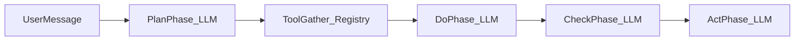

# F08 — AICO 工具调用与命令上下文（Command-as-Tool）

> **Architecture Role：** 在 **F03** 所定义的默认助手 **AICO** / 通用 **`npc_agent`**（`decision_mode: llm`）NLP 路径上，规定 **通过命令注册表执行受控命令、将可观测输出作为 LLM 上下文** 的契约；补齐「世界语义经命令取得 → 再经 LLM 组织答复」的设计初衷，并与 **F04**（`@`）、**F05**（`agent` 状态）及命令授权模型对齐。整体 **Agent 四层架构** 的 **规范真源** 见 [**F09**](F09_CAMPUSWORLD_AGENT_ARCHITECTURE_FOUR_LAYERS.md)。

**文档状态：Draft**

**交叉引用：** [**F09**](F09_CAMPUSWORLD_AGENT_ARCHITECTURE_FOUR_LAYERS.md)（CampusWorld Agent 四层架构：L1–L4、映射与边界）、[**F03**](F03_AICO_DEFAULT_SYSTEM_ASSISTANT.md)（AICO 实例、`tool_allowlist`、PDCA + LLM 基线）、[**F02**](F02_INTELLIGENT_AGENT_SERVICE_TYPE.md)（`npc_agent`、运行记录）、[**F04**](F04_AT_AGENT_INTERACTION_PROTOCOL.md)（`@<handle>`）、[**F05**](F05_AGENT_COMMAND_LIST_AND_STATUS.md)（Agent 列表/状态）、[**F06**](F06_CAMPUSLIBRARY_KNOWLEDGE_WORLD.md)（CampusLibrary 知识检索，与本特性互补）。

**实现锚点：** `[backend/app/commands/npc_agent_nlp.py](../../../../backend/app/commands/npc_agent_nlp.py)`（`run_npc_agent_nlp_tick`）、`[backend/app/game_engine/agent_runtime/frameworks/llm_pdca.py](../../../../backend/app/game_engine/agent_runtime/frameworks/llm_pdca.py)`（`LlmPDCAFramework`）、`[backend/app/game_engine/agent_runtime/worker.py](../../../../backend/app/game_engine/agent_runtime/worker.py)`（`LlmPdcaAssistantWorker`）、`[backend/app/game_engine/agent_runtime/resolved_tool_surface.py](../../../../backend/app/game_engine/agent_runtime/resolved_tool_surface.py)`（`build_resolved_tool_surface`、`PreauthorizedToolExecutor`）、`[backend/app/game_engine/agent_runtime/tool_gather.py](../../../../backend/app/game_engine/agent_runtime/tool_gather.py)`（`gather_tool_observations`、`parse_tool_invocation_plan_from_text`）、`[backend/app/game_engine/agent_runtime/tooling.py](../../../../backend/app/game_engine/agent_runtime/tooling.py)`（`RegistryToolExecutor`、`ToolRouter`）、`[backend/app/commands/agent_command_context.py](../../../../backend/app/commands/agent_command_context.py)`（`command_context_for_npc_agent`）、`[backend/app/commands/invoke.py](../../../../backend/app/commands/invoke.py)`（进程内命令网关语义）。**本 SPEC 为需求与契约；实现决策见 [ADR-F08-Tool-Gather](../../../../architecture/adr/ADR-F08-Tool-Gather.md)。**

---

## 1. Goal

- 定义 **Command-as-Tool**：在单次 **`aico` / `@<handle>`** tick（或实现约定的有限步扩展）内，经 **`RegistryToolExecutor`** + **`ToolRouter`**（`tool_allowlist`）+ **`command_context_for_npc_agent`** 执行 **已注册命令**，将 **`CommandResult.message`** 及实现白名单允许的 **`CommandResult.data`** 子集，规范化为 **`ToolObservation`** 文本，注入后续 **LLM** 阶段，使助手答复 **以世界中真实命令输出为依据**，而非仅凭模型先验。
- **工具语义面向 Agent**：注册表中的命令名与参数应对 Agent **可读、可组合**（例如 `help`、`look`、自省类 `agent_tools`）；候选集、组合策略与 **PDCA 各阶段是否调用工具** 由本节与 §6 规定 **策略位**（实现可配置，初稿给出 **v1 默认建议**）。
- **执行路径**：工具调用等价于「在 **同一进程** 内完成与 SSH 会话 **相同鉴权链** 的命令执行」（`authorize_command`、策略表达式、`command_policies`），**不是**由外部客户端再开一条 HTTP/SSH 去执行字符串；语义上与用户手工输入 `look` 一致，调用方为实现内的 **`CommandContext`**（见 §7）。
- 与 **F03** §5.5 **上下文整合** 的关系：**`memory_context`（LTM）** 与 **ToolObservation（命令观测）** 为两类注入源；合并顺序与优先级见 §6。

### 1.1 在整体 Agent 架构中的位置

本 SPEC（Command-as-Tool、ToolGather、**AICO** 在 L3′/L4′ 的特化）建立在 **`npc_agent` 四层架构**之上。**L1–L4 定义、双视角图示、与 F02–F08 及 F07 的映射与边界** 的 **规范真源** 见 [**F09 — CampusWorld Agent 四层架构**](F09_CAMPUSWORLD_AGENT_ARCHITECTURE_FOUR_LAYERS.md)；本文 **不重复** 全表与各层长文补充。

### 1.2 AICO 特化（L3′ / L4′）

- **AICO 与公共框架**：**AICO** 仍属 **`npc_agent` + F03** 默认实例，应 **复用** L1–L3 的 **公共能力**（tick 入口、Worker、框架协议、工具执行与运行记录等）。**禁止**将 **仅适用于 AICO** 的 L3 策略偏好、L4 经验包选择与 **通用 `npc_agent`** 无差别混写在同一实现单元中。
- **AICO 特化须有独立实现单元**：在 **L3′（AICO 思考管线特化）** 与 **L4′（AICO 经验/Skill 组合）** 上应有 **独立模块或子包**（如 `aico/` 编排器、AICO 专属 `preflight`、默认 prompt 与工具偏好），**调用** 公共 L2/L3 API，**不**复制 L1 数据语义或绕过 **`authorize_command`**。公共实现 **不**硬编码 `aico`（种子、默认 YAML 键等约定处除外）。
- **验收暗示**：能区分「改 L1 本体」「改 L2 命令工具」「改 L3 通用思考框架」与「仅改 AICO 的 L3′/L4′」；测试可对通用 `npc_agent` 与 **`service_id=aico`** 分别覆盖。

---

## 2. Non-Goals

- 不将 **某一厂商** 的 Function Calling / JSON Schema 定为 **唯一** 互操作格式（实现可选用结构化计划、或宿主解析的轻量协议，见 §7）。
- 不要求 **v1** 即支持「流式多轮对话中任意时刻用户中断」的完整交互模型（可与 F04 会话产品迭代对齐）。
- **不替代** **[F06](F06_CAMPUSLIBRARY_KNOWLEDGE_WORLD.md)** 的图/向量检索；**CampusLibrary** 与 **命令工具上下文** 互补：前者偏静态/入库知识，后者偏 **当前会话与世界状态** 的可观测文本。

---

## 3. 业界对齐（参考，非规范性依赖）

以下仅作 **产品/架构对标**，实现以 CampusWorld **命令注册表与授权** 为准。


| 范式                                                  | 可借用的思想                                                 |
| --------------------------------------------------- | ------------------------------------------------------ |
| **Claude Code 类助手**                                 | 受控能力集、步骤可审计、每步结果以 **人类可读摘要** 进入后续推理。                   |
| **OpenClaw / 仓库级 coding agent 生态**（名称与仓库链接待人工确认后替换） | **Observe → Act** 短循环、**步数/时间上限**、失败时重试或降级为「无工具纯 LLM」。 |


---

## 4. 核心术语


| 术语                   | 含义                                                                                      |
| -------------------- | --------------------------------------------------------------------------------------- |
| **ToolObservation**  | 单次命令执行后，经规范化模板拼接的 **文本块**（含命令名、参数摘要、stdout 等价 `message`、可选 `data` 摘要），供注入 LLM `user` 侧。 |
| **tool_trace**       | 本 tick 内所有工具调用的有序列表；应写入 **`agent_run_records.command_trace`**（与 F02 运行记录一致），供排障与审计。     |
| **preflight_policy** | **可选** 的确定性规则（不经 LLM）：例如对「帮助体系介绍」类意图先执行 **`help help`** 再进入 Do；由产品/运维配置或代码策略表实现。        |
| **llm_tool_plan**    | **Plan 阶段** LLM 输出的 **结构化计划**（如受限 JSON：待执行命令列表及参数）；解析失败时 **降级**（见 §7）。                  |


---

## 5. 与 F03 PDCA 的关系

### 5.1 实现要点（与 §5.2 对齐）

- **F03** 约定 **`tool_allowlist`** 与注册表工具面；**`agent_tools`** 可列出白名单内工具。
- **初始化冻结权限面**：`LlmPdcaAssistantWorker.create` 构建 **`ResolvedToolSurface`**（`tool_allowlist` ∩ `get_available_commands(tool_ctx)`，并移除默认禁止项如 **`aico`**），运行时由 **`PreauthorizedToolExecutor`** 执行命令（集合成员校验 + `execute`，避免 tick 内热路径重复 `authorize_command`；权限与策略的交集在构造面时一次性等价于原链）。
- **ToolGather**：对 LLM 输出中解析到的 **`llm_tool_plan`（JSON，`commands` 数组，0..N 条）** 顺序执行，生成 **ToolObservation**，写入 **`command_trace`**；**各 PDCA 阶段**在阶段 LLM 调用之后均可解析并执行一批命令（多工具、多阶段），再注入**后续**阶段 LLM 的 `user` 侧（见 `llm_pdca.py`）。
- **上限**：`agents.llm` 的 `extra` 可选键 `tool_gather_max_commands_tick`、`tool_gather_max_chars_tick`、`tool_gather_max_commands_phase`、`tool_gather_max_rounds_per_phase`（见 `tool_gather.py`）。

### 5.2 方案 A（v1 编排说明）

1. **Plan（LLM）**：输出自然语言与/或 **`llm_tool_plan`** JSON；若 **`phase_llm.plan` = skip**，可为空计划。
2. **ToolGather（Plan）**：对解析到的每条命令，在 **冻结权限面**内执行；汇总为 **ToolObservation**。
3. **Do（LLM）**：`user` 含 **用户消息**、**Plan 输出**、**Plan 阶段 ToolObservation**、**`memory_context`**（见实现拼接顺序）。
4. **ToolGather（Do / Check）**：对 Do、Check 阶段 LLM 输出中若含 JSON 计划，同样可执行并注入后续阶段（**Act** 阶段默认不再从 LLM 输出追加工具执行，以避免与「润色-only」冲突；可配置迭代）。

### 5.3 方案 B（**后续**）

多轮 **LLM ↔ 工具**：直到模型输出 **`FINAL`** 或明确表示无需再调用工具。更接近深度 **agent 循环**，复杂度高；**v1 可不采纳**。




---

## 6. 各 LLM 阶段与工具策略（v1 建议）

以下策略为 **初稿默认**，人工审核后可改为「配置驱动」或「仅 AICO 默认」。


| 阶段             | 是否使用工具            | 说明                                                                                                       |
| -------------- | ----------------- | -------------------------------------------------------------------------------------------------------- |
| **Plan**       | **可选**            | 输出 **`llm_tool_plan`**（推荐）或纯文本计划；**不直接执行**命令，除非实现将「解析 + 执行」合并为同一子阶段（不推荐）。                                |
| **ToolGather** | **必执行（当有合法计划项时）** | 非 LLM 阶段；执行 0..N 条命令，受 **上限** 约束（§8）。                                                                    |
| **Do**         | **间接**            | 基于 **ToolObservation** 生成草稿答复；**本阶段不再默认执行新命令**（避免与方案 B 混淆）。                                              |
| **Check**      | **通常否**           | 以 Do 草稿与 F03 **check** prompt 为主；若需二次核对世界状态，实现可选用 **只读** 命令（如 `look`），须在 **tool_allowlist** 与策略中显式允许并计次。 |
| **Act**        | **否**             | 润色最终用户可见文本；不引入新观测。                                                                                       |


**候选与组合：**

- **候选工具集** = **`ToolRouter.filter(RegistryToolExecutor.list_tool_ids(...))`**，与 **F03** `tool_allowlist` 一致。
- **组合**：允许多条命令顺序执行（如 `help help` → `agent_tools aico`）；**顺序**由 Plan 或 **preflight_policy** 决定；总条数与总字符 **封顶**（§8）。

**终止条件：**

- ToolGather 在 **N 条命令执行完毕**、**超限时截断**、或 **命令失败**（按策略：中止 tick / 跳过该条 / 将错误文本写入 ToolObservation）时结束。

---

## 7. 工具选择与参数、调用形态

- **v1 无原生 function-calling 时**：推荐 **Plan 输出受限 JSON**（示例形状，非最终 schema）：
  ```json
  {
    "commands": [
      { "name": "help", "args": ["help"] },
      { "name": "look", "args": [] }
    ]
  }
  ```
  解析失败时：**降级** 为仅 LLM、或执行 **单条安全默认**（如仅 `help`），行为由实现与 **preflight_policy** 共同定义。
- **调用形态**：与「用户在 SSH 输入 `look`」**语义等价**，但在实现上为 **进程内直接调用** `Command.execute`（经 `RegistryToolExecutor`），**不**经过外部客户端；须完整走 **`authorize_command`** 与 **`command_context_for_npc_agent`**（含 **`service_account_id`** 时的服务账号权限）。
- **预留**：若 LLM 提供商支持 **tool_calls**，实现可选用 **结构化 tool_calls** 与上述 JSON 计划 **二选一**，本 SPEC 不强制唯一路径。

---

## 8. 安全与不变量

- **禁止默认递归**：工具上下文中 **不得** 默认再次调度 **`aico` / `@` NLP**（避免无限嵌套）；若未来允许「子助手 tick」，须单独 **深度上限** 与 **标识符**。
- **每 tick 上限**：**最大命令条数**、**ToolObservation 总字符**、**wall-clock 时间**；超限截断并记入 **tool_trace**。
- **`CommandResult.data`**：仅允许 **白名单键** 进入 ToolObservation（防泄漏大图 JSON、内部 id）；默认可仅使用 **`message`**。
- **授权**：与 **`authorize_command`**、**`command_policies`**、F11 数据访问策略 **一致**；**不**因「Agent 调用」绕过审计。

---

## 9. 可观测性

- **`agent_run_records.command_trace`**：每条记录建议包含：`command_name`、`args` 摘要、`success`、`message_len`、可选 **内容哈希**（非存全文）。
- 日志与排障：工具失败原因应可区分 **授权拒绝**、**未知命令**、**业务 Error** 与 **系统异常**（与 SSH **System Error** 分层）。

---

## 10. 验收标准（建议）

**人工 / SSH（DB 已迁移且种子就绪）：**

- 对「介绍 `help` 命令本身」类问题，在启用本特性的构建上，**至少一次** 将 **`help`（或等价）命令输出** 纳入 **Do 阶段上下文**，最终 **`CommandResult.message`** 为自然语言答复（非未捕获的网络 DNS 类 **System Error** 裸传；该类错误应在 LLM 前或工具层被处理/降级）。
- **`agent_tools <service_id>`** 所列工具与 **`tool_allowlist`**、策略过滤一致。

**自动化（方向性，实现可后置）：**

- 与 **`tests/commands/test_registry_tool_executor_auth.py`** 授权语义一致：工具执行路径 **不拓宽** 权限。
- 与 **`tests/commands/test_npc_agent_nlp.py`** 等 mock 路径兼容：可在 mock LLM 下断言 **ToolObservation** 注入 **Do** 的输入拼接（具体断言由实现 PR 补充）。

---

## 11. 与 F03 / ADR 的后续动作（非本文件范围）

- 实现采纳后，建议新增 **ADR**（例：ADR-F08-AICO-Tool-Context）描述 **ToolGather** 插入点与与 **`LlmPDCAFramework`** 的代码级决策。
- **F03** 可在 §5.5 保持摘要，以 **指向本 SPEC** 为 **扩展来源**（见 F03 交叉引用）。

---

## 附录 A — `ToolObservation` 文本模板（示例）

```
--- tool_observation begin ---
[1] command=help args=[help]
ok=true
message:
<CommandResult.message 原文或截断>
--- tool_observation end ---
```

截断策略与编码由实现定义，须符合 §8 上限。