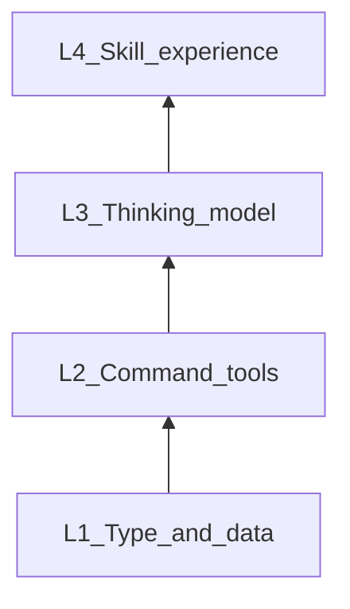
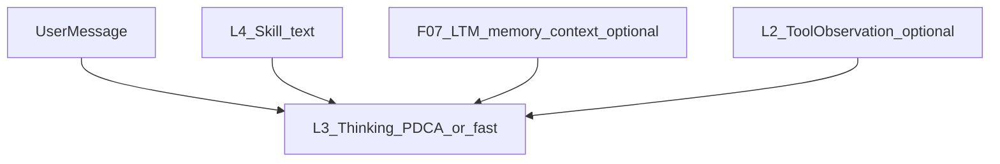

# F09 — CampusWorld Agent 四层架构（规范真源）

> **Architecture Role：** 定义 **`npc_agent` / Agent 运行时** 的全局 **四层架构**（L1–L4），作为 **特性 SPEC 与实现** 的 **单一引用锚点**；**不**替代各特性的细节契约（F02–F08）。**与** [**F02**](F02_INTELLIGENT_AGENT_SERVICE_TYPE.md)（`npc_agent` 类型与运行时）**并列**：F02 偏「类型与行为契约」，F09 偏「分层空间视图」。

**文档状态：Draft**

**交叉引用：** [**F02**](F02_INTELLIGENT_AGENT_SERVICE_TYPE.md)、[**F03**](F03_AICO_DEFAULT_SYSTEM_ASSISTANT.md)、[**F04**](F04_AT_AGENT_INTERACTION_PROTOCOL.md)、[**F05**](F05_AGENT_COMMAND_LIST_AND_STATUS.md)、[**F06**](F06_CAMPUSLIBRARY_KNOWLEDGE_WORLD.md)、[**F07**](F07_PER_USER_AGENT_MEMORY_AND_ASYNC_LTM_PROMOTION.md)、[**F08**](F08_AICO_TOOL_CONTEXT_AND_AGENT_LOOP.md)（Command-as-Tool、ToolGather、AICO 特化）。

**与其它文档中「L1/L2」用语：** [**F11**](../../../api/SPEC/features/F11_DATA_ACCESS_POLICY_FOR_GRAPH_API.md) 等处的 **授权分层**、HiCampus 校验 **L1–L5** 与本文 **Agent 四层（L1–L4）** **不同域**；同名仅为编号习惯，勿混读。

---

## 1. Goal

- 提供 **CampusWorld Agent**（以 **`type_code=npc_agent`** 与 **`app/game_engine/agent_runtime/`** 为主）的 **统一分层语言**：**L1 类型与数据**、**L2 命令工具**、**L3 思考模型**、**L4 经验 Skill**。
- 明确 **特性 SPEC** 与 **代码模块** 在各层上的 **映射** 与 **边界**（尤其 **L4 Skill** vs **F07 LTM** vs **F06 CampusLibrary**）。
- 用 **双视角图示** 澄清「底座栈」与「单次 tick 上下文流」，避免将 mermaid 箭头误读为单一依赖方向。

## 2. Scope / Non-Goals

- **Scope：** 全仓 **`npc_agent`** 及 **AICO**、未来系统内置 Agent 的 **架构叙述**；实现细节仍以 F02、F03、F08 等为准。
- **Non-Goals：** 不规定具体 **规则引擎**、**向量库** 选型；不替代 **F11** 数据访问策略条文。

---

## 3. 四层定义（总表）

自上而下 **叙述顺序** 为：**L4 → L3 → L2 → L1**（与「经验 → 思考 → 工具 → 世界」一致）。**依赖方向**见 §4。

| 层级 | 名称 | 职责 | 说明（摘要） |
|------|------|------|--------------|
| **L1** | **类型与数据层** | 本体与状态；本体推理、常识规则 | 图节点、关系、NodeType；声明式可验证推理；见 §6.1。 |
| **L2** | **命令工具层** | 面向 Agent 的工具面 | 命令注册表、`RegistryToolExecutor`、`tool_allowlist`、`ToolObservation`；见 §6.2。 |
| **L3** | **Agent 思考模型层** | 认知编排与多模式推理 | `ThinkingFramework`、快慢思考、PDCA+LLM 等；见 §6.3。 |
| **L4** | **经验 Skill 层** | 语义 Skill、业务经验与场景理解 | 命令拉取或指定注入；见 §6.4。 |

---

## 4. 双视角：底座栈 vs 单次 tick 上下文流

**视角 A — 底座栈（实现/依赖直觉）**  
上层 **使用** 下层能力：**L4/L3/L2** 的运行时 **读取并变更** 的对象根植于 **L1**；**L2** 的 `authorize_command`、图读写 **依赖** L1 中的主体与客体；**L3** **编排** 对 L2 的调用；**L4** 文本 **注入** L3 的 prompt 拼接。  
**底座为最下：L1。**

图注：**BT** 方向下 **L1 在底、L4 在上**；箭头表示「**构建在上一层之上**」（能力栈），**不是** tick 内上下文流的唯一方向。

**视角 B — 单次 tick 上下文流（用户载荷 → 模型输入）**  
对用户可见的 **答复生成路径**，上下文块常按 **Skill / 记忆 / 工具观测 → 思考管线内各阶段** 自上而下 **汇入** LLM；**不**表示「L4 依赖 L3 的数学依赖」，而是 **信息流**。

图注：**F07** 的 `memory_context` **不是** L4；见 §5。

---

## 5. 特性 SPEC 映射与边界

| 层 | 主要特性 SPEC / 文档 | 边界说明 |
|----|------------------------|----------|
| **L1** | 数据模型 SPEC、[**F01**](../../../database/SPEC/features/F01_TRAIT_CLASS_MASK_FOR_AGENT.md)、[**F11**](../../../api/SPEC/features/F11_DATA_ACCESS_POLICY_FOR_GRAPH_API.md) 客体 | 图的 **类型与实例**；策略表达式作用的对象。 |
| **L2** | [**F02**](F02_INTELLIGENT_AGENT_SERVICE_TYPE.md) §4–§6、[**F08**](F08_AICO_TOOL_CONTEXT_AND_AGENT_LOOP.md) ToolGather、`ToolObservation` | **命令即工具**；F08 规定 **工具输出进上下文** 的契约。 |
| **L3** | [**F02**](F02_INTELLIGENT_AGENT_SERVICE_TYPE.md) 思维模型、[**F03**](F03_AICO_DEFAULT_SYSTEM_ASSISTANT.md) PDCA+LLM、ADR-F03 | **PDCA** 为常见慢路径，非 L3 全部。 |
| **L4** | [**F08**](F08_AICO_TOOL_CONTEXT_AND_AGENT_LOOP.md) L4 补充、[**F06**](F06_CAMPUSLIBRARY_KNOWLEDGE_WORLD.md)（互补） | **经验 Skill**：可经命令或注入；**非** LTM 同义词。 |

**L4 vs F07（长期记忆）**

| 维度 | **L4 Skill（本架构）** | **F07 LTM / `memory_context`** |
|------|------------------------|----------------------------------|
| 语义 | 可版本化 **经验条目**、场景剧本、世界侧 **Skill** 标识 | **按用户区隔** 的 **长期记忆** 检索与晋升 |
| 典型载体 | 命令输出、节点绑定、显式注入 | `agent_memory_entries` / LTM 表、`build_ltm_memory_context_for_tick` |
| 与 L3 | 作为 **可选文本块** 进入 tick | 作为 **`memory_context`** 进入 tick（F03 §5.5） |

二者 **可并存** 于同一 tick，**拼接顺序与截断** 由实现或 F03 扩展约定。

**L4 vs F06（CampusLibrary）**

- **F06**：OS 级知识世界、入库、`cl search`、GraphRAG/pgvector 等 **检索路径**。
- **L4**：偏 **与本 tick 强绑定** 的短文本、**命令可拉取** 的经验、**语义世界 Skill 标识**。
- **互补**：同一问题可 **先 F06 检索** 再经 L2 暴露为观测，或 **L4 直接注入**；产品边界由实现划分。

---

## 6. 分层补充（自 F08 迁移）

### 6.1 L1 推理与常识规则

- **本体推理**：类型、关系、约束推导；可复现、可测试。
- **常识规则**：上界/下界/禁止组合；**不**依赖单次 LLM。示例（阈值以本体为准）：人的身高通常 **不超过 3 米**；真空光速上界可用 **教学/简化本体**（如「不超过每秒 10 万公里」）或替换为精确常数。

### 6.2 L2 命令工具层

将 L1 信息 **整合为可调用能力**：`RegistryToolExecutor`、`ToolRouter`、`tool_allowlist`、**`ToolObservation`**（定义见 [**F08**](F08_AICO_TOOL_CONTEXT_AND_AGENT_LOOP.md)）。

### 6.3 L3 思考模式与组合

- **勿将 L3 等同为单一固化模式**；`LlmPDCAFramework` 为 **参考实现**。
- **快思考**：经 L2 **直接调工具**（规则/只读查询等）。**慢思考**：完整 PDCA+LLM。
- **组合与嵌套**：外层框架调内层；复杂拓扑 **优先代码** 表达。
- **与 L1 边界**：L1 为声明式数据侧；L3 为 **tick 级** 过程控制。

### 6.4 L4 Skill 来源与注入

- **语义世界中的 Skill**：与 L1 对象/世界包元数据 **可对齐标识**。
- **经命令得到**：注册表命令拉取，鉴权 + `tool_allowlist`。
- **指定方式注入**：tick 入参、`nodes.attributes` 绑定、L3 预置片段、会话元数据（策略允许）；**trace 可区分** 命令拉取 vs 预注入。

---

## 7. 与代码模块的映射（锚点，非实现承诺）

| 层 | 主要路径 | 备注 |
|----|-----------|------|
| **L1** | `backend/app/models/graph.py`、`db/ontology/`、NodeType 种子 | 图与类型 |
| **L2** | `app/commands/registry.py`、`agent_runtime/tooling.py`、`invoke.py` | ToolGather **契约** 见 F08；**实现缺口** 以 F08 §5.1 为准 |
| **L3** | `agent_runtime/frameworks/`、`worker.py`、`npc_agent_nlp.py` | `LlmPDCAFramework` 等 |
| **L4** | 无单一目录；**未来** 可与内容包、节点属性、命令共存 | **经验模块** 可渐进落地 |
| **F07 注入** | `app/services/ltm_semantic_retrieval.py`、`npc_agent_nlp.py` | `memory_context` |

---

## 8. AICO 与通用 `npc_agent`（摘要）

- **AICO** 为 **F03** 默认实例：复用 **L2/L3** 公共能力；**特化** 宜落在 **L3′ / L4′**（独立模块），见 [**F08**](F08_AICO_TOOL_CONTEXT_AND_AGENT_LOOP.md) §1 与 F03。
- 公共代码 **不**硬编码 `aico`（种子/YAML 约定处除外）。

---

## 9. 后续

- 采纳后可增加 **ADR-F09-Agent-Four-Layers**（与 ADR-F03 并列）。
- 各特性 SPEC **以 F09 为架构索引**，细节 **不重复粘贴** 全表。
