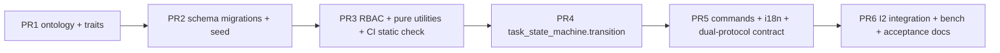

# Task System — Phase B Execution Plan (SSOT)

> **Status**: in-flight (all 6 PRs implemented — see [§3](#3-pr-rollout-summary)).
>
> This file is the **execution-time** SSOT for Phase B; the original
> high-level proposal lives at
> [`/.cursor/plans/task-system-phaseB-plan-080c36a4.plan.md`](../../../.cursor/plans/task-system-phaseB-plan-080c36a4.plan.md)
> (read-only).
>
> **Scope-anchor**: [`SPEC.md`](SPEC.md) v1, invariants I1–I8 (Phase B
> targets I1 / I3 / I4 / I5 / I6; I2 partially covered; I7 / I8 → Phase C).
> Event set: `create / publish / claim / assign / complete` (5 events).
>
> **Out of scope (Phase C)**: `submit-review / approve / reject / handoff /
> cancel / fail / start / expand`, bulk commands, async expand worker,
> `task.consistency_audit`, hypothesis property tests, agent pool
> subscription with `*` wildcard expansion, `scope_selector` late-binding
> freeze, lease/heartbeat enable.

## 1. PR dependency graph

Linear order; each PR is independently CI-green and rollback-safe.

## 2. Cross-cutting requirements

- **Invariant contracts**: every state-mutating PR explicitly enumerates
  which of I1–I8 it defends or touches.
- **i18n bilingual**: all user-visible error / success keys land in both
  `zh-CN` and `en-US`. Locale drift is gated by
  [`tests/commands/test_task_i18n_keys_complete.py`](../../../backend/tests/commands/test_task_i18n_keys_complete.py).
- **CI static check** (PR3 onward): `task_state_transitions / task_outbox /
  task_assignments` and `nodes.attributes.{current_state,state_version}` are
  only writable from `task_state_machine.py` /
  `db/seeds/task_seed.py` / `db/schema_migrations.py` /
  `db/schemas/database_schema.sql`. Enforced by
  [`scripts/check_task_state_machine_writers.py`](../../../backend/scripts/check_task_state_machine_writers.py).
- **Performance**: 4 baselines in
  [`tests/bench/task_bench.py`](../../../backend/tests/bench/task_bench.py);
  drift > 30% blocks merges in the release pipeline (smoke runs in CI).
- **Observability**: Phase B uses the structlog event names
  `task.created / opened / published / claimed / assigned / completed /
  state_changed` (subset of [F04 §3.6](features/F04_TASK_RELATIONAL_SUBSTRATE_AND_OBSERVABILITY.md#36-task_events)).

## 3. PR rollout summary

| PR | Title | Anchor doc | Key code | Tests |
|----|-------|-----------|---------|-------|
| PR1 | Ontology + traits | [F01 §3](features/F01_TASK_ONTOLOGY_AND_NODE_TYPES.md#3-属性辞典注册到-node_typesschema_definitionproperties) | `backend/db/ontology/graph_seed_node_types.yaml`, `backend/app/constants/trait_mask.py` | `tests/db/test_task_node_type_registration.py` |
| PR2 | Schema + seed | [F04 §3](features/F04_TASK_RELATIONAL_SUBSTRATE_AND_OBSERVABILITY.md#3-ddl-草案), [F05 §9](features/F05_TASK_POOL_FIRST_CLASS_REGISTRY.md#9-默认-seed-池phase-b-写入) | `db/schemas/database_schema.sql` (`task_system` block), `db/schema_migrations.py::ensure_task_system_*`, `db/seeds/task_seed.py` | `tests/db/test_task_system_schema_section.py`, `tests/db/test_task_system_schema_postgres.py`, `tests/services/test_task_seed.py` |
| PR3 | RBAC + utilities + CI gate | [SPEC §1.4](SPEC.md#14-rbac-权限码), [F05 §4.1](features/F05_TASK_POOL_FIRST_CLASS_REGISTRY.md), [F01 §2.1](features/F01_TASK_ONTOLOGY_AND_NODE_TYPES.md#21-blocked_by-环检测b2-7) | `app/services/task/{permissions,errors,acl,selector,blocked_by}.py`, `scripts/check_task_state_machine_writers.py` | `tests/services/test_task_acl.py`, `tests/services/test_task_selector_validate.py`, `tests/services/test_task_blocked_by_cycle.py`, `tests/test_static_task_writes.py` |
| PR4 | State machine | [F03 §3](features/F03_TASK_COLLABORATION_WORKFLOW.md#3-单事务原子写入模板) | `app/services/task/task_state_machine.py`, `app/services/task/task_pool_service.py` | `tests/services/test_task_state_machine_unit.py`, `tests/integration/test_task_invariants.py` |
| PR5 | Commands + i18n + dual-protocol | [`docs/command/SPEC/features/CMD_task.md`](../../command/SPEC/features/CMD_task.md) | `app/commands/game/task/{__init__,_helpers,task_command,task_pool_command}.py`, `app/commands/i18n/locales/{zh-CN,en-US}.yaml` (commands.task.*) | `tests/commands/test_task_command_parsing.py`, `tests/commands/test_task_i18n_keys_complete.py`, `tests/contracts/test_task_dual_protocol.py` |
| PR6 | I2 + bench + docs | [SPEC §1.8.2](SPEC.md#182-性能基线oq-30) | `tests/bench/task_bench.py`, `tests/integration/test_task_invariants_i2.py`, this file + TODO/ACCEPTANCE updates | `tests/integration/test_task_invariants_i2.py`, `tests/bench/test_task_bench_smoke.py` |

## 4. Invariant coverage matrix (Phase B)

| Invariant | PR | Test |
|-----------|----|------|
| **I1** SSOT current_state == latest transition.to_state | PR4 | `test_create_task_emits_initial_transition_and_outbox` |
| **I2** active assignments roles ⊆ workflow.expected_roles (Phase B path) | PR6 | `test_i2_holds_through_phase_b_path` |
| **I3** single-write-path | PR3 | `tests/test_static_task_writes.py` (CI gate) |
| **I4** monotone event_seq + state_version optimistic lock | PR4 | `test_optimistic_lock_concurrent_transitions` |
| **I5** single-transaction atomicity | PR4 | exception path implicit in `transition()` (rollback on raise) |
| **I6** idempotent replay (7d TTL) | PR4 | `test_idempotent_replay_does_not_double_write` |
| **I7** outbox 90d retention | Phase C | — (audit worker) |
| **I8** parent rollup | Phase C | — (parent rollup feature) |

## 5. Risk & mitigation

- **R-A** (PR2 production migration immutability): pre-merge staging
  rollback / forward dry-run mandatory.
- **R-B** (PR4 lock-order deadlock): single fixed lock order
  `nodes → task_assignments → task_state_transitions → task_outbox`;
  PR6 32-agent claim bench exercises lock contention.
- **R-C** (i18n key drift): bilingual completeness test fails CI.
- **R-D** (CI static check false-positive): allow-list scoped to
  `task_state_machine.py / task_replay.py / db/seeds/task_seed.py /
  db/schema_migrations.py / db/schemas/database_schema.sql`.
- **R-E** (bench flakiness on shared CI): smoke mode (N=50) in PR CI;
  release mode (N=10000) only in dedicated release pipeline.

## 6. Final acceptance gate

Phase B is considered "done" when **all** of the following hold:

1. `tests/integration/test_task_invariants.py` PASSes against PostgreSQL
   (covers I1 / I4 / I5 / I6 + workflow_pin + ACL deny + pool-not-found).
2. `tests/integration/test_task_invariants_i2.py` PASSes (I2).
3. `tests/contracts/test_task_dual_protocol.py` PASSes (SSH ↔ REST same
   `data` shape modulo `correlation_id` / `trace_id`).
4. `tests/bench/task_bench.py` smoke run reports `all_passed=true` (≥ 70%
   of every target).
5. CLI end-to-end:
   `task create --to-pool hicampus.cleaning → task claim → task complete`.
6. `task pool list` returns the three Hicampus seed pools.
7. [`ACCEPTANCE.md`](ACCEPTANCE.md) Phase B checkboxes are either ticked
   or explicitly punted to Phase C (`fail / cancel / start / submit-review
   / approve / reject / handoff / expand`, async expand, audit worker,
   chaos suite, hypothesis suite).

## 7. Phase C handover notes

- The state machine **already rejects** every Phase C event with
  `WorkflowEventNotAllowed` (see `_PHASE_B_EVENTS` in
  `app/services/task/task_state_machine.py`); enabling each Phase C event
  is a one-line whitelist edit + matching outbox `event_kind` mapping.
- The seed `default_v1` workflow already declares the full Phase C event
  spec — no re-seed needed when Phase C events get unlocked.
- `task_assignments.lease_expires_at` / `last_heartbeat_at` columns are
  pre-provisioned (NULL in v1) and the `idx_task_assignments_lease_expiring`
  partial index is in place — Phase C heartbeat / lease worker can simply
  begin writing.
