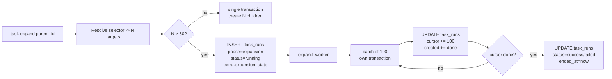

# F01 — 任务本体与节点类型

> **Architecture Role：** 在知识本体中新增 `type_code=task` 节点与配套**稀疏关系边**，承载任务身份与语义位置；通过 `scope_selector` 表达作用对象集合，**不**为每个被作用对象建图边，避免 supernode/edge-explosion。
>
> **依赖：** [`SPEC.md`](../SPEC.md) §1.1 D1 边稀疏律、§1.2 SSOT 表、§1.6 schema 版本约定、§1.7 软删策略。

**文档状态：Draft（v1）**

---

## 1. Goal

- 用 **单一节点类型** `task` 承载所有任务（个人备忘 → 楼宇巡检 → 多 Agent 协作）。
- **永久关系边度 O(1)**：仅 `SCOPED_AT / OWNED_BY / PARENT_OF / BLOCKED_BY`；作用对象集合由 `scope_selector` DSL 在查询期推导。
- 对接图种子本体登记机制（[`graph_seed_node_types.yaml`](../../../../backend/db/ontology/graph_seed_node_types.yaml)），`schema_definition.properties` 与实例 `nodes.attributes` 同形。

## 2. 关系边

| 边类型 | 起 → 止 | 基数（per task） | 含义 |
|---|---|---|---|
| `SCOPED_AT` | `task` → 空间锚点 / 设备 | **≤ 1** | 任务的**范围锚点**；可为 `room / building_floor / building / logical_zone / world / device`（任何 `trait_class ∈ {SPACE, DEVICE, ENV}` 节点） |
| `OWNED_BY` | `task` → `account / npc_agent` | **≤ 1** | 发起人 |
| `PARENT_OF` | `task(parent)` → `task(child)` | 仅父任务持出边 | 任务树；子任务**按需物化** |
| `BLOCKED_BY` | `task` → `task` | 小基数（≤ 8） | 任务依赖前置任务完成；**禁止成环**（B2-7，创建边前必经 §2.1 环检测） |
| `TARGETS_PINNED` | `task` → 任意节点 | **≤ 8（硬上限）** | **例外通道**，用于 selector 表达不出的明确钉死目标 |

**禁列**：通用 `TARGETS` 多边边；`ASSIGNED_TO` 边（迁移到关系表 `task_assignments`）；`USES_WORKFLOW` 边（迁移到 attributes `workflow_ref` + 独立表）。

> **D1 校验**：`task` 节点出边总数（含上述全部）应严格保持 O(1)，运行期监控可统计 `outdegree(task) > 12` 的异常节点。

### 2.1 `BLOCKED_BY` 环检测（B2-7）

新建 `BLOCKED_BY(from: T_a, to: T_b)` 边前，仓储层执行环检测：

```sql
WITH RECURSIVE closure(source) AS (
  SELECT to_node_id FROM edges
   WHERE from_node_id = :T_b AND kind = 'BLOCKED_BY'
  UNION
  SELECT e.to_node_id FROM edges e
    JOIN closure c ON c.source = e.from_node_id
   WHERE e.kind = 'BLOCKED_BY'
)
SELECT 1 FROM closure WHERE source = :T_a;
```

- 命中（T_a 已在 T_b 的依赖闭包内）→ 拒绝插入边，返回 `CycleDetected` 错误（i18n `commands.task.error.cycle_detected`）。
- 运行时深度护栏：递归展开 > 64 层直接返回 `CycleDetected`（兜底防止病态图）。
- 写入路径仅 `task create --blocked-by <id1,id2,...>` 与未来 `task block-on <a> <b>` 命令；**直改 `edges` 表被禁止**，由 CI 静态检查拦截。
- 已有 `BLOCKED_BY` 边如通过数据修复工具引入环，由 `task.consistency_audit` 检测并写 `task_events(kind='task.consistency_drift', payload={reason:'blocked_by_cycle'})`；**v1 不自动拆环**。

## 3. 属性辞典（注册到 `node_types.schema_definition.properties`）

| 属性 | 类型 | 必填 | 默认 | 含义 | `value_kind` / `mutability` |
|---|---|---|---|---|---|
| `current_state` | string | **是** | `draft` | 主状态 SSOT；取值由 `workflow_ref` 解析的状态机决定 | `dynamic_snapshot` / `runtime` |
| `state_version` | integer | **是** | `0` | 乐观并发控制版本号；状态机每次迁移 +1 | `dynamic_snapshot` / `runtime` |
| `workflow_ref` | object `{key:string, version:integer}` | **是** | `{key:"default_v1", version:1}` | 状态机定义引用（指向 `task_workflow_definitions`）；**创建时 pin**（OQ-23 方案 A）：`version` 在 `task create` 服务内被解析为当时 `is_active=true` 的最大 `version`，写回节点后**不再随定义热更新漂移**；已在 in-flight 的任务不跨版本迁移；`task migrate --to <key>:<ver>` 留 v2 | `static` / `instance_managed` |
| `title` | string (≤ 120) | **是** | — | 任务标题 | `static` / `instance_managed` |
| `priority` | string enum `low|normal|high|urgent` | 否 | `normal` | 优先级 | `static` / `instance_managed` |
| `due_at` | string (ISO8601) | 否 | — | 截止时间；**v1 仅记录，不驱动状态机** | `static` / `instance_managed` |
| `assignee_kind` | string enum `user|agent|pool|group` | **是** | `pool` | 期望的执行者类别 | `static` / `instance_managed` |
| `scope_selector` | object (jsonb DSL) | 否 | — | 作用对象选择器；late-binding 解析 | `static` / `instance_managed` |
| `visibility` | string enum `private|explicit|role_scope|world_scope|pool_open` | **是** | `world_scope` | 可见性级别（见 [SPEC §1.5](../SPEC.md#15-可见性谓词矩阵)）；Phase B 当前仅启用 `private|explicit|pool_open` | `static` / `instance_managed` |
| `tags` | array<string> | 否 | `[]` | 业务标签；用于巡检筛选、可见性辅助 | `static` / `instance_managed` |
| `children_summary` | object（见 §5.3） | 否 | `null`（无子任务） | 父任务子节点计数瘦摘要；I8 由状态机同事务维护；非父任务为 `null` | `dynamic_snapshot` / `runtime` |
| `pool_id` | integer | 条件 | — | 任务归属的池主键（FK 引用 [`task_pools.id`](F04_TASK_RELATIONAL_SUBSTRATE_AND_OBSERVABILITY.md#38-task_pools)）；**`assignee_kind=pool` 时必填**；其它 `assignee_kind` 必为 NULL；**单池归属**（v1 不支持一任务多池），多池语义经父子任务表达 | `static` / `instance_managed` |

**禁列字段**（必须在关系表，不允许在 `nodes.attributes`）：

| 禁列字段 | 正确位置 |
|---|---|
| `description_md` 长描述 | [`task_details.description_md`](F04_TASK_RELATIONAL_SUBSTRATE_AND_OBSERVABILITY.md#3-ddl-草案) |
| `assignees[]` | `task_assignments` |
| `history[]` / `transitions[]` | `task_state_transitions` |
| `runs[]` / `command_trace[]` | `task_runs` |
| `events[]` | `task_events` |
| `comments[]` | v2 — `task_comments` |

## 4. `scope_selector` DSL 规范

### 4.1 形态

```json
{
  "_schema_version": 1,
  "anchor_ref": "<scoped_at_node_id>",
  "bounds": {"min": 1, "max": 5000},
  "include": [
    {"trait_class": "DEVICE", "trait_mask_all_of": ["CONTROLLABLE"], "descendants_of_anchor": true},
    {"type_code": "access_terminal", "tags_any": ["exterior"]}
  ],
  "exclude": [
    {"node_id": 12345}
  ]
}
```

| 字段 | 类型 | 含义 |
|---|---|---|
| `_schema_version` | integer | 强制；v1 = `1` |
| `anchor_ref` | integer | `SCOPED_AT` 边目标节点 id；冗余落入便于离线分析 |
| `bounds` | object `{min:int≥0, max:int≥1}` | **OQ-B2-6**：解析结果数量护栏；默认 `{min: 0, max: 10000}`；`resolved_count < min` → `SelectorBoundsExceeded(reason='min')`，`resolved_count > max` → `SelectorBoundsExceeded(reason='max')`；`task create / expand` 命令失败，`task_state_transitions.metadata.selector_bounds_violation` 记录触发详情 |
| `include[]` | array | OR 关系；每项是一个匹配子句 |
| `exclude[]` | array | 在 include 解析后做差集 |

**子句字段**：

| 字段 | 类型 | 含义 | 索引/性能 |
|---|---|---|---|
| `node_id` | integer | 直接命中单节点（不参与遍历） | PK lookup，O(1) |
| `type_code` | string | 限定节点类型 | `nodes(type_code)` 索引 |
| `trait_class` | string | 限定 [`F01 trait_class`](../../../database/SPEC/features/F01_TRAIT_CLASS_MASK_FOR_AGENT.md) 语义类（如 `DEVICE / SPACE / AGENT / ENV / TASK`） | `nodes(trait_class)` 索引；用于粗粒度高效过滤 |
| `trait_mask_any_of` | array<string> | 命中**任一** [`trait_mask`](../../../../backend/app/constants/trait_mask.py) 能力位（OR 语义）；SQL：`(nodes.trait_mask & :mask) <> 0` | `nodes(trait_mask)` 位运算索引；O(N) 扫描可被 trait_class 联合大幅收窄 |
| `trait_mask_all_of` | array<string> | 命中**全部**指定能力位（AND 语义）；SQL：`(nodes.trait_mask & :mask) = :mask` | 同上 |
| `descendants_of_anchor` | boolean | 沿 `location_id` 单父链反向枚举锚点的全部后代 | 递归 CTE；与 trait/type 过滤组合时显著缩小工作集 |
| `tags_any` | array<string> | 节点 `attributes.tags` 任一命中 | jsonb GIN（如已建） |
| `tags_all` | array<string> | 节点 `attributes.tags` 全部命中 | 同上 |
| `attr_eq` | object | `{path: value}` 路径精确匹配（v1 限单层） | jsonb 表达式索引可选 |

子句间字段为 **AND**；子句间为 **OR**。

**性能优先级建议**（编写 selector 时尽量沿用，从而触发低成本路径）：

1. **`trait_class` 优先**：先用语义类粗筛（如 `DEVICE`）。
2. **`trait_mask_*` 二筛**：能力位组合（如 `CONTROLLABLE + AUTO`）。
3. **`type_code` 三筛**：当上两层无法表达精确意图时收窄到具体类型。
4. **`descendants_of_anchor` 必带**：除非显式 `node_id` 锚点，否则总应限定为锚点子树，避免全表扫描。
5. **`tags_*` 末位**：jsonb 字段查询代价最高，仅在前几层不足以收窄时使用。

### 4.2 Late-binding 解析契约（D1 + 一致性）

- **默认行为**：每次"列表/分派/可见性查询"重新解析 selector。优点是世界变化（设备增删）即时反映；缺点是不固化。
- **执行实例 freeze**：当 agent 通过 `task expand` 或开始执行时，`task_state_machine` 在创建对应 `task_runs` 行的同时，将 selector 解析快照写入 `task_runs.graph_ops_summary.resolved_targets[]`（含 `node_id / type_code / resolved_at`）。该快照即审计与回放依据。
- **不一致原则**：execute 期间外部对世界的变更**不影响已固化快照**；如需重新覆盖，由 owner 显式 `task expand` / 重新发起子任务。

### 4.3 与 `TARGETS_PINNED` 的边界

- 若任务作用对象 ≤ 8 且**无法用 selector 表达**（如"具体那扇报修门"），允许使用 `TARGETS_PINNED` 边。
- 同一任务中 `scope_selector` 与 `TARGETS_PINNED` 可并存；执行时取并集（在 `resolved_targets[]` 合并）。
- 创建时校验：`count(TARGETS_PINNED edges) ≤ 8` 否则拒绝。

### 4.4 `trait_class` / `trait_mask` 过滤（性能优先路径）

引入这两类过滤的目的：用 [F01 trait](../../../database/SPEC/features/F01_TRAIT_CLASS_MASK_FOR_AGENT.md) 已有的**类型级语义内涵**和**实例级冗余位图**，让 selector 的候选集收窄落到 **B-tree / 位运算索引** 上，避免对 `nodes` 大表做全行扫描或跨多个 `type_code` 的联合查询。

#### 4.4.1 命名常量

- `trait_mask_any_of` / `trait_mask_all_of` 的元素**必须是 `backend/app/constants/trait_mask.py` 中已定义的常量名**（如 `CONTROLLABLE / AUTO / SPATIAL / FACTUAL / PERCEPTUAL / TEMPORAL / EVENT_BASED / MOBILE / LOAD_BEARING / CONCEPTUAL` 或预组合 `DEVICE_TYPICAL_IOT_END / NPC_AGENT / WORLD_OBJECT_BASE` 等）。
- selector 解析器在编译期将名字翻译为数值（OR 折叠），**不接受裸数字位**，避免 bit 重排时静默失效。
- 未知名字 → JSON Schema 校验拒绝，错误为 `UnknownTraitMaskName`。
- `trait_class` 为字符串，取值范围由 [F01 §2.2 / §2.3](../../../database/SPEC/features/F01_TRAIT_CLASS_MASK_FOR_AGENT.md) 决定（如 `DEVICE / SPACE / AGENT / ENV / TASK / ABSTRACT` 等）。

#### 4.4.2 SQL 模板

单子句翻译为 SQL（伪代码）：

```sql
-- {trait_class: "DEVICE", trait_mask_all_of: ["CONTROLLABLE", "AUTO"],
--  descendants_of_anchor: true}
SELECT n.id
  FROM nodes n
 WHERE n.id IN (
         WITH RECURSIVE descendants AS (
           SELECT id FROM nodes WHERE id = :anchor_ref
           UNION ALL
           SELECT c.id FROM nodes c JOIN descendants d ON c.location_id = d.id
         )
         SELECT id FROM descendants
       )
   AND n.trait_class = 'DEVICE'                              -- B-tree
   AND (n.trait_mask & :all_mask) = :all_mask                -- 位运算
;

-- {trait_mask_any_of: ["CONTROLLABLE", "AUTO"]}
WHERE (n.trait_mask & :any_mask) <> 0;
```

子句间 include 取并集；exclude 做差集；`scope_selector` 与 `TARGETS_PINNED` 解析后取并集（[§4.3](#43-与-targets_pinned-的边界)）。

#### 4.4.3 索引依赖

- 依赖 `nodes(trait_class)` 与 `nodes(trait_mask)` 的 B-tree 索引（已由 [F01 trait](../../../database/SPEC/features/F01_TRAIT_CLASS_MASK_FOR_AGENT.md) 创建）。
- 与 `descendants_of_anchor` 联用时，递归 CTE 先收窄到锚点子树，再在子树上做位运算过滤；典型楼宇巡检场景候选集量级从 `O(N_total)` 降到 `O(N_subtree ∩ mask)`。
- v1 不引入 trait_mask 的 GIN/部分索引；如未来 SPEC `LIGHTING / SECURITY` 等业务位增多再评估。

#### 4.4.4 校验与 freeze 互动

- selector freeze（[§4.2](#42-late-binding-解析契约d1--一致性)）发生在执行实例创建（`task_runs.started_at`）；freeze 写入的 `resolved_targets[]` 已是过滤后的 `node_id` 列表，**不**回写 selector DSL。
- 若类型层 `trait_mask` 在任务执行期间被改写（运维路径），late-binding 查询会立即生效；已 freeze 的 run 不变，确保审计稳定（详见 [F03 / I3](F03_TASK_COLLABORATION_WORKFLOW.md#1-goal)）。

#### 4.4.5 错误形态

| 错误 | 触发 |
|---|---|
| `UnknownTraitMaskName` | `trait_mask_any_of` / `trait_mask_all_of` 含未在常量模块注册的名字 |
| `UnknownTraitClass` | `trait_class` 不在已注册类列表 |
| `EmptySelector` | include 为空且无 `TARGETS_PINNED` |

## 5. 父子任务（`PARENT_OF`）按需物化与手动 rollup

### 5.1 按需物化

- 父任务**不预先**为每个范围对象创建子任务；范围由 `scope_selector` 表达即可。
- `task expand <parent_id>` 命令（或 agent 内部调度）在执行期物化所需子任务节点：
  - 解析父 selector → resolved_targets
  - 为每个 target 创建子 `task` 节点：`SCOPED_AT → target`、`PARENT_OF` 反向边、继承父 `workflow_ref / visibility / pool_id`
  - 父任务 `current_state` 推进到 `in_progress`（首次 expand 时）
- workflow_definition 可声明 `max_children`（默认 256）作为护栏；超限拒绝物化并要求拆分父任务。
- **同步 / 异步切换阈值（OQ-21）**：
  - `len(resolved_targets) ≤ expand_sync_threshold`（默认 **50**，可 workflow_definition 覆写）：同步路径，子任务节点与 `PARENT_OF / SCOPED_AT` 边在父事务 / 状态机事务内一次性写入。
  - `len(resolved_targets) > expand_sync_threshold`：走 §5.2 异步协议。

### 5.2 大范围 expand 的异步协议（OQ-21）

**动机**：楼宇巡检 `expand` 可解析出 1k–10k 子任务，单事务写入会造成锁范围过大、事务日志膨胀、并发性急剧退化。复用已有 `task_runs(phase='expansion')`（详见 [F04 §3.5](F04_TASK_RELATIONAL_SUBSTRATE_AND_OBSERVABILITY.md#35-task_runs)），**不**为 expansion 单独建表。

**协议流**：



**步骤**：

1. **启动（命令层同步返回）**：解析父 `scope_selector` 得 `N`，若 `N > 50`：
   - 在 `task_runs` 插入一行：`phase='expansion', status='running', extra.expansion_state={total_planned: N, created: 0, failed: 0, cursor: null, batch_size: 100}`
   - 生成 `expansion_run_id`，立刻返回 `{status: 'pending', expansion_run_id, total_planned}`；命令不阻塞等待。
   - 写 `task_state_transitions(event='expansion_started', metadata={expansion_run_id, N})`（走状态机服务，沿用幂等键）。
2. **后台 worker**（`task.expand_worker`，`agent_role=sys_worker`）：
   - `SELECT id FROM task_runs WHERE phase='expansion' AND status='running' ORDER BY started_at FOR UPDATE SKIP LOCKED LIMIT 1`
   - 按 `cursor` 取下一批 `batch_size` 个 target：
     - 每批独立事务：创建子 task 节点 + `PARENT_OF / SCOPED_AT` 边；失败节点累加 `failed + error_samples`。
     - 批末 `UPDATE task_runs SET extra = jsonb_set(extra, '{expansion_state,cursor}', ...), extra.expansion_state.created=..., last_batch_at=now()`。
   - 每 K 批（默认 K=10）写一次 `task_events(kind='task.expansion_progressed', payload={created, failed, cursor})`。
3. **完成**：`cursor` 耗尽后：
   - `UPDATE task_runs SET status = CASE WHEN failed=0 THEN 'success' ELSE 'failed' END, ended_at=now()`
   - 写 `task_state_transitions(event='expansion_completed' | 'expansion_failed')`
   - 父 `nodes.attributes.children_summary` 由本次 expansion 写入（首次填入或增量 merge；详见 §5.3）。

**可恢复性**：
- worker 崩溃：`status='running'` 行会被下一个 worker 续跑（`cursor` 断点）。
- 事务粒度 = 批次；最坏重跑一批 100 个子节点。
- 命令层 `task show --expansion` / `task expansion show <run_id>` 可查进度。

**资源护栏**：
- `expand_concurrent_runs` 默认 4（同时处理的 expansion_run 上限）；超出时新 `expand` 命令返回 `ExpansionBackpressure`（命令层可选 retry）。
- `expansion_state.total_planned > workflow_definition.max_children_async`（默认 10_000）时拒绝 `expand`，要求拆分父任务。

**ACCEPTANCE 新增（见 §11）**：
- [ ] `N=200` 场景 `task expand` 命令 P99 ≤ 50ms 返回 `{status:'pending', expansion_run_id}`。
- [ ] worker 崩溃后 `task_runs` 行保持 `status='running'` + 完整 `cursor`，新 worker 可续跑至全部成功。
- [ ] `expansion_progressed / completed / failed` 事件按规写入 `task_events`。

### 5.3 手动 rollup（默认）

- 父任务的 `current_state` 不被子任务自动驱动。
- 父 `nodes.attributes.children_summary = {total, open, in_progress, done, failed, cancelled}` 作为 SSOT 瘦摘要（B2-3，OQ-21 异步 expand 场景由 worker 初始化、后续子任务状态事件同事务维护）：
  - **I8 不变式**：`children_summary.total = COUNT(*) FROM edges WHERE kind='PARENT_OF' AND from_node_id = parent_id`；`SUM(open + in_progress + ...) = total`。
  - 子任务状态机事件（`open/claim/start/complete/fail/cancel/...`）在同事务内对父执行 `UPDATE nodes ... FOR UPDATE` 更新对应计数（见 [F03 §3](F03_TASK_COLLABORATION_WORKFLOW.md#3-单事务原子写入模板) step 6'）。
- `task complete <parent_id>` 时状态机校验：
  - **所有 `PARENT_OF` 子任务的 `current_state` ∈ workflow_definition.terminal_states**（默认 `{done, cancelled, rejected, failed}`）
  - 否则返回 `ChildrenNotTerminalError`，不变更父任务状态。
- `task cancel <parent_id>` **不**级联子任务（避免误伤已完成历史）；如需级联取消，提供 `task cancel <parent_id> --cascade`（v1 文档化，Phase C 实现）。

### 5.4 自动 rollup（v2 opt-in，留备忘录）

- 未来允许 workflow_definition 声明 `auto_rollup: true`；状态机在子任务进入终态时检查并推进父任务。涉及锁顺序、并发死锁、循环依赖防护，留 v2 设计。详见 [`SPEC.md`](../SPEC.md) §10.2。

## 6. `trait_class=TASK`

- 在 [`backend/app/constants/trait_mask.py`](../../../../backend/app/constants/trait_mask.py) 新增 `TASK` 类与 `trait_mask` 位编号；具体位由评审确定（[SPEC.md §10.3](../SPEC.md#103-v1-仍待评审的细节项)）。
- 与 [F01 trait_class/trait_mask](../../../database/SPEC/features/F01_TRAIT_CLASS_MASK_FOR_AGENT.md) 设计一致：mask 仅承载**类别身份**，不编码任何 workflow / 状态语义。

## 7. graph_seed YAML 草案

合入 [`backend/db/ontology/graph_seed_node_types.yaml`](../../../../backend/db/ontology/graph_seed_node_types.yaml)：

```yaml
  task:
    trait_class: TASK
    trait_mask: <TBD>           # §6 评审
    tags:
      - graph_seed
      - task
    schema_definition:
      type: object
      title: task attributes (v1)
      description: 任务节点；瘦属性 + SSOT；详情/分派/历史走独立关系表。
      properties:
        current_state:
          type: string
          title: 主状态
          value_kind: dynamic_snapshot
          mutability: runtime
        state_version:
          type: integer
          title: 乐观锁版本号
          value_kind: dynamic_snapshot
          mutability: runtime
        workflow_ref:
          type: object
          title: 工作流引用
          value_kind: static
          mutability: instance_managed
          properties:
            key: { type: string }
            version: { type: integer }
        title:
          type: string
          title: 标题
          maxLength: 120
          value_kind: static
          mutability: instance_managed
        priority:
          type: string
          enum: [low, normal, high, urgent]
          value_kind: static
          mutability: instance_managed
        due_at:
          type: string
          title: 截止时间（仅记录，不驱动状态机）
          value_kind: static
          mutability: instance_managed
        assignee_kind:
          type: string
          enum: [user, agent, pool, group]
          value_kind: static
          mutability: instance_managed
        scope_selector:
          type: object
          title: 作用对象选择器（late-binding；支持 trait_class / trait_mask 过滤）
          value_kind: static
          mutability: instance_managed
          properties:
            _schema_version: { type: integer }
            anchor_ref: { type: integer }
            include:
              type: array
              items:
                type: object
                properties:
                  node_id: { type: integer }
                  type_code: { type: string }
                  trait_class: { type: string }
                  trait_mask_any_of:
                    type: array
                    items: { type: string }   # backend/app/constants/trait_mask.py 常量名
                  trait_mask_all_of:
                    type: array
                    items: { type: string }
                  descendants_of_anchor: { type: boolean }
                  tags_any:
                    type: array
                    items: { type: string }
                  tags_all:
                    type: array
                    items: { type: string }
                  attr_eq: { type: object }
            exclude:
              type: array
              items: { type: object }    # 同 include 子句字段
        visibility:
          type: string
          enum: [private, explicit, role_scope, world_scope, pool_open]
          value_kind: static
          mutability: instance_managed
        tags:
          type: array
          items: { type: string }
          value_kind: static
          mutability: instance_managed
        pool_id:
          type: integer
          title: 池归属（FK → task_pools.id）；assignee_kind=pool 时必填，否则 NULL
          value_kind: static
          mutability: instance_managed
```

## 8. 样例

### 样例 A — 单房间清洁任务

```json
{
  "type_code": "task",
  "attributes": {
    "current_state": "open",
    "state_version": 1,
    "workflow_ref": {"key": "default_v1", "version": 1},
    "title": "F1 卫生间日常清洁",
    "priority": "normal",
    "assignee_kind": "pool",
    "visibility": "pool_open",
    "scope_selector": {
      "_schema_version": 1,
      "anchor_ref": 4711,
      "include": [{"node_id": 4711}]
    },
    "tags": ["cleaning", "daily"],
    "pool_id": 101
  }
}
```

边：`SCOPED_AT → room#4711`、`OWNED_BY → admin#1`；`pool_id=101` 引用 `task_pools.key='hicampus.cleaning'`（[F05 §9](F05_TASK_POOL_FIRST_CLASS_REGISTRY.md#9-默认-seed-池phase-b-写入)）。

### 样例 B — 楼宇安防巡检（多区/多房/多系统/多设备）

```json
{
  "type_code": "task",
  "attributes": {
    "current_state": "open",
    "state_version": 1,
    "workflow_ref": {"key": "patrol_v1", "version": 1},
    "title": "B 楼夜间安防巡检",
    "priority": "high",
    "assignee_kind": "agent",
    "visibility": "role_scope",
    "scope_selector": {
      "_schema_version": 1,
      "anchor_ref": 8000,
      "include": [
        {
          "trait_class": "DEVICE",
          "trait_mask_all_of": ["CONTROLLABLE"],
          "tags_any": ["security_relevant", "exterior"],
          "descendants_of_anchor": true
        },
        {"type_code": "access_terminal", "descendants_of_anchor": true}
      ],
      "exclude": [{"node_id": 8123}]
    },
    "tags": ["security", "patrol", "night"],
    "pool_id": 102
  }
}
```

边：`SCOPED_AT → building#8000`、`OWNED_BY → admin#1`；`pool_id=102` 引用 `task_pools.key='hicampus.security'`。子任务（如"巡检 F2 通道门禁"）由 `task expand` 在执行期按需物化，新增 `PARENT_OF` 边。**子任务可继承父池**（默认行为，由 `task expand` 实现）或显式发布到不同池（如 `hicampus.maintenance`）。

### 样例 C — 跨人协作任务（agent1 → admin → agent2）

```json
{
  "type_code": "task",
  "attributes": {
    "current_state": "in_progress",
    "state_version": 7,
    "workflow_ref": {"key": "review_handoff_v1", "version": 1},
    "title": "B 楼电梯异常排查后处置",
    "priority": "high",
    "assignee_kind": "agent",
    "visibility": "explicit",
    "scope_selector": {
      "_schema_version": 1,
      "anchor_ref": 8042,
      "include": [{"node_id": 8042}]
    },
    "tags": ["incident", "elevator"]
  }
}
```

行为见 [F03](F03_TASK_COLLABORATION_WORKFLOW.md) §5 接力示例；分派与状态变迁全部落 `task_assignments` / `task_state_transitions`。

## 9. ACCEPTANCE（与 [`ACCEPTANCE.md`](../ACCEPTANCE.md) Phase A 对齐）

- [ ] `task` 节点类型在 `graph_seed_node_types.yaml` 注册并通过 `ensure_graph_seed_ontology` 校验。
- [ ] 不存在 `TARGETS / ASSIGNED_TO / USES_WORKFLOW` 等被禁的多边/状态边。
- [ ] `scope_selector` JSON Schema 与 §4 形态一致，且 `_schema_version=1` 默认补齐。
- [ ] 样例 A/B/C 在评审中能正确表达"单房 / 楼宇 / 协作"三类典型任务。
- [ ] 父任务 `task complete` 在子任务非全终态时返回 `ChildrenNotTerminalError`。
- [ ] `TARGETS_PINNED` 创建时强制 ≤ 8。
- [ ] selector `trait_class` / `trait_mask_any_of` / `trait_mask_all_of` 字段经 JSON Schema 校验；未知 mask 名抛 `UnknownTraitMaskName`、未知类抛 `UnknownTraitClass`。
- [ ] selector 翻译为 SQL 时，`trait_mask_*` 在 `nodes(trait_mask)` 上执行位运算过滤；EXPLAIN 应显示走 B-tree 索引（与 [F01 trait](../../../database/SPEC/features/F01_TRAIT_CLASS_MASK_FOR_AGENT.md) 范式一致）。
- [ ] 性能基线：在 N=10⁵ 节点子树上，`trait_class=DEVICE + trait_mask_all_of=[CONTROLLABLE]` 的 selector 查询应在常用硬件上 P95 < 50ms（Phase C 基准）。

## 10. 相关

- 主 SPEC：[`../SPEC.md`](../SPEC.md)
- 任务池与认领：[`F02_TASK_POOL_AND_CLAIM_PROTOCOL.md`](F02_TASK_POOL_AND_CLAIM_PROTOCOL.md)
- 协作状态机：[`F03_TASK_COLLABORATION_WORKFLOW.md`](F03_TASK_COLLABORATION_WORKFLOW.md)
- 关系子底座：[`F04_TASK_RELATIONAL_SUBSTRATE_AND_OBSERVABILITY.md`](F04_TASK_RELATIONAL_SUBSTRATE_AND_OBSERVABILITY.md)
- 命令族：[`../../../command/SPEC/features/CMD_task.md`](../../../command/SPEC/features/CMD_task.md)
- 本体规范：[`../../../ontology/NODE_TYPES_SCHEMA.md`](../../../ontology/NODE_TYPES_SCHEMA.md)
