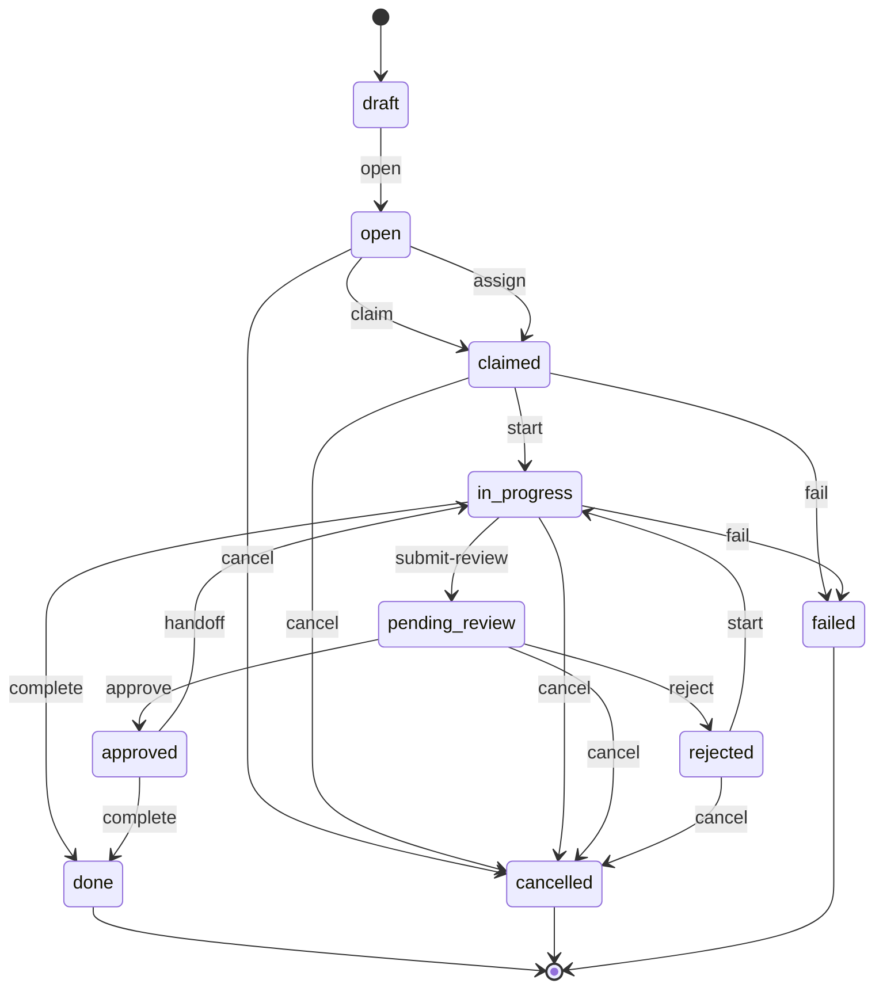

# F03 — 协作状态机与审批

> **Architecture Role：** 定义任务协作的**唯一写入入口** `task_state_machine.transition`，承载 SSOT 主状态、单事务多表写、`event_seq` 单调、幂等键、Outbox 同事务、审批接力。状态机定义存于独立表 `task_workflow_definitions`（Camunda/Argo 风格的版本化引用）。
>
> **依赖：** [`SPEC.md`](../SPEC.md) §1.1 D3、§1.3 I1–I6、§5 默认写入路径、[`F01`](F01_TASK_ONTOLOGY_AND_NODE_TYPES.md) `current_state / state_version / workflow_ref`、[`F04`](F04_TASK_RELATIONAL_SUBSTRATE_AND_OBSERVABILITY.md) 7 张表 DDL。

**文档状态：Draft（v1）**

---

## 1. Goal

- 提供唯一应用层服务入口 `app/services/task/task_state_machine.py::transition(...)`；命令层不得绕过直写图节点 `current_state` 或 `task_assignments`。
- 在**单 PostgreSQL 事务**内完成：幂等命中检查 → 行锁 → 校验 → 取 `event_seq` → 更新 SSOT → 维护 `task_assignments` → 追加 `task_state_transitions` → 写 `task_outbox`。
- 通过 workflow_definition 驱动状态机，支持典型链路 *agent1 检查 → admin 审批 → agent2 执行*。
- I1–I6 不变式契约级落地。

## 2. 默认 workflow `default_v1`

### 2.1 状态机图



### 2.2 状态语义

| state | 终态 | expected_roles（active）| 说明 |
|---|---|---|---|
| `draft` | 否 | `{owner}` | 初创，未发布 |
| `open` | 否 | `{owner}` | 可被认领/指派 |
| `claimed` | 否 | `{owner, executor}` | 已认领，未开工 |
| `in_progress` | 否 | `{owner, executor}` | 执行中 |
| `pending_review` | 否 | `{owner, executor, approver}` | 等待审批 |
| `approved` | 否 | `{owner, executor}` | 审批通过；可继续 `complete` 或 `handoff` |
| `rejected` | 否 | `{owner, executor}` | 审批驳回；可 `start` 重来或 `cancel`（**审批语义**） |
| `failed` | **是** | `{}` | 执行失败终态（OQ-20；**执行语义**，区别于 `rejected` 的审批驳回）；payload 含 `failure_reason / retry_attempt`；v2 `retry` 事件可从 `failed → open` |
| `done` | **是** | `{}` | 完成 |
| `cancelled` | **是** | `{}` | 取消（保留审计） |

### 2.3 workflow_definition 行（seed 写入 [F04 §3](F04_TASK_RELATIONAL_SUBSTRATE_AND_OBSERVABILITY.md#3-ddl-草案) `task_workflow_definitions`）

```yaml
key: default_v1
version: 1
is_active: true
spec:
  _schema_version: 1
  initial_state: draft
  terminal_states: [done, cancelled, failed]
  states:
    draft:        { expected_roles: [owner] }
    open:         { expected_roles: [owner] }
    claimed:      { expected_roles: [owner, executor] }
    in_progress:  { expected_roles: [owner, executor] }
    pending_review: { expected_roles: [owner, executor, approver] }
    approved:     { expected_roles: [owner, executor] }
    rejected:     { expected_roles: [owner, executor] }
    failed:       { expected_roles: [] }
    done:         { expected_roles: [] }
    cancelled:    { expected_roles: [] }
  events:
    open:           { from: [draft],         to: open,           required_role: owner }
    publish:        { from: [draft, open],   to: open,           required_role: owner,
                      preconditions: [no_active_executor],
                      side_effects: [update_pool(pool_id=:payload.pool_id),
                                     check_publish_acl(:payload.pool_id)] }
    claim:          { from: [open, rejected], to: claimed,       required_role: executor,
                      side_effects: [add_assignment(role=executor, kind=actor)] }
    assign:         { from: [open],          to: claimed,        required_role: owner,
                      side_effects: [add_assignment(role=executor, kind=payload.principal)] }
    start:          { from: [claimed, rejected], to: in_progress, required_role: executor }
    submit-review:  { from: [in_progress],   to: pending_review, required_role: executor,
                      side_effects: [add_assignment(role=approver, kind=payload.approver)] }
    approve:        { from: [pending_review], to: approved,      required_role: approver }
    reject:         { from: [pending_review], to: rejected,      required_role: approver,
                      side_effects: [retire_assignments(roles=[approver])] }
    handoff:        { from: [approved],      to: in_progress,    required_role: owner,
                      side_effects: [retire_assignments(roles=[executor]),
                                     add_assignment(role=executor, kind=payload.principal)] }
    complete:       { from: [in_progress, approved], to: done,   required_role: executor,
                      preconditions: [children_all_terminal] }
    fail:           { from: [claimed, in_progress], to: failed,  required_role: executor,
                      side_effects: [retire_assignments(roles=[executor])],
                      payload_schema: {failure_reason: str, retry_attempt: int, error_code: str?} }
    cancel:         { from: [draft, open, claimed, in_progress, pending_review, approved, rejected, failed],
                      to: cancelled, required_role: owner }
```

> `required_role` 含义：`actor_principal` 必须在 `task_assignments` 中持有 `is_active=true AND role=<role>` 行（`owner` 行在创建时由 `OWNED_BY` 边等价同步插入）。

### 2.4 其它 workflow（v1 可选 seed）

- **`patrol_v1`**：单环节执行 + 自动审批跳过（巡检无需人工审批）。
- **`review_handoff_v1`**：包含 `handoff` 阶段（用于 §5 接力示例）。

> 自定义 workflow 由管理员经 `task workflow create`（v2）或迁移直插入 `task_workflow_definitions`。v1 仅 seed 写入。

### 2.5 版本 pin 与迁移（OQ-23）

**创建时 pin**：`task create` 服务在事务内解析 `workflow_ref`：

```sql
SELECT version
  FROM task_workflow_definitions
 WHERE key = :workflow_key AND is_active
 ORDER BY version DESC
 LIMIT 1;
```

把解析得到的 `{key, version}` 写入 `nodes.attributes.workflow_ref`，**后续状态机所有校验均按此 pin 的版本执行**，即便 `task_workflow_definitions` 追加了新 `version` 或把旧 `version` 的 `is_active` 置 `false`，in-flight 任务行为不变。

**热更新语义**：

| 操作 | 对新任务 | 对 in-flight 任务 |
|---|---|---|
| 插入 `(key, N+1, is_active=true)` | 采用 `N+1` | 保持 `N` 不变 |
| 把旧 `(key, N, is_active=false)` | `task create` 回退到 `N-1 is_active=true` 行；若无则 `WorkflowDefinitionInactive` | in-flight 任务继续使用 `N`（已 pin） |
| 直接 `UPDATE spec` 覆盖（**不建议**） | 立即生效 | 立即生效；为防此风险，F04 §9 ACCEPTANCE 要求 CI 禁止 `UPDATE task_workflow_definitions SET spec=...`；升级必须 `INSERT` 新 `version` |

**迁移占位（v2）**：
- 新增 `task migrate <id> --to <key>:<version>`（需 `task.admin`），校验新版本状态集包含当前 `current_state` 且 events 超集兼容；写 `task_state_transitions(event='migrate', metadata={from_ref, to_ref, compatibility_report})`。
- v1 不实现；`workflow_ref.key / version` 视为 in-flight 任务的**不可变字段**，任何直改抛 `WorkflowPinViolation`（Phase B 加 CI 静态检查）。

**ACCEPTANCE（Phase B）**：
- [ ] 单元：`task create` 同一事务内拉取 `MAX(version) WHERE is_active`；并发创建时每任务 pin 到一致版本。
- [ ] 集成：插入 `default_v1 version=2` 后，既有 `version=1` 任务推进事件不报错；新 `task create` 使用 `version=2`。
- [ ] 静态检查：代码库中不存在对 `task_workflow_definitions.spec` 的 `UPDATE` 语句（CI grep）。

## 3. 单事务原子写入模板

```sql
BEGIN;

-- (1) 幂等键命中检查（I6）
SELECT id, to_state, metadata, event_seq
  FROM task_state_transitions
 WHERE task_node_id = :task_id AND idempotency_key = :idem_key;
-- 命中 → 直接返回原 TransitionResult，提交空事务（或 ROLLBACK 后返回）

-- (2) 加锁（守则：nodes → task_assignments → task_state_transitions）
SELECT id, attributes FROM nodes
 WHERE id = :task_id AND type_code = 'task'
 FOR UPDATE;

-- (3) 校验
--   a) (current_state, event) ∈ workflow_definition[workflow_ref].events
--   b) expected_version = (attributes->>'state_version')::int   -- I4
--   c) actor_principal 持有 events[event].required_role 的 active assignment
--   d) preconditions（如 children_all_terminal）

-- (4) 取 per-task event_seq（I4）
SELECT COALESCE(MAX(event_seq), 0) + 1 AS next_seq
  FROM task_state_transitions WHERE task_node_id = :task_id;

-- (5) 更新 SSOT（I4 乐观锁）
UPDATE nodes
   SET attributes = jsonb_set(
         jsonb_set(attributes, '{current_state}', to_jsonb(:next_state)),
         '{state_version}', to_jsonb((attributes->>'state_version')::int + 1))
 WHERE id = :task_id
   AND (attributes->>'state_version')::int = :expected_version;
-- 受影响行 = 0 → ROLLBACK + OptimisticLockError

-- (6) 派生表：task_assignments
--   side_effects 解析：
--   - retire_assignments(roles=[r1,r2,...])
UPDATE task_assignments
   SET is_active = false, released_at = now()
 WHERE task_node_id = :task_id AND is_active AND role = ANY(:retiring_roles);
--   - add_assignment(role, principal_kind, principal_id|principal_tag)
INSERT INTO task_assignments
  (task_node_id, principal_id, principal_kind, principal_tag,
   role, stage, is_active, assigned_by, assigned_at)
 VALUES (...);

-- (6') 父任务 rollup（I8 不变式，仅当本任务有 PARENT_OF 父边时；B2-3 / OQ-21）
--     为避免死锁，按固定顺序：先子锁（步骤 2 已锁），再父锁
SELECT parent_id FROM edges
 WHERE from_node_id IS NULL AND to_node_id = :task_id AND kind = 'PARENT_OF'
 -- (伪：实际由仓储层统一抽取父节点 id)
;
-- 若父存在：
SELECT id, attributes
  FROM nodes
 WHERE id = :parent_id AND type_code = 'task'
 FOR UPDATE;
UPDATE nodes
   SET attributes = jsonb_set(
         attributes, '{children_summary}',
         :recomputed_summary_jsonb)       -- 由服务按 :next_state 与 :current_state 增减
 WHERE id = :parent_id;
INSERT INTO task_events
  (task_node_id, kind, actor_principal_id, actor_principal_kind, payload, correlation_id, trace_id, created_at)
 VALUES
  (:parent_id, 'task.children_rolled_up',
   :actor_id, :actor_kind,
   jsonb_build_object('_schema_version', 1,
                      'child_task_id', :task_id,
                      'from_state', :current_state,
                      'to_state', :next_state,
                      'summary', :recomputed_summary_jsonb),
   :correlation_id, :trace_id, now());

-- (7) 追加 task_state_transitions
INSERT INTO task_state_transitions
  (task_node_id, event_seq, idempotency_key,
   from_state, to_state, event,
   actor_principal_id, actor_principal_kind, stage, reason,
   correlation_id, trace_id, metadata, idempotency_expires_at, created_at)
 VALUES (
   :task_id, :next_seq, :idem_key,
   :current_state, :next_state, :event,
   :actor_id, :actor_kind, :stage, :reason,
   :correlation_id, :trace_id, :metadata_jsonb,
   CASE WHEN :idem_key IS NULL THEN NULL ELSE now() + INTERVAL '7 days' END,
   now());

-- (8) 出站事件 task_outbox（与业务同事务，exactly-once 接入点）
INSERT INTO task_outbox
  (task_node_id, pool_key, event_kind, payload, correlation_id, trace_id, created_at)
 VALUES (
   :task_id, :pool_key_or_system,
   'task.state_changed', :payload_jsonb,
   :correlation_id, :trace_id, now());

COMMIT;
```

### 3.1 加锁顺序（死锁守则）

为避免父子任务并发更新死锁，强制锁顺序：

1. 子任务 `nodes` 行（步骤 2）
2. 父任务 `nodes` 行（步骤 6'，仅当有父）
3. `task_assignments` 行（步骤 6）
4. `task_state_transitions` / `task_events` / `task_outbox` 为 INSERT 无锁冲突

**同一父任务下多个子任务并发进入终态**：每子任务仍按"子锁→父锁"获取，父 `SELECT ... FOR UPDATE` 串行化，`children_summary` 计数保证原子自增/自减；并发吞吐由 PostgreSQL 单行锁决定（父任务峰值 1k rollup/s 足以应付 10k 子任务规模）。

**`children_summary` 结构**（B2-3）：

```json
{
  "_schema_version": 1,
  "total": 200,
  "by_state": {
    "draft": 0, "open": 15, "claimed": 3, "in_progress": 12,
    "pending_review": 0, "approved": 0, "rejected": 1,
    "failed": 2, "done": 165, "cancelled": 2
  },
  "terminal_count": 169,
  "last_updated_at": "2026-04-28T04:25:18Z"
}
```

- `task complete <parent>` 前置条件 = `terminal_count = total`（等价于"全部子任务终态"）。
- **I8 不变式**：`SUM(by_state.values()) = total` ∧ `total = COUNT(*) FROM edges WHERE kind='PARENT_OF' AND from_node_id=parent_id`。

### 3.1 加锁顺序与死锁

- **固定顺序**：`nodes → task_assignments → task_state_transitions → task_outbox`。
- 同任务内多 SELECT FOR UPDATE 必先取 `nodes` 行。
- 跨任务批操作禁止在单事务内（见 [F02 §7.3](F02_TASK_POOL_AND_CLAIM_PROTOCOL.md#73-why-不批事务)）。
- 集成测试要求覆盖：并发同一任务的两个事件，验证仅一方提交、另一方失败。

### 3.2 错误形态

| 错误 | 触发 |
|---|---|
| `IdempotentReplay` | 幂等键命中 → 返回原结果（**非异常**，正常路径） |
| `WorkflowEventNotAllowed` | `(current_state, event)` 不在 workflow_definition 中 |
| `OptimisticLockError` | `expected_version` 不匹配 |
| `RoleRequiredError` | actor 缺少 `required_role` 的 active assignment |
| `PreconditionFailed` | 如 `children_all_terminal` 未满足 |
| `WorkflowDefinitionNotFound` | `workflow_ref` 解析失败 |
| `WorkflowDefinitionInactive` | `is_active=false` |
| `PoolNotFound` | `event=publish` 或 `event=claim` 时 `pool_id` 解析失败 |
| `PoolInactive` | 目标池 `is_active=false` |
| `PublishAclDenied` | `event=publish` 时 actor 未通过池 `publish_acl` |
| `ConsumeAclDenied` | `event=claim` 时 actor 未通过池 `consume_acl` |

## 4. 服务签名

```python
# app/services/task/task_state_machine.py

@dataclass(frozen=True)
class TransitionResult:
    task_id: int
    from_state: str
    to_state: str
    event: str
    event_seq: int
    state_version: int
    idempotent_replay: bool       # True 表示命中幂等键，未实际写入
    correlation_id: str | None
    trace_id: str | None

def transition(
    task_id: int,
    event: str,
    actor_principal: Principal,
    expected_version: int,
    *,
    idempotency_key: str | None = None,
    correlation_id: str | None = None,
    trace_id: str | None = None,
    payload: dict | None = None,
    db_session: Session | None = None,   # 允许调用方传入会话，但 transition 内会建立 SAVEPOINT
) -> TransitionResult:
    """
    唯一状态迁移入口（不变式 I3）。
    - 不允许在外部已开事务中绕过本函数写 nodes.attributes.current_state / state_version
      或 task_state_transitions / task_assignments / task_outbox。
    """
```

- `actor_principal` 来自 [`CommandContext`](../../../../backend/app/commands/base.py)；含 `principal_id / principal_kind / roles`。
- `correlation_id / trace_id` 默认从 `CommandContext.metadata` 提取；缺失时自动生成 UUID。
- 命令层装饰器在调用前完成 RBAC 校验（`task.<event>` 权限码）。

## 5. 审批接力示例（agent1 → admin → agent2）

> 工作流：`review_handoff_v1`（与 `default_v1` 同图，强调 `submit-review / approve / handoff` 阶段）。

### 5.1 步骤拆解

| 步 | 角色 | 命令 | 状态变迁 | 事务内副作用 |
|---|---|---|---|---|
| 0 | admin | `task create --title ... --workflow review_handoff_v1:1 --assignee @agent1` | `draft → open → claimed`（连发 `open` + `assign` 事件，或单步 `create` 默认连发） | 插入 `assignment(role=executor, principal=agent1)` |
| 1 | agent1 | `task start <id>` | `claimed → in_progress` | 无 |
| 2 | agent1 | `task submit-review <id> --approver @admin` | `in_progress → pending_review` | 插入 `assignment(role=approver, principal=admin)` |
| 3 | admin | `task approve <id>` | `pending_review → approved` | 失活 `role=approver`；保留 `role=executor=agent1` |
| 4 | admin | `task handoff <id> @agent2` | `approved → in_progress` | 失活 `role=executor=agent1`；插入 `role=executor=agent2` |
| 5 | agent2 | `task complete <id>` | `in_progress → done` | 失活全部 active assignments |

### 5.2 事件流（按 `event_seq` 排序）

| event_seq | event | from → to | actor | active assignments after |
|---|---|---|---|---|
| 1 | open | draft → open | admin | owner=admin |
| 2 | assign | open → claimed | admin | owner=admin, executor=agent1 |
| 3 | start | claimed → in_progress | agent1 | owner=admin, executor=agent1 |
| 4 | submit-review | in_progress → pending_review | agent1 | owner=admin, executor=agent1, approver=admin |
| 5 | approve | pending_review → approved | admin | owner=admin, executor=agent1 |
| 6 | handoff | approved → in_progress | admin | owner=admin, executor=agent2 |
| 7 | complete | in_progress → done | agent2 | owner=admin |

每步 `nodes.attributes.current_state` 同步推进，`state_version` 每步 +1，`task_outbox` 同事务写出 `task.state_changed` 事件。

### 5.3 与 `npc_agent` 集成

- `agent1 / agent2` 通过各自 `subscription_bindings` 订阅 `task.pool.<scope_tag>` 或显式 `assign`。
- 审批人 `admin` 可通过 `task list --approver` 查看待审批集合（visibility = `role_scope`，谓词命中 `approver` 角色）。
  > 注：该路径属于扩展能力；当前实现未启用 `role_scope` 可见性。
- 通知（v2）：dispatcher 消费 `task_outbox.event_kind = task.state_changed` 推送给相关 principal。

## 6. 审批委托（v1 仅文档化，决策 13）

- v1 **不实现**委托表与命令；现有 `task assign` / `task handoff` 可作为临时变通。
- 未来扩展（详见 [SPEC §10.2](../SPEC.md#102-未来扩展v2-候选)）：

```
task_approval_delegations
  id BIGSERIAL PK
  delegator_id BIGINT NOT NULL
  delegatee_id BIGINT NOT NULL
  scope JSONB                  -- 例如 {workflow_ref: ..., pool_tags: [...]}
  valid_from TIMESTAMPTZ
  valid_to TIMESTAMPTZ
  is_active BOOLEAN DEFAULT true
```

- 钩子点：`task_state_machine._resolve_effective_principal_for_event(event='approve', actor=...)`，在校验 `required_role` 前查委托表替换 `effective_principal`。

## 7. 巡检 worker 与一致性保障

详见 [F04 §5](F04_TASK_RELATIONAL_SUBSTRATE_AND_OBSERVABILITY.md#5-一致性巡检-worker)。要点：

- 周期巡检不变式 I1 / I2；不一致写 `task_events.kind=consistency_drift` + structlog 告警。
- v1 **仅检测，不自愈**；I3 已在写路径强制单一入口。

## 8. ACCEPTANCE

- [ ] `task_state_machine.transition` 是 `current_state / state_version / task_assignments / task_state_transitions / task_outbox` 的**唯一**写入路径（CI 静态扫描 + 集成测试断言）。
- [ ] 默认 workflow `default_v1` 全状态/事件矩阵单元测试 100% 覆盖。
- [ ] §5 接力链路 7 步事务集成测试通过；`event_seq` 严格 1→7 递增；最终 `current_state=done`。
- [ ] 并发同一 task 双事件：仅一方提交，另一方收 `OptimisticLockError`。
- [ ] 同一 `(task_id, idempotency_key)` 重复调用返回 `idempotent_replay=True` 且不二次写。
- [ ] `task complete <parent>` 在子任务非全终态时返回 `PreconditionFailed`（[F01 §5.2](F01_TASK_ONTOLOGY_AND_NODE_TYPES.md#52-手动-rollup默认)）。
- [ ] 加锁顺序冲突的死锁压力测试通过（参考 [docs/testing/SPEC/SPEC.md](../../../testing/SPEC/SPEC.md)）。

## 9. 相关

- 主 SPEC：[`../SPEC.md`](../SPEC.md)
- 任务本体：[`F01_TASK_ONTOLOGY_AND_NODE_TYPES.md`](F01_TASK_ONTOLOGY_AND_NODE_TYPES.md)
- 任务池：[`F02_TASK_POOL_AND_CLAIM_PROTOCOL.md`](F02_TASK_POOL_AND_CLAIM_PROTOCOL.md)
- 关系子底座：[`F04_TASK_RELATIONAL_SUBSTRATE_AND_OBSERVABILITY.md`](F04_TASK_RELATIONAL_SUBSTRATE_AND_OBSERVABILITY.md)
- 命令族：[`../../../command/SPEC/features/CMD_task.md`](../../../command/SPEC/features/CMD_task.md)
- 死锁守则：[`../../../testing/SPEC/SPEC.md`](../../../testing/SPEC/SPEC.md)
