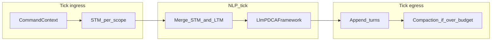
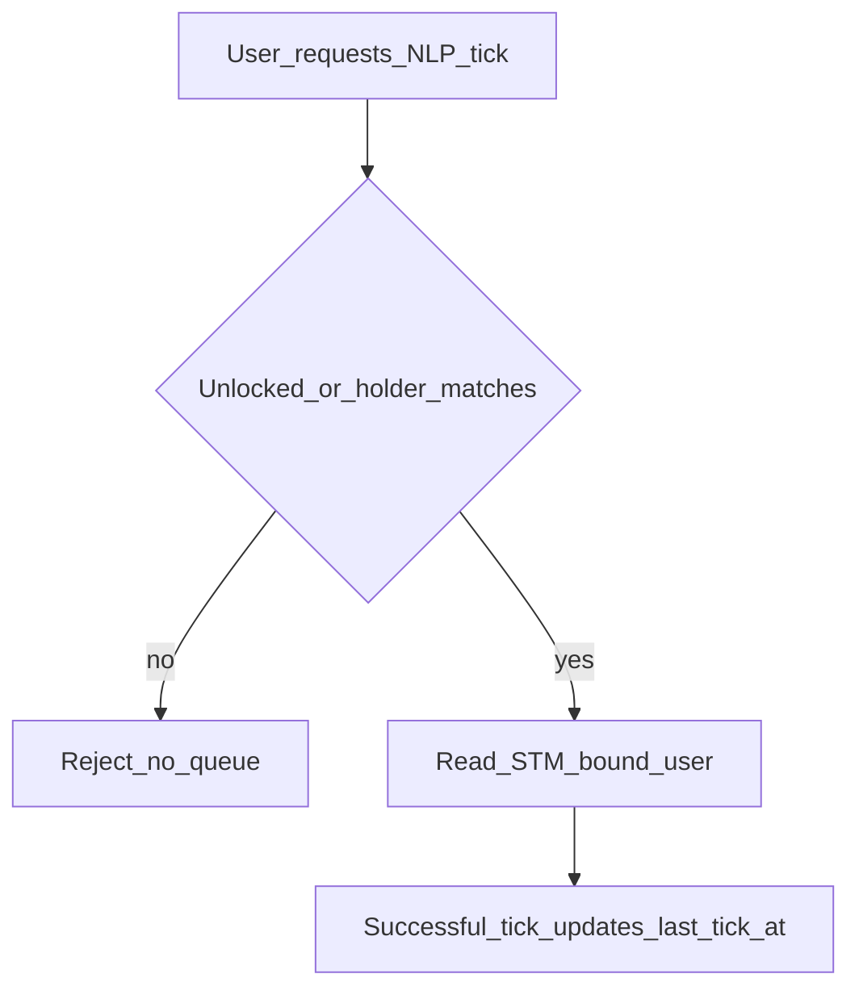
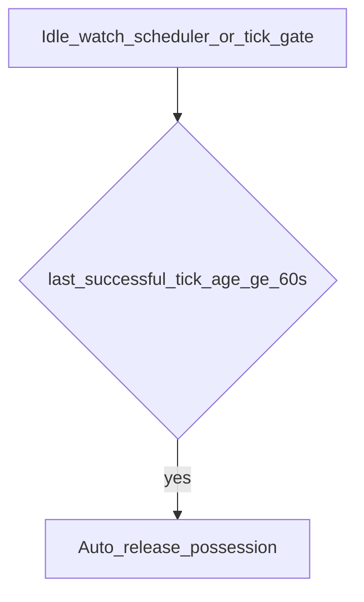

# F12 — NLP Agent 多轮对话与会话记忆（STM / LTM）

> **Architecture Role：** 为 **`npc_agent`** 在 **`decision_mode: llm`** 下的 **NLP 公共路径**（`aico`、`@<handle>`、`run_npc_agent_nlp_tick`）定义 **会话级短期记忆（STM）**、**压缩（compaction）** 与 **长期记忆（LTM）写入/检索** 的契约；使多次命令调用在约定的 **生命周期作用域** 内保持语义连续，并在容量或会话结束时将可检索知识沉淀到 LTM。与 **F08**（工具观测）、**F07**（按用户区隔的 LTM 晋升）、**F11**（意图分类）互补。**Agent 四层架构** 规范真源见 [**F09**](F09_CAMPUSWORLD_AGENT_ARCHITECTURE_FOUR_LAYERS.md)。

**文档状态：Partially implemented**（与正文其他段落冲突时 **以 §18 表格为准**；代码真源见 [`ADR-F12`](../../ADR/ADR-F12-conversation-stm-and-ltm.md)。）

**交叉引用：** [**F08**](F08_AICO_TOOL_CONTEXT_AND_AGENT_LOOP.md)（Command-as-Tool、`memory_context` 与 ToolObservation）、[**F07**](F07_PER_USER_AGENT_MEMORY_AND_ASYNC_LTM_PROMOTION.md)（用户级记忆与异步晋升；本文 flush 与晋升边界见 §9）、[**F11**](F11_AGENT_INTENT_CLASSIFIER_RUNTIME.md)（Plan 前意图提示）、[**F06**](F06_CAMPUSLIBRARY_KNOWLEDGE_WORLD.md)（CampusLibrary；与本节 LTM 检索互补）。

**实现锚点（现状）：** [`backend/app/commands/npc_agent_nlp.py`](../../../../backend/app/commands/npc_agent_nlp.py)（`run_npc_agent_nlp_tick`、`maybe_ltm_memory_context`）、[`backend/app/game_engine/agent_runtime/worker.py`](../../../../backend/app/game_engine/agent_runtime/worker.py)（`LlmPdcaAssistantWorker.tick`、`FrameworkRunContext.memory_context`）、[`backend/app/game_engine/agent_runtime/memory_port.py`](../../../../backend/app/game_engine/agent_runtime/memory_port.py)（`SqlAlchemyMemoryPort`、`AgentRunRecord`）、[`backend/app/game_engine/agent_runtime/frameworks/llm_pdca.py`](../../../../backend/app/game_engine/agent_runtime/frameworks/llm_pdca.py)（`_assemble_plan_user`）、[`backend/app/services/ltm_semantic_retrieval.py`](../../../../backend/app/services/ltm_semantic_retrieval.py)（LTM 检索）、[`backend/app/game_engine/agent_runtime/conversation_stm_service.py`](../../../../backend/app/game_engine/agent_runtime/conversation_stm_service.py)（Mode A/B STM、附身、`release_mode_b_possession_for_transport_session_if_configured`）；SSH [`backend/app/ssh/session.py`](../../../../backend/app/ssh/session.py) `SessionManager.remove_session` 与 WebSocket [`backend/app/api/ws_handler.py`](../../../../backend/app/api/ws_handler.py) 断开时在配置开启下 **幂等释放** Mode B 锁行。

### 实现状态对照（§18 摘要）

| ID | 状态 | 说明 |
|----|------|------|
| D1 / D25 | **Done** | 成功 tick 后 append STM / 刷新 `last_successful_tick_at`；失败与 gate **不** append。 |
| D2 / D8 | **Done** | tick **前**仅 `FOR UPDATE` 冲突检测；**`locked_by_account_node_id` 在成功 tick 后写入**。 |
| D5 | **Done** | Plan：`recent_conversation` + `retrieved_memory`；Do：`memory_context_do`（见 `llm_pdca`）。 |
| D7 / D23 | **Partial** | 检索侧 caller + 可选 thread；**`agent_long_term_memory.caller_account_node_id` 迁移后为 NOT NULL**；异步晋升写入路径须单独对齐 F07。 |
| D9 | **Partial** | 传输断开释放（SSH + WS）、tick 路径 idle 抢占已实现；**sweep / 结构化 `release_reason` / D14 指标**仍待办。 |
| D10–D11 / D17 / D20 | **Partial** | 确定性截断为主；**sync_llm / compaction_focus / cheap 模型**未接线。 |
| D14 | **Not done** | Prometheus 级指标未齐。 |
| D18 | **Done** | `aico -nd/-l/-cd` + thread 元数据表；隐式 thread 懒创建。 |
| D19 | **Partial** | NLP 链 `prompt_fingerprint` + provider 剥离；全局统一出口见 ADR 二阶段。 |
| Passthrough | **Locked** | HTTP 不可用时的 passthrough **不**触碰 Mode B 锁、**不**刷新 `last_successful_tick_at`（等同不设 `passthrough_counts_as_success_tick`）。 |
| Transport release（全局） | **Done** | **`npc_agent.daemon_possession.possession_release_on_transport_close`**：与 **`agents.llm.by_service_id`**（如 AICO）分离，表示 **全体** Mode B daemon 在传输断开时的运行时策略。 |

---

## 1. Goal

- **会话连贯：** 在同一 **ConversationScope**（见 §4）内多次 NLP tick 共享 **STM**，后续轮次模型可见前文用户意图与助手结论（指代、续问、同一任务跟进）。
- **两类作用域（规范性）：** 系统必须区分 **每用户助理型** 与 **系统 daemon / 共享 NPC 附身型**（见 §4）；配置与存储键、并发语义分别约束。
- **容量可控：** STM 超过配置阈值时 **compaction**（摘要 + 丢弃或折叠旧段），避免无限增长与上下文爆炸。
- **跨会话回忆：** 通过 **LTM 检索**（现有 `enable_ltm` 路径）与可选 **flush**（会话结束或 compaction 淘汰段）沉淀 episodic/语义条目，与 **F07** 对齐。
- **传输绑定：** **每用户助理型** 默认 **caller × 传输会话 × agent 节点**；**daemon 型** 的 STM 在 **全系统内「每一个 Mode B agent 节点实例」一条线程**，与传输会话解耦（详见 §4）。
- **Mode B 并发策略：** **不提供排队**；非占有者 tick **一律拒绝**。系统可部署 **多个 daemon agent 节点实例**（如多个安防巡检节点），附身冲突分散在实例维度，整体 **可控**。
- **Mode B 空闲释放：** 占有成功后，若 **连续无成功 NLP 对话 tick**，经 **`possession_idle_release_seconds`（默认 60）** 自动释放附身，他人可抢占（详见 §4.2、§9.1）。
- **公共性：** 契约面向 **任意** `npc_agent` NLP 入口，不仅限于 `service_id=aico`。

---

## 2. Non-Goals

- **v1** 不要求「流式输出中途用户打断」的完整交互模型。
- **不替代** F08 **ToolObservation** 机制；STM **默认不**全量存储每轮工具原始观测（§7；含义 **§19.1**）。
- **不替代** Execution Gate、命令授权或 CampusLibrary（F06）的主体检索职责。
- **不将**某一厂商 API 定为唯一实现方式；以下为 **对标**，非依赖。
- **Mode B：** **不提供**「等待队列」式附身；冲突处理仅为 **拒绝 + 多实例分流 + 空闲自动释放**（§4.2）。

---

## 3. Current behavior（实现现状摘要）

- **每 tick 新 run：** `SqlAlchemyMemoryPort` 仍写入 **`AgentRunRecord`** / **`AgentMemoryEntry`**（单次 tick 审计）；跨 tick **会话 transcript** 由 **`agent_conversation_stm` / `agent_daemon_stm_lock`** 承载（`enable_conversation_stm`，默认关闭见配置注释）。
- **STM + LTM：** `run_npc_agent_nlp_tick` 在 STM 开启时合并 **STM 文本**与（可选）**LTM**（`build_ltm_memory_context_for_tick`，按 **`ltm_retrieval_scope`** 决定是否按 thread 过滤）；Plan 区块顺序见 §7 / `llm_pdca`。
- **Scope 键：** Mode A：**`(caller_account_node_id, transport_session_id, agent_node_id, conversation_thread_id)`**；Mode B：**每 agent 单行锁**，`lock_transport_session_id` 记录占有者传输会话（用于断开释放）。
- **Passthrough：** HTTP LLM 不可用时 **提前返回**，**不**走 STM / Mode B 锁，**不**刷新成功 tick 时间戳。

---

## 4. Agent dialogue lifecycle scopes（两类多轮对话作用域）

本章为 **产品级规范性约束**：CampusWorld 中 NLP Agent 的多轮 STM/LTM 生命周期 **至少**支持下列两种；节点通过配置归属其一（默认与 **AICO** 对齐第一类）。

### 4.1 Mode A — Per-user assistant（每用户 + 传输会话 + Agent）

| 维度 | 约定 |
|------|------|
| **典型实例** | 默认助手 **AICO**：为 **每一调用用户** 提供独立对话体验。 |
| **ConversationScope 键** | **`(caller_user_id, transport_session_id, agent_node_id, conversation_thread_id)`**（`transport_session_id` = `CommandContext.session_id`）。**`conversation_thread_id`**：**首次进入对话时懒创建**（每传输会话可有一条隐式 default，**§23.3.2**）；**`aico -nd` / `-cd`** 仅切换或新建该 id（**§22.4**）。 |
| **STM 语义** | 仅该用户在该传输会话内与该 agent 的对话线程；**不**与其他用户共享 transcript。 |
| **并发** | 多用户可同时与 **各自的** AICO（或同类型助理节点）对话；scope 键天然隔离。 |
| **传输会话结束** | 该用户的 SSH/WebSocket 会话结束时，对该 scope 触发 **flush / TTL**（配置可选）；**不**影响其他用户。 |
| **LTM** | 检索与写入命名空间须包含 **用户标识**，避免跨用户串味（见 §11）。 |

### 4.2 Mode B — System daemon / shared NPC（系统级共享上下文 + 附身独占）

| 维度 | 约定 |
|------|------|
| **典型实例** | **知识挖掘**、**安防巡检** 等以 **系统 NPC** 形式运行的 daemon Agent：**每一个此类图节点实例**在全系统只有 **一条 STM 线程**（该实例内共享上下文）。同类职责可通过 **多个 agent 节点实例** 横向扩展，附身冲突 **按实例隔离**。 |
| **ConversationScope 键** | **`agent_node_id` 单一真源**（针对 **该节点这一实例**）：STM **不包含** `transport_session_id` 作为分区键。 |
| **附身（独占）语义** | 同一时刻 **至多一名用户** 可与 **该 agent 实例** 进入 NLP 对话。非占有者发起 tick → **拒绝**（明确错误文案）；**不提供排队**。 |
| **冲突可控** | 部署多个 daemon 实例（多节点）时，用户可附身 **不同实例**，全局竞争稀释；配合 **空闲自动释放**，锁占用时间短。 |
| **占有生命周期** | **获取（v1）：** 该用户在该 agent 实例上 **首次成功完成 NLP tick** 且锁空闲时取得附身（与 **§18 D2** 一致）。**显式 `attach` / `attach_lease`** 留 **v2**，不在 v1 对外承诺。**释放：**（1）占有者传输会话结束（若 `possession_release_on_transport_close`）；（2）显式 `detach`；（3）**空闲超时**：自 **上一次成功完成的 NLP tick** 起算，连续 **`possession_idle_release_seconds`（默认 60）** 内无新的 **成功 NLP tick**，自动释放（「附身后不对话」不占坑）。计时器在每次成功 tick 后重置。工程未就绪时的降级语义见 **§23.8**。 |
| **STM 与用户信息** | STM 内容虽 **该实例内一份**，但 **必须**在每条 tick、每条持久化记忆中携带 **`bound_user_id`（及可选 `bound_username`）`**：便于审计、合规与多轮内模型知晓「当前对话主体是谁」；**LTM flush / episodic 条目必须写入绑定用户标识**，不得匿名混入系统全局事实而不标注来源用户。 |
| **与 Mode A 的差异（摘要）** | Mode A：**多用户并行、各自 STM**；Mode B：**单实例单 STM、串行附身、拒绝非占有者、须记录绑定用户**。 |

### 4.3 Configuration declaration（节点侧）

- 建议在 **`npc_agent` 节点 `attributes`**（或 `agents.llm` extra）声明 **`conversation_scope_mode`**：
  - **`per_user_session`** — 对应 §4.1（默认，与 AICO 期望一致）。
  - **`system_shared_exclusive`** — 对应 §4.2（daemon / 附身型）。
- **authorization：** daemon agent 仍可单独配置谁 **有权附身**（角色/权限）；与本节 **并发独占** 正交。

### 4.4 Terminology（术语）

| 术语 | 含义 |
|------|------|
| **ConversationScope** | 隔离 STM 的逻辑边界；键形状由 **`conversation_scope_mode`** 决定（§4.1 / §4.2）。 |
| **Possession / 附身** | Mode B 下用户对 **某个 daemon 实例** 的 **独占对话权**；非占有者 **拒绝**（无排队）；**60s 无成功 NLP tick** 自动释放（可配置）。**v1 权威实现：PostgreSQL 单行锁 + `last_successful_tick_at`**（**§18 D8、D22**）；Redis **不作为**附身或 STM 的真源。 |
| **bound_user** | Mode B 下当前 STM 线程对应的 **对话用户**；须写入 STM 元数据与 LTM 条目。 |
| **STM（短期记忆）** | 在 CurrentScope 内、注入下一轮 LLM 的 **近期轮次原文** + **滚动摘要**（compaction 产物）。 |
| **Compaction** | 当 STM 超过预算时，将 **淘汰段** 折叠为摘要并可 **写入 LTM**；保留 **最近明文窗口**（对标业界 keep-recent）。 |
| **LTM flush** | 在会话结束或 compaction 时，将摘要/episodic **持久化**；Mode B 须在 flush 载荷中带 **`bound_user`**。 |
| **transport_session_id** | `CommandContext.session_id`；**Mode A** 为 scope 键的一部分；**Mode B** 可记录在锁上用于「传输断开即释放」，但不分割 STM；**空闲释放以 NLP tick 时间戳为准**（§4.2）。 |

---

## 5. Industry alignment（参考，非规范性依赖）

以下机制写入实现时可对标；URL 供人工查阅，**不要求**字段级兼容。

| 来源 | 可借用机制 | 参考链接 |
|------|------------|----------|
| **Claude Code / Agent SDK** | 按会话延续上下文；接近窗口上限时 **compact**，摘要作为合成线索；Continue / Rewind / Clear 等产品语义 | [Claude — Session management and long context](https://www.claude.com/blog/using-claude-code-session-management-and-1m-context)、[Agent SDK — Work with sessions](https://platform.claude.com/docs/en/agent-sdk/sessions) |
| **Pi / Inflection 类 compaction** | 阈值触发（如接近上下文比例）；**保留最近 token**；**迭代摘要**（新轮合并旧摘要与淘汰段，减轻反复摘要失真） | 社区深度解析（如 Pi compaction / summarization 公开笔记）；实现以 **参数化Budget** 为准 |
| **通用 RAG / MemGPT 思想** | STM = 工作集；LTM = 检索增强；写入与读取分离 | 教科书级区分，CampusWorld 以 **命令与世界语义** 为增量 |

---

## 6. STM vs LTM division of labor

| 层级 | 职责 | 时间尺度 | 典型内容 | 业界参照 |
|------|------|----------|----------|----------|
| **STM** | 维持 **当前 ConversationScope 内** 对话连贯；供 **下一次** NLP tick 注入 | Mode A：**单 `(transport_session × conversation_thread)` scope**（默认每会话一线程）；Mode B：**附身存续期间**（可跨传输会话至释放）；可选 TTL | 近期 user/assistant **原文** + **滚动摘要**；Mode B 元数据含 **bound_user**；可选 **工具轨迹一行摘要**（非全量 ToolObservation） | Claude：会话 thread + compact 边界；Pi：**keepRecentTokens** |
| **LTM** | **跨会话** 偏好、事实、项目约束；**检索增强**，不替代 STM | 持久；异步晋升（F07） | 向量段落、结构化记忆、episodic 摘要；**必须可关联用户**（Mode A 按 caller；Mode B 按 **bound_user**） | Pi-memory 类偏好注入；通用向量记忆库 |

**边界规则**

1. STM **不作为**跨登录事实真源（Mode A）；Mode B 的全局 STM 仍须在 LTM 与审计字段上 **按用户可追溯**。
2. LTM **写入源**：**(a)** compaction 淘汰段 **(b)** 会话结束 flush（Mode A）或 **占有释放 flush**（Mode B） **(c)** F07 异步晋升 / 人工管线。
3. **单次 tick** 内 F08 **ToolObservation** 仍为「当前步观测」；**默认不进 STM**（含义见 **§19.1**）；实现可选 `stm_include_tool_summary` 写入简短摘要。

---

## 7. Injection contract（与 F08 拼接顺序）

**目标：** Plan（及后续阶段若复用）可见「对话连贯 + 检索记忆 + 世界与工具」。

**规范合并顺序（相对 `_assemble_plan_user` 演进）：**

1. World snapshot（若有）
2. Tools available（若有）
3. Intent hint（若有，F11）
4. **Recent conversation（STM）** — 含滚动摘要 + 保留窗口内的 user/assistant 原文；**Mode B** 可在块首注入 **`Current dialogue user: …`**（与 bound_user 一致）
5. **Retrieved memory（LTM）** — 语义检索结果；与现有 `memory_context` 中 LTM 部分一致。**Mode A：** 默认命名空间 **`caller_user_id + agent_node_id`**，**不过滤** `conversation_thread_id`（跨线程可召回）；若配置 **`ltm_retrieval_scope=thread`** 则仅当前线程（**§18 D23**）。**Mode B：** v1 **仅当前 `bound_user`**；跨用户聚合桶 **§19.2**（v2）。
6. User message（本轮）

实现可先将 **STM + LTM** 拼入单一字符串传入 `memory_context`，但 **SPEC 要求**逻辑分段清晰，便于日志裁剪与测试。

**与 F08 关系：** F08 §5.2 Do 阶段仍含 ToolObservation；STM **不替换** ToolObservation；二者并行。

**多阶段 / 多轮 prompt 不重复（已定）：** 两层含义，**业界上通常合成一条原则**：**变化少的上下文占「稳定前缀」、本轮对话占「增量尾部」**，避免每一轮用户输入都把 **system、CampusWorld ontology primer、长期不变的工具说明** 等与上一轮 **逐字相同** 的大块再塞一遍；应把 token 与模型注意力留给 **本轮用户话轮、STM/LTM 的新增或变更块、当轮世界快照差异** 等。具体手段依运行时而定（例如 **prompt / context caching**、固定段落顺序以命中 **KV cache**、或会话状态 API 只传增量），SPEC **不绑定**某一厂商字段，但实现应 **有意区分**「很少变的全局指令」与「随对话演进的内容」。**同一 tick 内**仍须遵守：**完整 STM + LTM 仅在 Plan** 注入；**Do / Check** 不得再粘贴与 Plan **相同**的「Recent conversation / Retrieved memory」长文本。`llm_pdca`（或等价）按 phase 分支传入 **minimal / phase-specific** 上下文，并辅以测试断言 Do prompt **不包含**与 Plan 重复的 STM 块（见 **§18 D5**、**§20.1**）。

---

## 8. Triggers and ordering

| 事件 | Mode A（per_user_session） | Mode B（system_shared_exclusive） |
|------|---------------------------|----------------------------------|
| **Tick 开始前** | 读取 scope STM → LTM → 注入 | 校验 **附身锁**；读取 **全局** STM → LTM → 注入（须含 bound_user） |
| **附身冲突** | 不适用（按用户隔离） | 非占有者 → **拒绝 tick**，返回明确错误文案 |
| **Tick 成功后** | Append 本轮对话到该用户 scope | Append 到 agent 全局 STM；**校验 caller == bound_user** |
| **STM 超预算** | Compaction；可选 LTM enqueue | 同左；摘要与 LTM 条目 **带 bound_user** |
| **传输会话结束** | 对该 `(user, session, agent)` flush / 清理 STM | **仅当结束者为占有者** 时触发释放锁 + flush（配置）；默认占有绑定传输会话时 **会话结束即释放** |
| **空闲超时（Mode B）** | — | 距 **上次成功 NLP tick** ≥ `possession_idle_release_seconds`（默认 60）→ **自动释放**附身（可选 flush）；非占有者不因计时器误伤 |

**Compaction 与 flush 顺序：** 会话结束、空闲释放或 detach 时若 STM 仍超预算，可先 compaction 再 flush。

---

## 9. Configuration（草案键）

配置可落在 **`agents.llm.<service>.extra`**，并由 **`npc_agent.attributes`** 覆盖（合并优先级可对齐 F11：`extra` 为底，`attributes` 切片覆盖）。

### 9.1 Scope mode（首要）

| 键 | 含义 | 建议默认 |
|----|------|----------|
| **`conversation_scope_mode`** | **`per_user_session`**（§4.1）或 **`system_shared_exclusive`**（§4.2） | `per_user_session` |
| **`possession_idle_release_seconds`** | Mode B：**无成功 NLP tick** 的空闲秒数后自动释放附身（释放后他者可附身该实例） | **`60`** |
| `possession_release_on_transport_close` | Mode B：占有者 `session_id` 断开即释放 | `true`（建议）；**平台默认**见 [`settings.yaml`](../../../../backend/config/settings.yaml) **`npc_agent.daemon_possession.possession_release_on_transport_close`**（与 **AICO / `agents.llm.by_service_id.aico` 解耦**，作用于全体 daemon 独占实例）；SSH/WebSocket 钩子共用。**业界**：会话租约 / fencing 常在 **传输网关或运行时全局策略** 声明，而非绑定某一助手 SKU。 |

**说明：** 「无对话」 operationalized 为 **无新的成功完成 NLP tick**；每次成功 tick 刷新空闲计时。附身取得时机 **v1** 为 **首次成功 tick**（显式 `attach` 见 **§18 D2** / **v2**）。**空闲释放**：完整惰性计时 + sweep 见 **§21（D9）**；工程未就绪时对外语义 **§23.8**。

### 9.2 STM（两模式共用预算键）

| 键 | 含义 | 建议默认 |
|----|------|----------|
| `enable_conversation_stm` | 是否启用会话 STM | `false`（逐版本改为 `true`） |
| `stm_max_turns` | 保留完整轮对上限 | 如 20 |
| `stm_max_chars` | 字符硬上限 | 如 32000 |
| `stm_max_tokens_estimate` | 可选 token 估计上限 | 视模型 |
| `compaction_trigger_ratio` | 相对 STM 预算触发 compaction | 如 0.85–0.92 |
| `compaction_keep_recent_tokens` | 摘要后保留的近期明文预算 | 如 4000–8000 |
| `reserve_tokens` | 预留系统与回复头room | 视部署 |
| `compaction_use_iterative_summary` | 迭代式摘要 | `true` |
| `stm_backend` | `memory`（仅开发单机） / `database`（**生产默认；STM 与 Mode B 锁的真源**） / `redis`（**非 v1 权威**：不得单独承担耐久 STM 或附身锁；若保留该枚举值，语义为实验或后续「只读缓存」层，须 ADR） | **`database`** |
| `stm_ttl_seconds` | 空闲淘汰（**Mode A** 为主；Mode B 慎用全局 TTL） | 可选 |

**弃用说明：** 原草案 `conversation_scope_binding` = `user_agent_only`（跨终端共享）与 **Mode B** 易混淆；跨终端共享助理应由 **`per_user_session` + 产品定义的 session 粘滞策略** 单独 SPEC，**不推荐**与 daemon **system_shared_exclusive** 混用同一键。

### 9.3 LTM（检索 + 写入）

| 键 | 含义 |
|----|------|
| `enable_ltm` | 检索注入 |
| `ltm_flush_on_session_end` | Mode A：传输会话结束 flush |
| `ltm_flush_on_possession_release` | Mode B：占有释放时 flush |
| `ltm_flush_on_compaction` | compaction 淘汰段写入 |
| `ltm_async_promotion` | 异步索引（**F07**） |
| `ltm_episode_namespace` | 隔离键：**须包含 user**（Mode A caller；Mode B **bound_user**）与 **agent_node_id** |
| `ltm_record_bound_user` | Mode B：**强制** true（规范性默认） |
| **`ltm_retrieval_scope`** | **`user_agent`**（默认）：检索 **`caller_user_id + agent_node_id`**，**不过滤** `conversation_thread_id`。**`thread`**：仅当前线程（高隔离场景）。**§18 D23** |

检索 **top-k、阈值** 等与 [`ltm_semantic_retrieval`](../../../../backend/app/services/ltm_semantic_retrieval.py) 实现对齐。

---

## 10. Persistence strategy（推荐矩阵）

### 10.1 STM

| 方案 | 适用 | 优点 | 缺点 |
|------|------|------|------|
| **PostgreSQL** | **生产默认（唯一权威）** | Mode A：**每 scope 一行** STM（JSONB 消息列表等）；Mode B：**每 `agent_node_id` 一行** 锁 + STM，**同事务**（**§18 D8、D22**） | 需迁移与索引；裁剪任务见 §21 |
| **Redis** | **可选 Phase 2** | 仅作 **读缓存** 等优化 | **不得**作为 STM 或附身锁的 **唯一**持久真源；**v1 不进**正确性路径（ADR） |
| 进程内存 | 单实例、开发 | 极简 | 重启丢；**禁止**作为 Mode B 默认；多实例 Mode A 亦 **不得**仅靠内存 |

**Mode B：** **PostgreSQL 单行**（`locked_by_user_id`、`lock_session_id`、`last_successful_tick_at`、STM payload 等）；避免分进程各一份内存 STM。

### 10.2 LTM

| 方案 | 职责 | 与仓库关系 |
|------|------|------------|
| 向量存储（pgvector 等） | 语义检索 | F06 / F07 / F02 LTM 叙述 |
| **`AgentMemoryEntry` 或专用 episode 表** | 结构化 episodic、审计 | `append_raw`；**payload 含 `bound_user_id`（Mode B 必填）** |
| 异步队列 | flush 不阻塞关闭 | **F07** |

### 10.3 Idempotency and isolation

- **Flush 幂等键：** Mode A：幂等键 **必须**含 **`conversation_thread_id`**（**§23.3.2**：懒创建隐式 default）；推荐形状 **`conversation_thread_id + flush_generation`**（**§23.3.4**）。Mode B：`agent_node_id + possession_generation`（每次占有递增）或等价 UUID。
- **用户隔离：** Mode A：**禁止**跨用户读取同一 scope；Mode B：**全局 STM 可读仅占有者**；**LTM 条目始终带用户维度**，禁止未标注用户的「匿名全局记忆」写入（除非单独合规 SPEC）。

---

## 11. Observability

建议结构化字段：`conversation_scope_mode`、`conversation_scope_id`、`bound_user_id`（Mode B）、`possession_granted` / `possession_denied_reason`（如 `not_holder`、`idle_released`）、`possession_idle_release_seconds`、`last_successful_tick_at`、`stm_turns`、`stm_chars`、`compaction_triggered`、`ltm_flush_enqueued`、`flush_idempotent_key`。

---

## 12. Acceptance criteria（建议）

**Mode A**

- 同一 **`conversation_thread_id`**（及 user、agent）下连续两次 NLP tick，第二次 Plan 可见第一次对话内容；默认线程下等价于「同传输会话连续对话」。
- 不同用户并行对话 **互不**泄漏对方 STM。

**Mode B**

- 用户 A 附身 **某 daemon 实例** 后，用户 B **对同一实例**同时发起 NLP → **拒绝**（无排队）。
- 用户 B 可对 **另一 daemon 实例**（另一 `agent_node_id`）正常附身与对话（多实例分流）。
- **空闲释放：** A 附身后 **60s 内无成功 NLP tick**，锁释放；B 随后可对 **同一实例**附身成功。
- STM 与 LTM 条目中可稽核 **`bound_user_id`** 与对话内容一致。
- 占有释放后新附身 **不**默认继承前一用户的明文 STM（除非产品显式要求「继承摘要」——须单独条款）。

**共用**

- STM 超限时 compaction 后轮数或字符下降，且保留最近窗口明文。
- 多进程部署：**内存 STM** 不得作为 Mode B 默认。
- **Early-fail（D25）：** gate / 早期错误路径 **未**形成成功 tick 时 **不**增长 STM、Mode B **不**刷新 idle 计时。

---

## 13. Data model boundary（规范级）

- **`AgentRunRecord`：** 保持 **每 tick 一条** run；字段建议含 **`conversation_scope_mode`**、**`bound_user_id`**、**`conversation_thread_id`**（Mode A）、**`prompt_fingerprint`**（与 D19 对齐）。
- **STM 权威存储（D22）：** **新建专用表**（ADR 定名），**不**复用 `agent_memory_entries` 作为会话 transcript 主存。**Mode A：** 键 **`(caller_user_id, transport_session_id, agent_node_id, conversation_thread_id)`**，列为有序 **消息列表（§18 D24）**、滚动摘要、`stm_generation` 等。**Mode B：** **同一 PostgreSQL 行** 承载 **附身锁列 + STM JSONB**（**§18 D8**）。
- **附身锁：** **v1** 以 **`SELECT … FOR UPDATE`** 在同一事务内更新锁列与 STM，防止双占有（**D8**）；**不用 Redis 作为锁真源**（**D22**）。列 **`last_successful_tick_at`** 供空闲释放判定。
- **`agent_long_term_memory`：** **`caller_account_node_id`（NOT NULL，迁移删除旧 NULL 行）** 与 **`conversation_thread_id`（可空）** 等元数据，以支持 **D23** 检索范围；Mode B 写入 **须与 `locked_by_account_node_id` 一致**。具体 DDL 见迁移与 ADR。
- **F02 `agent_memory_entries`：** 仍为 **原始条目 / 晋升原料** 等用途，**不是** F12 STM 主真源。

---

## 14. Mermaid — data flow（Mode A）

## 15. Mermaid — possession（Mode B）

说明：**拒绝路径**与 **成功 tick** 见上图一；**60s 无成功 NLP tick** 的空闲释放由定时检查或与下一次 tick 闸门惰性比对 `last_successful_tick_at` 触发（实现选一），上图二仅为语义。**工程落地清单**见 **§21**。

---

## 16. Relation to F07 / F08

- **F07：** 用户级 LTM 晋升；Mode B 的 flush 须 **按 bound_user** 进入 F07 命名空间或并行 episodic 通道，避免「系统 agent」记忆变成无用户维度的黑盒。
- **F08：** `memory_context` 含 STM + LTM；ToolObservation 不变。

---

## 17. Resolved product decisions（摘要）

- Mode B：**拒绝非占有者**、**不设排队**；**默认 `possession_idle_release_seconds = 60`**；**多 daemon 实例** 分摊附身面。
- **成功 NLP tick**：`FrameworkRunResult.ok is True` 刷新计时；`ok is False` 不刷新；**passthrough 不刷新计时、不写附身 holder**（不设 `passthrough_counts_as_success_tick` 为真）。
- **附身取得**：v1 **`locked_by` 在首次成功 tick 后写入**；显式 `attach` / `attach_lease` 留 **v2**。
- **Mode B 释放后 STM**：v1 **清空明文**（可选 `daemon_stm_handoff_summary_on_release`）。
- **Mode A 线程与 STM：** **`conversation_thread_id` 自 STM 功能起懒创建**（默认每传输会话一条隐式线程，**§23.3.2**）；**`-nd`/`-cd`** 切换线程；flush/STM 键 **自始含 thread**。**破坏性迁移可接受**，不做旧 STM 回填。
- **Plan / Do / 跨轮前缀**：完整 STM+LTM **仅 Plan**；Do/Check **不重复**同一块；system、primer 等 **慢变块** 勿每轮 **无谓重复全文**，见 **§20.1**（**§18 D5**）。
- **工具**：默认 **不进 STM**（**§19.1**）；可选 `stm_include_tool_summary` 仅命令名。
- **Mode B LTM 检索**：v1 **仅 bound_user**；跨用户 **聚合桶** 见 **§19.2**（v2）。
- **Mode B 锁真源**：v1 **PostgreSQL 单行 + `FOR UPDATE`**。
- **D9**：**tick 路径 idle 抢占 + 传输断开幂等释放** 已实现（§21 勾选）；**sweep / 结构化释放日志 / D14** 仍列入 **§21**。
- **Compaction**：v1 **截断最旧轮**；同步 LLM 摘要可选（默认关）。
- **摘要模型**：启用同步 LLM 摘要时 → **cheap 独立 endpoint**（**§20.2**）。
- **留存 / 删除权**：与 **§18 D12**、F07 对齐。
- **冲突披露**：用户侧泛化文案；管理员脱敏 id（**§18 D13**）。
- **观测**：最小指标集（**§18 D14**）。
- **D15**：**暂不**提供用户可见 **compact**（对话内压缩命令）；列入 **§21**。
- **D18（目标 + 已定子项）**：Mode A 下 **AICO** **多对话线程**（**§22.4**）；**ConversationScope** 须 **`conversation_thread_id`**。**`aico -nd "..."`：创建线程并立刻首轮 NLP tick**（§18）。
- **D16（已定）**：Rewind / 检查点回退语义 **STM 截断**（§18）。
- **D17（已定）**：Compaction **运维默认 steering**（不强绑 F11）（§18）。
- **D19（已定）**：Provider 缓存 **抽象层 + 按 provider 实现**（§18）。
- **D20（已定）**：LLM compaction **同步**（本 tick 内摘要完成后再 Plan）（§18）。
- **D21（已定）**：Subagent 等价物 **默认路线 A**（§18）。
- **D22–D25（已定）**：**PostgreSQL** 为 STM/锁唯一权威；**Redis** 非 v1 真源（§18）；**Mode A LTM** 默认 **跨 thread** 检索（**D23**）；STM **message 列表载荷（D24）**；**early-fail 不写 STM、不刷 idle（D25）**。

**条文索引：** **§18**（规范性决策总表 **D1–D25**）、**§19**（术语）、**§20**（业界对齐）、**§21**（待办清单）、**§22**（D16–D21 详述）、**§23**（rationale、业界对照；**与 §18 冲突时以 §18 为准**）。

---

## 18. Normative decisions（D1–D25）

| ID | 决策（规范性） |
|----|----------------|
| **D1** | **成功 NLP tick** = 整段 PDCA 结束且 **`FrameworkRunResult.ok is True`** 时刷新 `last_successful_tick_at` 并允许 append STM；`ok is False` **不**刷新 idle。**Passthrough**（无 HTTP LLM）**不**刷新 `last_successful_tick_at`、**不**写入附身 holder（**实现锁定**：等同不因 passthrough 视为成功 tick）。 |
| **D2** | v1 **首次成功 tick 后**写入 `locked_by_account_node_id`（tick **前**仅用 **`FOR UPDATE`** 做冲突与 idle 抢占，**不**预先占坑）；显式 `attach` / `attach_lease` 留 **v2**。已有成功附身后的失败 tick **不**自动释放附身（除非配置 `release_on_tick_hard_error`）。 |
| **D3** | Mode B 占有释放后 v1 **清空 STM 明文**（或 `stm_generation++` 丢弃旧段）；可选 `daemon_stm_handoff_summary_on_release` 启用 **一条脱敏交接摘要**。LTM flush（若进行）**先于** STM 清空。 |
| **D4** | Mode A v1 **维持** `transport_session_id` 分区；跨终端共享 STM **v2** 且须对并发 tick **串行化**。 |
| **D5** | **跨轮次**：**不必**在每轮用户消息中重复加载与上一轮 **比特级相同** 的 system、primer、静态工具长说明等；优先 **稳定前缀 + 本轮可变块**（primer 真源见 [**CAMPUSWORLD_SYSTEM_PRIMER**](../CAMPUSWORLD_SYSTEM_PRIMER.md)）。**单次 tick 内**：完整 STM+LTM **仅在 Plan** 注入；Do 使用 **`memory_context_do` minimal**（Plan 结论指针 + ToolObservation 等），**不得**重复粘贴与 Plan 相同的「Recent conversation / Retrieved memory」长文本；测试断言防回归。**禁止**在同一轮链路的多阶段 LLM 调用中 **多次全文粘贴同一段** STM/LTM（**§20.1**）。 |
| **D6** | **默认**不把 ToolObservation **全文**写入 STM；可选 `stm_include_tool_summary`：**仅命令名列表**，默认不写 `CommandResult.data`；截断正文为高级运维选项、默认关（**§19.1**）。 |
| **D7** | Mode B LTM 检索 v1 **仅当前 bound_user**；**跨用户聚合桶** 定义见 **§19.2**（**v2**）。**Mode A** LTM 默认跨线程检索见 **D23**（与 D7 并列适用，勿混淆）。 |
| **D8** | Mode B 附身锁 + STM：**PostgreSQL 单行**（`agent_node_id`）+ **`SELECT … FOR UPDATE`**；锁列与 STM JSON **同行**更新。 |
| **D9** | **部分已落地：** tick 路径 **idle 抢占**、SSH **`SessionManager.remove_session`** / WebSocket **断开**时 **幂等**清除 `lock_transport_session_id` 匹配行（**`npc_agent.daemon_possession.possession_release_on_transport_close`**，默认 true）。**仍待 §21：** 后台 sweep、结构化 `release_reason` 日志、D14 对齐、UTC 策略统一表述。 |
| **D10** | Compaction v1：**超预算先确定性截断最旧轮**；可选 `compaction_mode=sync_llm`（默认关）。若启用 LLM 摘要，**须同步**（**D20**）。**异步摘要**仅 **后续版本 / §21**。LLM 摘要 **调用语义**见 **§22.6**。 |
| **D11** | 若启用同步 LLM 摘要：**专用 cheap 模型**（`compaction_model_ref`），摘要 prompt **强制保留实体列表**；失败 **降级截断**。是否主流见 **§20.2**。 |
| **D12** | STM：`stm_ttl_seconds` 等可配置；Mode B 释放清空缩短暴露。LTM 随 F07；用户删除 → 标记删除其 LTM + **尽力**清除 STM 中含该用户句子。审计与可遗忘记忆 **分轨**。 |
| **D13** | 附身冲突：普通用户 **仅**「正由其他会话使用」；持 `admin.agent.possession.view` 可见 **脱敏 id**；永不默认暴露完整用户名。 |
| **D14** | v1 最小指标：`possession_denied_total{reason}`、`idle_release_total`、`stm_compaction_total`、`tick_latency_ms` P95、`stm_chars_bucket`；与 F10、F03 日志命名一致。 |
| **D15** | **暂不**向终端用户提供 **compact** 能力（无 `/compact`、无 `aico --compact` 等）；与 **用户主导压缩** 相关的交互列入 **§21** 待办；服务器侧 **自动**截断/可选 LLM 摘要仍可由 D10/D11 约束。 |
| **D16** | **Rewind / 检查点回退**采用 **STM 截断**：自所选检查点起 **截断注入模型的 STM**（后续轮次不再进入模型上下文）；**不得**将 **物理删除**持久化审计记录作为满足该语义的 **唯一**手段——合规所需 **不可变审计轨** 仍 **只追加**（若启用）。**用户可见 rewind UI** 与否 **§21**，一经提供须符合本语义。语义背景 **§22.2**、**§23.1**。 |
| **D17** | **Compaction steering** 采用 **默认 steering**：由 **`agents.llm` extra / 节点配置**（如按 `service_id` 的 **`compaction_focus`** 或等价键）提供 **运维侧默认摘要导向**；**不**要求 **F11** 必须产出 **`compaction_hint`**。启用 **LLM 摘要**（D20）时，摘要输出 **宜**含 **结构化槽位**（实体、open_tasks、`last_user_intent` 等），见 **§22.3**、**§23.2**。其余（硬截断提示文案等）可配置。 |
| **D18** | **AICO 多对话线程** 见 **§22.4**；Mode A 的 STM scope **须**含 **`conversation_thread_id`**（**M1 起懒创建**，与 flush 幂等键对齐；**不做**旧数据回填）。**`aico -nd "..."`**：**创建新线程并以引号内文本立即发起首轮 NLP tick**（**无二阶段默认空线程**）。**`-l` / `-cd`** 见 **§22.4**。**默认线程、LTM 检索范围、flush 键** 见 **§23.3**（**23.3.2–23.3.4** 已与 **D23、§10.3** 对齐升格）。 |
| **D19** | **Provider prompt / context 缓存**：实现 **与厂商解耦的抽象层**（如 LLM 调用栈上的 **transport / adapter 策略**），**按 provider** 填入缓存字段、breakpoint、计费语义；记录 **`prompt_fingerprint`**（primer / tools / system 变更则失效）；**无缓存能力时行为须正确**（缓存仅为优化）。**v1 接入范围：** **`npc_agent` NLP → worker → LLM** 链优先；全局统一出口 **ADR 二阶段**。私有机房等 **ADR** 可关闭缓存。详见 **§22.5**、**§23.4**。 |
| **D20** | **`compaction_mode=sync_llm`（若启用）**：**同步** —— **同一 NLP tick 内**先完成 **compaction LLM 摘要**，再进入 **本轮主 Plan**；**v1 不以异步摘要为主路径**（异步可列入 **§21** 后续）。触发、prompt、降级、配额仍受 **D10/D11** 与 **§22.6**、**§23.5** 约束。 |
| **D21** | **Subagent / 子上下文等价物**：**默认路线 A** —— 单 tick 内 **ReAct / Do** 承载工具观测，**不引入**独立 **`run_kind=subagent`** 子 run；路线 **B/C** **不作为 v1 默认**，须单独评审后启用。见 **§22.7**、**§23.6**。 |
| **D22** | **持久化真源：** Mode A STM、Mode B **锁 + STM** 均为 **PostgreSQL 新建表/行**（**§13**）；**Redis 不作为** STM 或附身锁的 **v1 权威**；若保留 `stm_backend=redis` 配置枚举，仅表示 **实验或非耐久**路径，须 ADR。**可选 Phase 2：** Redis **只读缓存**（带版本 / generation 校验）。 |
| **D23** | **Mode A LTM 检索：** **默认** **`user + agent`** 命名空间，**可召回**各 `conversation_thread_id` 下写入的条目（与助理产品一致）；**写入**仍须带 **`conversation_thread_id` 元数据**。**`caller_account_node_id` 列迁移后为 NOT NULL**；Mode B 写入须与 **`locked_by_account_node_id`** 一致。高隔离通过 **`ltm_retrieval_scope=thread`**。**Mode B 不受本条替代**，仍以 **D7** 为准。 |
| **D24** | **STM 载荷形状：** **有序 message 列表**（如 `role` / `content` / `ts`），外加滚动摘要等；支撑 compaction 与 **D16** STM 截断。**不用**与 `AgentRunRecord` 或 `agent_memory_entries` 混为单一 transcript 真源。 |
| **D25** | **Early-fail：** 在 **成功 NLP tick（D1）形成前**因 execution gate、校验失败等 **终止** → **不**向 STM **append** 本轮；Mode B **不**刷新 **`last_successful_tick_at`**。须 **测试**覆盖（**§12** 可扩一条）。 |

---

## 19. Glossary（规范性术语）

### 19.1 「工具不进 STM」指什么

- **STM** 在本 SPEC 中指注入 Plan 的 **对话连贯块**（user/assistant 轮次 + 滚动摘要 + 可选 **一行**工具名摘要）。
- **F08 ToolObservation** 是 **当前 tick、当前工具步** 的结构化观测（命令结果、错误、截断数据），随 Do 阶段传入，用于 **当下推理**，不是 **多轮对话 transcript**。
- **「不进 STM」** = **默认不把** ToolObservation **全文**（尤其含 `CommandResult.data`、大段 stdout）**追加到跨 tick 持久化的 STM transcript**。理由：**体积**、**敏感输出泄露**、与 **审计分级** 冲突；模型在 **同一 tick 内** 仍通过 Do 看到完整观测。
- **`stm_include_tool_summary`**：若开启，仅在 STM **末尾追加极短一行**（如使用的命令名列表），**不**替代 ToolObservation，也不等同于「把工具输出写入记忆」。

### 19.2 「跨用户聚合桶」（v2 预研）

- **动机**：Mode B 若 LTM **仅 bound_user**，daemon **无法**从默认向量检索里直接召回「上一任操作员写入的脱敏隐患摘要」等业务事实。
- **聚合桶**：单独 **命名空间 / 索引前缀**（如 `agent_node_id + scope=system_sanitized`），仅允许 **运维角色** 或 **脱敏管线** 写入；检索结果 **必须** 带来源用户与时间戳段落，**不**与 per-user LTM **默认混搜**。
- **v1**：**不实现**开放检索；**v2** 须 **合规 / 安全评审** 后引入。

---

## 20. Industry alignment（补充）

### 20.1 多阶段、多轮与「不重复长 prompt」

- **跨 tick、每轮用户消息（业界常见心智模型）**：把上下文拆成 **慢变块**（system、角色约束、**ontology primer** 摘要、工具清单中不随房间/会话变的部分）与 **快变块**（本轮 `user`、滚动 STM、当次 LTM 命中、当前 world/tools 切片、ToolObservation）。目标不是「永远不发 primer」，而是 **避免无意义的重复**：若某段与上一轮相比 **未变**，运行时应用 **缓存、引用已有回合前缀、或等价机制** 复用，而不是在每一轮请求体里再堆一份全文。这与各云厂商的 **prompt caching / 前缀复用**、以及「**稳定 system + 单调增长的对话尾部**」的编排一致；CampusWorld 的 primer 仍以 **`build_ontology_primer`** / System Primer 文档为真源，注入策略应避免对 **未变化前缀** 的 **重复全文传输**（在提供商支持时用缓存或等价机制）。
- **单次 tick 多阶段（Plan / Do / Check）**：在 **快变块**内部仍须 **单一权威**：完整 STM+LTM **仅 Plan 一次**；后续阶段只带 **增量**（ToolObservation、Plan 结论指针等）。**禁止**在同一轮链路的多处 LLM 调用里 **重复塞入同一段** 长 STM/LTM 全文 → token 浪费与 **自相引用**。

### 20.2 D11：主模型 vs cheap 副模型做摘要

- **业界常见**：长上下文 **压缩 / 摘要** 常与 **主对话模型解耦**，采用 **更小、更快、更便宜** 的模型或专用 summarization 路由（云厂商普遍 **多档定价**；应用层常见 **tiered routing**）。动机：**成本**、**尾延迟**（摘要可并行或异步）、把 **主模型窗口**留给用户任务。
- **CampusWorld**：v1 以 **截断**为主可 **无**副模型；若开启 **同步 LLM 摘要**（D10 可选路径），采用 **cheap 专用模型**（D11）与上述实践一致。

---

## 21. Backlog — 待办清单（首版不落地或暂缓）

以下 **暂不实现** 或 **暂缓**，保留为 SPEC 待办；工程上可先采用 **最小可用**（例如仅传输断开释放 + 文档约定 idle 语义），待排期：

**Mode B / 附身（D9）**

- [x] **惰性 idle 释放（tick 路径）**：非占有者 tick 时比对 `now - last_successful_tick_at` ≥ 阈值 → 抢占释放。
- [ ] **后台 sweep**：低频任务扫描 Mode B 行，避免「无下一请求则永不释放」。
- [x] **传输会话结束幂等释放**：SSH `SessionManager.remove_session` / WebSocket `handle_disconnect` → `release_mode_b_possession_for_transport_session_if_configured`（见 **`npc_agent.daemon_possession.possession_release_on_transport_close`**）。
- [ ] **结构化日志** `release_reason=idle|transport_close|detach`。
- [ ] **时间统一 UTC**（跨洲 skew 策略另议）。
- [ ] **观测**：idle 释放计数、锁等待，与 **D14** 面板对齐。

**用户可见 compact（D15）**

- [ ] **对话内 / 命令式 compact**：不向用户提供 **`/compact`、`-compact`、`aico --compact`** 等 **手动触发摘要** 能力；待产品与 CLI 统一后再做；自动截断 + 可选 LLM 摘要（D10/D11/D20）与之独立。

**多对话与 rewind（与 §22 联动）**

- [x] **D18 AICO 子命令**：`aico -nd` / `aico -l` / `aico -cd`（见 **§22.4**）；STM scope 含 **`conversation_thread_id`**；**`-nd`** **首轮 NLP 立即执行**。
- [ ] **D16 Rewind UI**：若暴露用户可见 **回退 / 检查点** 命令，语义 **须**为 **STM 截断**（**§18 D16**）；审计双轨与 i18n 待实现。

---

## 22. Extended decisions — D16–D21 详述

本节展开 **§18** 中 D16–D21 的语义与实现边界。**已定结论以 §18 表格为准**；下文 **不等于**均已编码落地。

### 22.1 D15（对应 §21）— 用户 compact 暂缓

- **已定**：**不向用户暴露**「我现在要把上下文压一压」的 **显式 compact** 交互（避免与 SSH/MUD 命令面、权限、Mode B 附身状态纠缠）。
- **仍可进行**：服务端在超预算时 **自动**确定性截断（D10）；配置开启时 **自动或阈值触发** LLM 摘要（D20/D11），用户无感。
- **后续若开放**：须定义 **Mode A/B** 下谁有权压缩、是否影响 **审计可读 transcript**、是否与 **D16** 检查点冲突。

### 22.2 D16 — Rewind / 「检查点」是什么、起什么作用

- **概念（对标 Claude Code `/rewind`）**：在某一 **消息边界** 设检查点；**回退**时 **丢弃该检查点之后的整段 transcript**（含其间 user/assistant 与 **已进入 STM 的工具轨迹摘要**），模型从检查点 **重新接话**。用于「走错分支时不叠纠正句，而是 **剪掉失败尝试** 再重问」。
- **作用**：减轻 **context rot**（失败推理链不再长期占用窗口）；让用户在 **同一对话线程** 内 **分叉重试**，而不是只能开新会话（D18）或依赖模型自行遗忘。
- **已定（§18）**：实现该语义时采用 **STM 截断**（模型侧）；审计 **不可单靠物理删库** 满足合规时，须 **只追加** 不可变轨。
- **仍须实现 / 评审**：是否提供 UI、是否仅 Mode A、检查点粒度（建议 **user 消息边界**）、与 **compaction** 顺序 —— **§21**。

### 22.3 D17 — 「坏摘要 / 摘要可控性」（steering）

指 **自动或 LLM 驱动的 compaction** 在 **未猜中用户下一步意图** 时，把仍需要的细节摘要掉，导致 **bad compact**。

**已定（§18）**：**默认 steering** 来自 **运维配置**（如 **`compaction_focus`**），**不**强制 F11 产出 `compaction_hint`。

**仍可配置 / 迭代：**

1. **结构化槽位**（实体、open_tasks、`last_user_intent`）是否 **强制 JSON** 输出格式（**建议**，见 **§23.2**）。
2. **触发策略**：比例阈值 vs **接近硬上限前多一次摘要尝试**（与 D20 联动）。
3. **用户可见提示**：硬截断 / 摘要失败后是否 **一行 i18n**（产品可选）。

以上不影响 **D10 v1 默认截断**；在 **启用 LLM 摘要** 时尤为关键。

### 22.4 D18 — AICO 多对话线程：目标子命令面（规范性目标）

在 **Mode A、默认助理 AICO** 上，除「单传输会话单线程」现状外，目标支持 **用户显式多对话**，以便 **新任务新线程** 而不必新开 SSH/WebSocket：

| 形式（示例） | 语义 |
|--------------|------|
| **`aico -nd "..."`** | **New dialogue**：创建 **新的 `conversation_thread_id`**，并以 **引号内的首条用户消息** **立即**发起 **首轮 NLP tick**（**§18 D18**，无二阶段空线程默认）。 |
| **`aico -l`** | **List**：列出当前用户与 **该 agent 节点** 下的对话线程（至少含 **thread id**、**最后活动时间**；可选 **首句摘要 / 标题**）。 |
| **`aico -cd <conversation_id>`** | **Continue**：将当前传输会话上的 **默认对话上下文** 切换到指定线程；后续无子命令的 **`aico <message>`**（或 `@aico`）均写入 **该线程** 的 STM，直至再次 `-nd` 或 `-cd`。 |

**实现要点：**

- **Scope 键演进**：STM / flush 幂等键须包含 **`conversation_thread_id`**（**§4.1**）；**LTM** 命名空间与默认 **不过滤 thread** 见 **§18 D23**、**§9.3 `ltm_retrieval_scope`**。
- **默认线程**：在未 `-cd`、未 `-nd` 的首轮行为上，可实现为 **「每 `transport_session_id` 一个 implicit default thread」** 或 **全局 default** —— **须单一真源**，避免用户困惑。
- **`@aico` 与 `aico` 等价**：若 `@aico` 入口存在，应 **传递同一 thread 上下文**（命令上下文存储 **current_conversation_thread_id**）。
- **安全**：`-l` / `-cd` **仅本人线程**；禁止枚举他人对话。

### 22.5 D19 — Provider 缓存（prompt / context caching）详述

**含义**：多数云 LLM API 支持对 **请求前缀**（稳定 system、文档块）做 **服务端缓存**：相同前缀 **命中缓存** 时，减少 **重复计费的输入 token** 与 **首包延迟**，等价于把「慢变块」（D5）从 **带宽** 与 **成本** 上真的做成「只传一次或极少更新」。

**实现侧（§18 D19 已定：抽象层 + 按 provider）：**

1. **缓存边界**：按各 provider 文档配置 **最小长度**、**cache breakpoint**；与 **§7** 段落顺序一致才有稳定命中率。
2. **失效与版本**：**primer**、**工具清单**、**system prompt** 变更须反映到 **`prompt_fingerprint`**，避免 **陈旧前缀**。
3. **按 provider 实现**：在 **统一抽象层** 下接入 Anthropic / OpenAI / Azure 等 **各自字段**，禁止业务核心硬编码单一 SDK。
4. **降级**：无缓存时 **须**行为正确；缓存 **仅优化**。
5. **隐私 / 驻留**：政务等 **ADR** 可整体关闭缓存。

### 22.6 D20 — 调用 LLM 做 compaction 摘要（详述）

**与 D10/D11 的关系**：D10 允许配置 **`compaction_mode=sync_llm`**；**此时**触发 **额外一次（或链式）LLM 调用**，输入为 **拟淘汰的 STM 段 + 既有滚动摘要（若有）**，输出为 **新的滚动摘要**；再执行 **丢弃旧明文** 或 **折叠轮次**。

**须约定清楚（§18 D20：同步已定）：**

1. **触发**：由 **`compaction_trigger_ratio` / 字符阈值** 与产品策略决定；可与 D17 **早摘**策略联动。
2. **阻塞**：**已定同步** —— 摘要完成后再 **本轮 Plan**；异步 **非 v1 主路径**（**§21**）。
3. **Prompt 契约**：除 **实体列表**（D11）外，**须注入** **当前 user 最后一句话** 与拟淘汰段（见 **§23.5**）。
4. **降级**：超时 / 429 / 解析失败 → **确定性截断**（不阻塞主对话）。
5. **计费与配额**：摘要 **单独 token ceiling**。

### 22.7 D21 — 子上下文 / Subagent 等价物

**业界心智**：父会话发起子代理；子代理 **独立上下文窗口** 完成大量工具调用；父会话 **只合并最终结论**，中间 ToolObservation **不进入父 STM**。

**CampusWorld 映射选项：**

| 路线 | 说明 |
|------|------|
| **A — v1 足够** | 单 tick 内 **ReAct / Do** 已承载工具观测；**不进 STM**（D6）已避免工具噪声污染多轮 transcript；**不引入**独立子 run。 |
| **B — 显式子 tick** | 新 **`run_kind=subagent`**（或单独框架入口），子 run **完整工具痕迹**仅存 **子 `AgentRunRecord`**，父 STM 仅 **append 一行用户可见结论**（须权限与审计）。 |
| **C — 异步汇报** | 子任务后台跑，完成后 **LTM 或通知** 写入；父对话 **cd / pull** 拉结论（复杂度高）。 |

**已定（§18 D21）**：**默认路线 A**；B/C **须单独评审**，不因默认假设启用。

---

## 23. 决策 rationale、业界实践与剩余选项

**D16–D25 的规范性结论见 §18。** 本章保留 **背景、业界对照**；**§23.3.2–23.3.4** 已与 **D18、D23、§10.3** 对齐，其余仍可能含 **非升格** 的实施提示，与 §18 冲突时 **以 §18 为准**。

### 23.1 D16 — Rewind / 检查点

**已定（§18）**：回退语义采用 **STM 截断**（模型可见 transcript 剪枝）；审计 **不得**单靠物理删记录满足合规时 **须只追加**不可变轨。

**要解决什么问题**  
长对话走错分支时，失败推理链留在 STM 会加剧 **context rot**。**Rewind** 在 **消息边界** 剪枝，让用户 **分叉重试**。

**曾考虑的路线**  
硬删除持久化记录 **不作为 §18 采纳方案**；与 **STM 截断**对照见下表。

| 路线 | 行为 |
|------|------|
| **STM 截断（已定）** | 从检查点截断 **注入模型的 STM**；审计可 **追加** |
| **硬删除** | 物理删 transcript | **非 D16 采纳语义** |

**业界实践**  
Claude Code **`/rewind`**（见 [Session management and 1M context](https://www.claude.com/blog/using-claude-code-session-management-and-1m-context)）。

**实施提示（非升格条文）**  
检查点粒度建议 **user 消息边界**；**用户 UI** **§21**。

---

### 23.2 D17 — 摘要质量、坏摘要（bad compact）与 steering

**已定（§18）**：**默认 steering** 来自 **运维配置**（如 **`compaction_focus`**），**不**强制 F11 产出 `compaction_hint`。

**要解决什么问题**  
自动摘要易 **bad autocompact**（同上篇 Anthropic / Claude Code 叙述）；须 **steering** 降损。

**业界实践**  
用户 `/compact` 带说明、**主动早压**、**结构化摘要**（MemGPT 类）。

**剩余可选（未一概升格 §18）**

- 摘要 **JSON 槽位**（`entities` / `open_tasks` / `last_user_intent`）是否 **强制**：**强烈建议**，见实现指南。  
- **触发**：比例阈值 vs **硬上限前多一次摘要** —— 产品可调。  
- **硬截断一行 i18n**：可配置。

---

### 23.3 D18 — AICO 多线程：子命令语义、默认线程、LTM 范围

#### 23.3.1 `-nd`：首条消息 vs 空线程

**已定（§18 D18）**：**创建线程并立即以引号内文本发起首轮 NLP tick**。

**业界实践**  
Slack / Teams / ChatGPT 常见 **首条消息同时开线程**。

**扩展**  
若未来需要 **`aico -nd` 无参** 仅建空线程，须 **单独 SPEC**，避免与已定语义混淆。

#### 23.3.2 默认线程（未 `-cd` / `-nd`）

**问题**  
同一 SSH `session_id` 下，用户从未切换时，STM 落在 **隐式 default thread** 还是 **全局 per-user default**？

**业界实践**  
终端会话心智：**一个终端窗口 = 一条连续对话**；换线程需 **显式切换**（`cd` 类比）。

**已定（§18 D18）**  
**每 `(caller_user_id, transport_session_id, agent_node_id)` 懒创建 **一条**隐式 default **`conversation_thread_id`**（首次需要时 UUID）。**不做**跨传输会话的全局默认线程（避免用户不知「仍在旧话题」）。

#### 23.3.3 LTM 检索是否按 thread 隔离

**问题**  
同一用户多条 **对话线程**，LTM 向量检索是 **仅当前 thread**、还是 **user+agent 全局**？

**业界实践**

- **ChatGPT 记忆**、许多 **助理产品**：偏 **用户级** 连续偏好，不限单线程。  
- **客服工单 / 工单 bot**：偏 **ticket 隔离**，防串题。  
- **RAG**：常用 **metadata filter**（`session_id` / `project_id`）可选。

**已定（§18 D23）**

1. **默认 `ltm_retrieval_scope=user_agent`：** **写入**须带 **`conversation_thread_id` 元数据**；**检索**按 **`caller_user_id + agent_node_id`**，**不过滤** thread。  
2. **`ltm_retrieval_scope=thread`：** 仅当前线程（高隔离）。**Mode B** 仍以 **D7**（bound_user）为准，本条 **不替代** D7。

#### 23.3.4 Flush 幂等键（与 §10.3 对齐）

**问题**  
引入 `conversation_thread_id` 后，Mode A 的 flush 幂等键若仍 **不含** thread，会 **串线程**。

**已定**  
**必须含 `conversation_thread_id`**；推荐 **`conversation_thread_id + flush_generation`**（**§10.3**）。

---

### 23.4 D19 — Provider 缓存（prompt / context caching）

**已定（§18）**：**抽象层 + 按 provider 实现**；**`prompt_fingerprint`**；无缓存时 **须正确**；合规环境 **ADR** 可关。

**要解决什么问题**  
慢变前缀每轮全文上传 **成本高**；云厂商 **前缀缓存** 与 D5 一致。

**业界实践**  
Anthropic / OpenAI 等 **各自字段**；**前缀稳定 + 哈希失效**。

**实施提示**  
主路径 **UT** 覆盖「无缓存也能跑」；各云 **渐进开启**。

---

### 23.5 D20 — 调用 LLM 做 compaction 摘要

**已定（§18）**：**同步** —— 本 tick **先摘要（若启用）再 Plan**；**v1 不以异步为主路径**。

**要解决什么问题**  
截断 **无语义**；LLM 摘要 **有延迟与失败风险**。

**业界实践**  
客户端 compaction 常见 **同步压再答**；cheap 模型见 D11 / §20.2。

**实施提示**  
Prompt **须含** 当前 user 尾句 + 拟淘汰段；**单独 output cap + 超时**；失败 **降级截断**（D11）。

---

### 23.6 D21 — Subagent / 子上下文等价物

**已定（§18）**：**默认路线 A**（单 tick ReAct / Do）；**B/C 须单独评审**。

**要解决什么问题**  
极长工具链可能撑爆 **单 tick 内**上下文（§22.7）。

**业界实践**  
[Claude Code subagents](https://www.claude.com/blog/subagents-in-claude-code)、LangGraph 子图隔离。

**若将来启用 B**  
建议用 **工具体积 / 步数阈值 + 显式 mode** 触发，写入运维手册。

---

### 23.7 文档与规范一致性（附身 attach、§4.2）

**已对齐**：§4.2 与 **§18 D2** 一致 —— **v1** 仅首次成功 tick；**attach** **v2**。

---

### 23.8 D9 未落地时的「语义 vs 行为」沟通

**问题**  
§21 中 **idle 释放、sweep** 未实现时，用户文档仍写 **60s 自动释放**，会产生 **预期落差**。

**推荐（非规范）**  
在 **发行说明 / 用户可见帮助** 中标注：**空闲自动释放以传输断开释放为先**；完整 idle 计时 **依赖 §21 实现**。SPEC 正文可在 §9.1 **说明**中增加一句 **「工程未就绪时的降级语义」**（不升格为硬规范，除非 intentionally）。

---

### 23.9 小结表（§18 已定一览）

| 编号 | **已定结论** |
|------|----------------|
| **D16** | **STM 截断**；审计 **只追加**不可变轨（合规）；UI **§21** |
| **D17** | **运维默认 steering**（如 `compaction_focus`）；**不**强制 F11 |
| **D18-a** | **`aico -nd "..."` 立即首轮 NLP tick** |
| **D18-b / c / Flush** | **§23.3.2–23.3.4** 已与 **D18、D23、§10.3** 对齐 |
| **D22** | **PG** STM/锁真源；**Redis** 非 v1 权威 |
| **D23** | Mode A LTM **默认跨 thread**；配置 **`thread`** |
| **D24** | STM **message 列表**载荷 |
| **D25** | **Early-fail** 不写 STM、不刷 idle |
| **D19** | **抽象层 + 按 provider**；`prompt_fingerprint`；无缓存须正确 |
| **D20** | **同步** LLM compaction（再 Plan） |
| **D21** | **默认 A**；B/C 单独立项 |
| **§4.2** | attach **v2**（已与 D2 对齐） |

---
