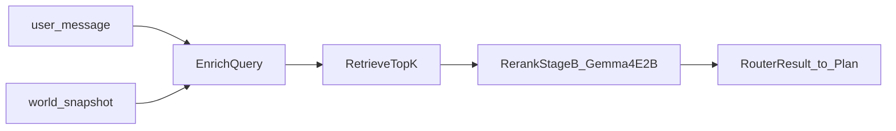
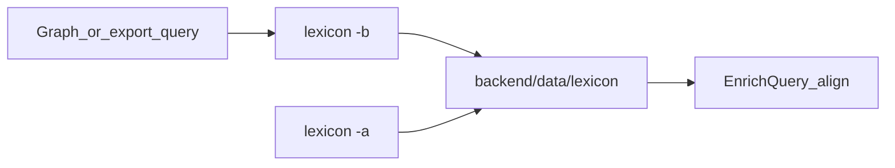
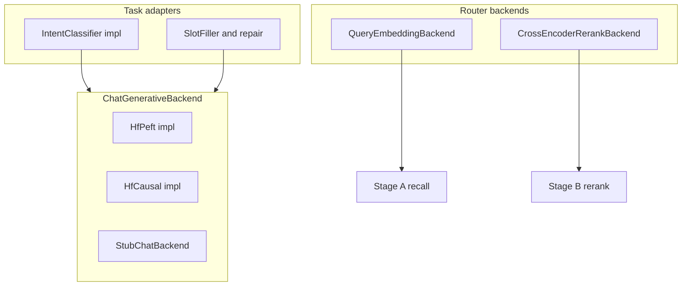

# F14 — Agent 工具路由（Draft）：候选工具 Top-K 与必选工具约束

**文档状态：Draft（契约基线已收口；**运行时脚手架已部分落地**，默认值关闭或 Stub；阈值标定、真实阶段 B 权重、D6 兜底等仍以本文 backlog / §11 为准）**

**交叉引用：** [**F08**](F08_AICO_TOOL_CONTEXT_AND_AGENT_LOOP.md)（Command-as-Tool、manifest、`ResolvedToolSurface`）、[**F11**](F11_AGENT_INTENT_CLASSIFIER_RUNTIME.md)（意图分类与安全向 coarse intent）、[**F10**](F10_AICO_PERFORMANCE_AND_LATENCY.md)（延迟与可观测性）、[**F12**](F12_NLP_AGENT_MULTI_TURN_SESSION_MEMORY.md)（STM/LTM；EnrichQuery 拼接 STM）、[**F13**](F13_AICO_INTERACTIVE_UPGRADE.md)（交互式 `aico`）、[**F09**](F09_CAMPUSWORLD_AGENT_ARCHITECTURE_FOUR_LAYERS.md)（四层架构）。

**实现锚点（现状接线，供对齐）：** [`backend/app/game_engine/agent_runtime/aico_world_context.py`](../../../../backend/app/game_engine/agent_runtime/aico_world_context.py)（`build_world_snapshot_from_session`、`build_llm_tool_manifest`）、[`backend/app/game_engine/agent_runtime/frameworks/llm_pdca.py`](../../../../backend/app/game_engine/agent_runtime/frameworks/llm_pdca.py)（Plan / Check、`RETRY: need_tools=` 解析；**`schema_subset` 仅收窄 Plan 相位工具 JSON**，Do 仍持全量解析面）、[`backend/app/game_engine/agent_runtime/tool_gather.py`](../../../../backend/app/game_engine/agent_runtime/tool_gather.py)、[`backend/app/game_engine/agent_runtime/resolved_tool_surface.py`](../../../../backend/app/game_engine/agent_runtime/resolved_tool_surface.py)。**F14 管线（规则 / EnrichQuery / embedding Stub / 阶段 B Stub / 可选槽位）**：[`tool_router/`](../../../../backend/app/game_engine/agent_runtime/tool_router/)（入口 `run_tool_router`）、[`model_backends/`](../../../../backend/app/game_engine/agent_runtime/model_backends/)（§6.1 Protocol + Stub）。**槽位 JSON Schema 真源**：[`tool_router_slot_output.schema.json`](../../../../backend/app/models/agent_model/tool_router/schemas/tool_router_slot_output.schema.json)；repair 文案 v1：[`prompts/slot_repair_v1.en.txt`](../../../../backend/app/models/agent_model/tool_router/prompts/slot_repair_v1.en.txt)。**F11 意图 SLM** 已有 [`intent_classifier_interface.py`](../../../../backend/app/game_engine/agent_runtime/intent_classifier_interface.py) / [`peft_intent_classifier.py`](../../../../backend/app/game_engine/agent_runtime/peft_intent_classifier.py)；**Plan 主 LLM** 为 [`llm_client.py`](../../../../backend/app/game_engine/agent_runtime/llm_client.py) / `llm_providers/`。

---

## 1. Goal

在 **Plan 阶段主 LLM** 之前（或与前置 hint 并行），将 **用户话语 + 运行时快照** 转为：

- **候选工具 Top-K**：`candidates[]`，每项含 `tool_name`、`score`、`tier`（**tier 语义见 §3.3**）。
- **必选工具集合** `mandatory_tool_names[]` 与可选 **建议集合** `suggested_tool_names[]`。
- **路由元数据**：`router_confidence`、`source`（可多来源组合，见 §3.2），以及可选 **`clarify`** 信号（歧义过大时交由对话策略；**虚拟澄清 / 客户侧确认** 见 §11）。

用于 **收窄本轮下发给 Plan 的 ToolSchema 子集**、**向 Plan 提示注入**、或在策略允许时 **硬门控**（见 §5），从而降低 **错工具** 与 **不调工具凭模型先验答世界** 的概率。

---

## 2. 与现有特性的关系

| 特性 | 边界 |
|------|------|
| **F08** | 工具注册表、manifest、执行语义真源。F14 **消费** tool card 文本与 revision，**不改变**命令执行与授权语义。 |
| **F11** | **安全向、大颗粒度意图**：`informational` / `verify_state` / `execute`，与 **execution_gate** 同向；**不负责**「具体选哪条注册命令/工具」。Plan 中可为 **Intent hint**（软提示）。 |
| **F14** | **工具名级** 路由：候选 Top-K、mandatory/suggested **工具集合**。与 F11 **正交**，可并行注入 Plan（`Intent hint` + `Tool router hint`）。 |
| **execution_gate** | 仍负责 **最终是否允许执行**；F11/F14 均 **不替代** 门禁。 |

---

## 3. 问题形式化

### 3.1 输入

- `user_message`：当前用户自然语言 utterance。
- `world_snapshot`：与实现一致的快照 payload（例如位置、身份、已安装世界等；真源字段以 [`aico_world_context`](../../../../backend/app/game_engine/agent_runtime/aico_world_context.py) 为准）。
- `tool_registry_revision`：可选；至少应能绑定 **manifest / 冻结工具面** 的版本（如 manifest 内容哈希）。

### 3.2 输出

- `candidates[]`：`{ tool_name, score, tier }`（**`tier` 见 §3.3**）。
- `mandatory_tool_names[]`：**已决议（P0）** 列出之名须在 **当前 tick 内** 对每一项产生对应 **`ToolObservation`**（即经 ToolGather 执行该工具并成功纳入本轮可观测上下文）。与 §5 `hard_must_invoke` / Check **证据判定**对齐；**不许**超出 **`ResolvedToolSurface` / `tool_allowlist` 冻结闭包**。
- `suggested_tool_names[]`：可选。
- `router_confidence`：标量或分档；定义须在评测集中可操作。**已决议（P1）**：与 **`max_score` / `margin` 固定阈值表**（阶段 B）联合驱动 **`clarify`**（例如 confidence 低且 margin 低 → `clarify`）；细则实现立项时填充分档表。**后续**：可考虑 **虚拟澄清命令** 走客户侧确认（§11）。
- `source`：**已决议（P1）** 允许 **多来源组合**（如 `rule+embedding`、`rule+embedding+rerank`）；日志与 schema 须 **可枚举**、稳定排序（建议按管线阶段字典序拼接）。
- `clarify`：可选布尔或结构化原因码（OOD、margin 过低等）。

**`mandatory` 生成（已决议 P0）**：**规则 ∪ 槽位 SLM**（并集）；**冲突时规则优先于 SLM**；同一来源内多条规则冲突时依 **`rule_pack_version`** 内声明顺序或实现约定优先级。

**顺序与参数填充** 仍由 Plan / ReAct 负责；F14 只约束 **允许出现的工具名集合** 与 **提示**，除非启用硬门控。

### 3.3 `candidates[].tier` 语义（已决议 P1）

**`tier`** 表示该工具进入 **`candidates[]` 的最后一跳来源**（便于日志与 §9 对比），**不等于**整条路由的 `source`（管线级）。

| `tier` 取值 | 含义 |
|-------------|------|
| **`rule`** | 由规则层 / 快照绑定 **直接提名** 进入候选（未经过 embedding 相似度排序门槛；可与 embedding 结果合并去重）。 |
| **`embedding`** | 由 **阶段 A 双塔 embedding 召回** 进入 Top-K（`score` 为向量相似度或衍生分）。 |
| **`rerank`** | 经 **阶段 B 配对精排**（默认 **Gemma 4 E2B**，见附录 **B.1**）后的候选（`score` 为阶段 B 输出或归一化分）。 |
| **`slm`**（保留） | **v1 路由精排不使用**；预留字段以免 schema 破坏性变更（例如将来实验性路由 SLM 或与其它 SLM 头区分）。 |

**排序建议**：同分时 **`rerank` > embedding > rule`**（或按 `score` 全局排序）；实现须在日志中固定 documented。

### 3.4 `mandatory` 执行异常与兜底反馈（已决议 D6）

当 **`mandatory_tool_names[]` 中任一工具**在本轮执行链路中出现 **超时**、**权限拒绝**、**用户中断**，或 **同一 mandatory 集合仅部分达成 ToolObservation**（「部分成功」的判定边界由实现与产品共同细化）：**不再进入**基于 `RETRY: need_tools=` 的常规重试主路径作为主要补救（可与 Check 解耦）；统一转入 **兜底反馈**——向用户返回 **结构化失败说明**（原因码：timeout / denied / interrupted / partial）、已成功的观测摘要（若有）、以及可选 **`clarify` / 下一步建议**。须打结构化日志（如 `mandatory_fallback_reason`），供 §7 与 **执行达成率** 分列统计。

---

## 4. 两阶段业界范式（召回 + 精排）

**阶段 A — 召回**

- **规则与快照绑定**：方向词、`#id`、显式命令片段、指代词绑定 `world_snapshot`（如「这里」→ 当前房间字段）。
- **多轮上下文（已决议 P3 / D2）**：`EnrichQuery` **拼接 STM 摘要**（[**F12**](F12_NLP_AGENT_MULTI_TURN_SESSION_MEMORY.md)）。**`world_snapshot` 字段优先**：STM 仅作补充；二者语义冲突时 **以 `world_snapshot` 为准**，STM 对应片段须截断或丢弃；窗口长度与截断上限实现立项定义。
- **F11 `informational` 降耗（已决议 D1）**：当意图分类为 **`informational`** 时，**不跳过**阶段 B 精排；仅将阶段 A 的 **Top-K 缩小为 `K_info`（`K_info < K_default`）**，阶段 B 流程不变。`K_info` / `K_default` 见附录 **B.1（D5 已决议默认）**。
- **可选实体 span**：见附录 A（含 **规则工具候选**、**词表候选**）与 **NER baseline**；**词典对齐** 使用 **当前激活** 词表快照（§4.1）；产出拼入 **检索 query**。
- **双塔 embedding**：索引侧为「tool 描述 + 别名 + usage 摘要」；query 侧为「规则/snapshot 摘要 + 截断的用户句 + 实体 hint」。取 **Top-K**。

**阶段 B — 精排 / 歧义消解（已决议 P1）**

- 采用 **`max_score` 与 `margin` 固定阈值表**（配置或代码常量，版本化）；低于阈值时触发歧义策略（含 **`clarify`**，与 §3.2 `router_confidence` 联合）。
- **配对精排（默认 Gemma 4 E2B）**：对 `(query, tool_card)` 在 Top-K 内重排；默认 checkpoint **`google/gemma-4-E2B`**（Gemma 4 **E2B** 档，约 **2.3B effective**，详见附录 **B.1**）。该权重为 **多模态生成式骨干**，**路由场景仅用文本**；**禁止**用开放式多轮对话替代「候选工具配对打分」主路径。**槽位 SLM**、**F11 意图 SLM** 仍限于附录 A / F11 约定用途，**不承担**整轮 Top-K 开放式路由排序。

与 F11 的 **三分类 LoRA** 是 **不同任务头**：F11 不承担 tool-ranking；F14 不承担 intent 授权语义。

### 4.1 词表生成命令与持久化（`lexicon`）

**v1 约定**：通过系统命令 **`lexicon`** 从图库 **导出词表快照**，持久化到 **[`backend/data`](../../../../backend/data)** 下专用目录；运行时 **EnrichQuery / 词典对齐** 仅读取 **当前激活** 版本。实现须保证 **激活指针切换** 对外一致（避免半写状态）；权限键名见 §4.1 权限段。

| 标志 | 行为 |
|------|------|
| **`lexicon -b`** | **生成**新版本词表快照：数据来源 **已决议（D3）为全库导出**（当前 PostgreSQL 图库内适用于 gazetteer 的节点/别名集合，具体 SQL 或仓储接口实现立项）。写入 `backend/data/lexicon/` 下 **唯一 `id`**；**禁止原地覆盖**。**已决议（D8）**：**仅运维手工触发**；v1 **不做**定时任务、独立 agent 或等价 API 自动 `-b`（若将来需要须 **单独立项**，见 §11）。**`lexicon_revision`** 建议等于内容哈希或与 `id` 一致。 |
| **`lexicon -l`** | **列出**已有版本；建议列：`id`、`lexicon_revision`、`built_at`、可选 `source_graph_hint`、是否 **active**。 |
| **`lexicon -d <id>`** | **删除指定词库版本 `id`**（用户传入的要移除的版本标识）：删除对应目录/文件。**禁止删除当前激活版本**；须先 **`lexicon -a`** 切换到其他版本。**磁盘留存策略**（最多保留 N 个历史版本）仍可由运维策略配置，未在此限定单一数字。 |
| **`lexicon -a <id>`** | **切换激活**词表；此后路由与实体对齐逻辑 **只加载该 `id`**。指针更新须 **原子**（单独小文件或等价机制），多进程下以 **重新打开 / mtime / 显式 reload** 语义为准（实现立项时写明）。 |

**目录约定（v1）**：根路径 **`backend/data/lexicon/`**（相对于仓库 `backend/` 工作目录）；版本产物与 **`active` 指针文件** 同驻该树下；`backend/data/` 通常 **不入版本库**，由运维与生成命令维护。

**权限**：`lexicon` 属 **系统/运维级** 能力（类比 `world install`）；须在 **管理员上下文或等价授权** 下可用，与现有 `authorize_command` / 策略模型对齐。

#### 4.1a 词表工程实践（D8：对齐业界常见做法）

公开的大规模 **gazetteer / 检索索引** 部署常强调：**离线批量构建** 与 **在线只读服务** 分离、**版本化快照**、**切换时原子性与可回滚**，避免重建拖垮线上延迟（参见 [World Historical Gazetteer — Data Flow](https://docs.whgazetteer.org/content/phonetics/data-flow.html) 等与 **staging → 快照 → 生产指向切换** 同类叙述）。CampusWorld 词表体量较轻，**v1 仍采纳同一原则（缩小版）**：

| 实践 | F14 v1 对应 |
|------|-------------|
| **离线构建、在线只读** | **`lexicon -b`** 完成导出与落盘；运行时 **仅读取激活快照**，不在请求路径上做全库扫描重建。 |
| **不可变版本产物** | 每版 **唯一 `id`**、**禁止原地覆盖**；保留多版便于对比与回滚（§4.1 表）。 |
| **原子激活 / 可回滚** | **`lexicon -a`** 原子指针；须先切换再 **`lexicon -d`** 删除旧版（表内约束）。 |
| **去重与规范化** | 导出管道对 **节点名、别名** 做规范化与去重，降低对齐歧义（实现立项写明规则）。 |
| **可审计元数据** | **`built_at`、`lexicon_revision`、可选 `source_graph_hint`**；与路由日志 **`lexicon_active_id`** 一致。 |
| **运维节奏** | 图库或世界内容 **重大变更后手工 `-b`**，再评估 **`lexicon -a`**；与业界「变更驱动刷新」一致，**非定时自动构建**（D8）。 |

---

## 5. Plan 必选工具如何落地（enforcement_level）

三档须 **可配置**（运行时或 YAML）。**已决议（P0）**：**默认 `hint_only`**；运维可按环境切换 `schema_subset` / `hard_must_invoke`。

| 级别 | 行为 |
|------|------|
| `hint_only` | 仅将 mandatory/suggested **注入 Plan 提示文本**，不裁剪 schema。 |
| `schema_subset` | 本轮 **仅 Plan 相位**向 LLM 下发 **ToolSchema 白名单**（Do / Check 仍持 **节点解析面上的全量工具**，以免执行与门禁被误收窄）。**已决议（P0）**：白名单集合 **严格** `candidates ∪ mandatory_tool_names`（无额外「安全只读」自动并集；若需要 `help` 等常驻工具，须 **显式进入 candidates 或 mandatory**）。 |
| `hard_must_invoke` | 与 §3.2 **`mandatory` = 本轮须产生 ToolObservation** 对齐：若 Check 认定 **缺 mandatory 中任一工具的观测证据**，则与 **`RETRY: need_tools=`** 语义对齐（见 [`llm_pdca.py`](../../../../backend/app/game_engine/agent_runtime/frameworks/llm_pdca.py)）。**例外（§3.4）**：若失败原因属 **超时 / 权限拒绝 / 部分成功** 且产品路径选择 **兜底反馈**，则 **不以 RETRY 为主补救**，与 §3.4 一致。 |

**灰度**：配置能力必备；**不要求**全线同一时间启用 `schema_subset` / `hard_must_invoke`，由上线策略决定。

---

## 6. 微调与小模型（路由头）

- **训练目标**：在给定 snapshot 特征（可序列化为文本或结构化字段）下，预测 **gold 工具集合**（多标签）或 **对 Top-K 的子集选择**。
- **数据**：合成 + 人工纠错；字段至少含：用户句、快照摘要、manifest revision、标签工具集合。
- **指标**：macro-F1、subset exact match、**mandatory recall**（路由预测集中须含 mandatory；**在线真理**与 §3.2 对齐为 **ToolObservation 是否达成**，可分栏报告 **路由 recall** vs **执行达成率**）。
- **诚实边界**：「接近 100%」**仅**对 **冻结评测集 + 约定工具闭包** 成立；manifest 变更、OOD 话术需再训与线上监控。

### 6.1 模型后端接口抽象（实现契约，已决议）

**目的**：凡 **生成式 SLM**（F11 意图、F14 **槽位 / repair**、附录 C/D 可选路由实验头）及 **路由检索模型**（阶段 A **embedding**、阶段 B **配对打分**），均以 **稳定 Protocol（或等价抽象类）+ 可注入 Stub + 配置驱动工厂** 接入，避免将 transformers / 设备 / 缓存逻辑复制到各任务路径，便于 **替换 checkpoint** 与 **单元测试**。

**与既有栈的关系**

| 能力 | 现有锚点 | 本文约束 |
|------|----------|----------|
| Plan 主对话 LLM | `LlmClient`、`StubLlmClient`、`llm_providers/` | **不合并**进本节「本地小模型后端」默认路径（延迟、密钥与调用形态不同）；若将来槽位走云端小 API，可新增实现 **同一生成式 Protocol**。 |
| F11 意图 SLM | `IntentClassifier` Protocol、`PeftIntentClassifier`、`build_intent_classifier_for_tick` | **意图任务接口保持不变**；内部解码应 **收敛为调用统一「生成式后端」**（见下），与槽位 **共享加载与推理封装**。 |

**分层**

1. **任务适配器**（薄）：**意图**（`IntentClassifier` 实现）、**槽位**（如 `SlotFiller`：拼 prompt → 校验 JSON Schema → repair）、仅包含 **业务校验与日志**，不直接 `AutoModelForCausalLM.load`。  
2. **生成式推理后端**：**单次 chat 补全**，输出 **assistant 文本**；**JSON 解析 / jsonschema / repair 轮次** 留在适配器层（与 **附录 A.3.1** repair 版本策略一致）。  
3. **路由检索后端**：阶段 A **embedding**；阶段 B **`CrossEncoderRerankBackend`**（命名沿用 **配对 `(query, passage) → score`** 契约）。**D5** 默认 **`google/gemma-4-E2B`** 为 **生成式多模态骨干**，工具路由 **仅用文本支路** 实现配对打分；**禁止**把开放式对话生成挂接为路由主路径（实现形态须立项固化为单一后端）。

**生成式后端契约（建议命名 `ChatGenerativeBackend`）**

- **输入**：`messages`（`role` / `content`）、`max_new_tokens`、温度（槽位 **默认 0** / greedy）、可选其它生成参数。  
- **输出**：**结构化结果**（建议）：原始 **`text`**、**`latency_ms`**、**`backend_kind`**、**`model_id`**（或 artifact / checkpoint 标识），供 [**F10**](F10_AICO_PERFORMANCE_AND_LATENCY.md) 与 §9 复现。  
- **实现族（首期）**：**HF + PeFT**（artifact root）；**HF 全量 causal**（槽位基座无 adapter）；**`StubChatBackend`**（测试：**确定性返回**或按 fixture 映射 JSON 字符串）。进程内 **按 artifact / model key 单例缓存**（与现有意图 bundle 缓存同思路）。  
- **可选后续**：**HTTP/OpenAI 兼容**小模型网关 —— **单独实现类**，挂同一 Protocol，不作为默认。

**检索与配对打分后端契约（阶段 A / B）**

- **`QueryEmbeddingBackend`**：`encode` query / tool 侧文本 → 向量；供 Top-K 召回（典型为非生成式编码器）。  
- **`CrossEncoderRerankBackend`**：`(query, passage)` 对批量打分 → 精排序列（**接口名兼容 BERT 式 cross-encoder**；**D5 默认** 下由 **Gemma 4 E2B 文本配对适配器** 实现，见上）。  
- 各自提供 **`Stub*Backend`**（固定向量、确定性分数或哈希分数），供路由排序逻辑 **脱离重模型** 单测。

**配置与工厂**

- Settings / YAML 中声明 **`kind`**（如 `stub`、`hf_peft`、`hf_causal`）、**artifact 路径**、`max_new_tokens` 等；**`build_chat_generative_backend(cfg)`**（及 embedding / 阶段 B **`CrossEncoderRerankBackend`** 的 **build_…**）**单入口**装配。依赖缺失或显式关闭时 **降级 Stub 或 None**，行为与 F11 链式 fallback 一致。

**测试策略**

- **单元测试**：对槽位 / mandatory 合并等 **注入 `StubChatBackend`**，覆盖 validate、repair 分支。  
- **集成测试**：`@pytest.mark.integration` + 可选真实权重；CI 未就绪时可跳过。

**非目标（v1）**

- 不强制 **vLLM / TensorRT**；可作为后端实现族日后扩展。  
- 不把 Plan **`LlmClient`** 与本地 SLM 后端揉成 **单一实现类**。

---

## 7. 验收与 SLO（草案）

**非法工具调用（已决议 P0）**：解析得到的工具名满足 **任一** 即计非法：**∉ 注册表** 或 **∉ `tool_allowlist`**（与 F08 冻结工具面一致）。**可选扩展指标**（非 P0 非法定义）：调用 ∉ 本轮 `schema_subset`（若启用）可单独统计为 **schema 越权率**。

离线阈值 **首批推荐（已决议 P2，§9 填表后校准）**：

- mandatory recall（路由层）≥ **0.90**（冻结闭包评测集）；若分拆 **ToolObservation 达成率**，目标 ≥ **0.85**（首版建议，可收紧）。
- 非法工具调用率 ≤ **1.0%**（同上评测集）。
- `clarify` 率：**5%–20%** 区间初值（过低可能欠澄清；过高损体验），上线后按产品调参。

**复核周期**：每 **季度** 或在 **manifest / 工具闭包重大变更** 后重做 hold-out；Dev / Staging / Prod 可分环境阈值（Prod 最严）。

线上：结构化日志字段与 [**F10**](F10_AICO_PERFORMANCE_AND_LATENCY.md) 可观测性对齐（路由延迟、`source`、`lexicon` 激活 id、`tier` 分布、Top-K 哈希）。

---

## 8. Non-Goals

- 不保证 **CLI 参数完备性** 或单轮任务完成。
- 不替代 **世界真值校验**（命令输出仍为观测真源）。
- 本文 **不**将某一厂商 Function Calling 定为唯一格式。
- **v1 词表路径**不要求进程外 **Redis** 缓存；可选演进见 **§8.1**。

### 8.1 后续 Roadmap（词表 / 路由，非 v1 必选）

- **Redis 缓存**：对 **当前激活** 词表快照或编译后的检索结构（如 trie）做缓存。**已决议（P2）**：**暂不启用**，列入 **§11 backlog**。

---

## 9. 模型对比分析与推荐（强制章节）

本节 **不得**仅罗列附录表格；须在 **统一实验约定** 下给出 **对比结论** 与 **默认推荐栈**。若某项暂无实测数据，标明 **待 POC** 并给出 **POC 门槛**（指标 + 时间盒）。

### 9.1 对比范围

至少覆盖：

| 层次 | 必须对比的候选类型 |
|------|-------------------|
| **实体 / NER** | **工作假设（已决议 P2）**：**GLiNER-only**（spaCy / 微调编码器仍可作为 §9.2 **对照组**）；**规则栈与词表版本**（附录 A.1a / A.1b）、**当前激活 `lexicon` `id` / `lexicon_revision`**（§4.1）纳入同一评测复现说明 |
| **SLM 槽位** | **已决议（D9）**：基座 **`Qwen2.5-0.5B-Instruct`** + **微调 artifact**；附录 **A.3**；对照实验仍可对比一档 **小** 基座 |
| **工具路由** | **embedding 召回** + **阶段 B 配对精排（已决议 P1，唯一阶段 B）**；**默认 checkpoint**：**[`google/gemma-4-E2B`](https://huggingface.co/google/gemma-4-E2B)**（附录 **B.1** 评估摘要）；**开放式对话式整轮路由排序 N/A** |

### 9.2 对比维度（结果表模板）

评测时在 **同一 hold-out**、相同 **snapshot 拼接模板**、相同 **manifest hash** 下填写：

| 路线 | p50 / p95 延迟 | 显存/CPU | 领域指标（F1 / slot 合法率 / mandatory recall） | 依赖与许可证 | 中文与混排 | 可审计性 | 运维（索引/再训） |
|------|----------------|----------|--------------------------------------------------|--------------|------------|----------|------------------|
| … | … | … | … | … | … | … | … |

### 9.3 实验约定

- **数据集**：train/val/test 划分固定；版本号写入 SPEC 附录或数据 registry。
- **指标**：与 §7 对齐；额外报告 **非法工具率**、**clarify 触发率**（若实现）。
- **复现**：记录随机种子、框架版本、checkpoint id。

### 9.4 推荐建议（须填）

- **默认推荐栈（已决议工作假设，实施时用 §9.2 实测替换数值）**：  
  **`lexicon` 手工 `-b` / `-a`（§4.1）** → **YAML/JSON + `re` +（可选）`rapidfuzz`（附录 A.1a）** → **词典对齐** → **GLiNER-only（附录 A.5）** → **本地 embedding 召回（附录 B）** → **阶段 B 配对精排（默认 [`google/gemma-4-E2B`](https://huggingface.co/google/gemma-4-E2B)，附录 B.1）** → **槽位 SLM（基座 `Qwen2.5-0.5B-Instruct` 微调，D9；规则 ∪ SLM 产 mandatory 时按需）** → **EnrichQuery 含 STM（F12）**。
- **实现契约**：生成式槽位 / repair 与 F11 意图 SLM **共用 §6.1 生成式后端抽象**；阶段 A embedding 与阶段 B **`CrossEncoderRerankBackend`**（默认 Gemma 4 E2B 适配器）**共用 §6.1 路由后端 Protocol + Stub**，便于替换 checkpoint 与测试。
- **超参与 CE（D5）**：**`K_default`/`K_info`/batch/p95 目标** 采用 **附录 B.1 v1 默认**；**`max_score`/`margin`** 首次标定后版本化。
- **降级路径**：例如暂时关闭阶段 B 精排（仅 embedding，须 accept 精度下降）；GLiNER 失败回退规则+词典（不计入首选栈）。
- **暂不推荐**：路由阶段 **开放式 SLM 整轮排序**（已由 **阶段 B 配对精排**取代）。

### 9.5 §9 Owner 与时间盒（推荐方案，已写入 P3）

- **Owner**：**Agent 运行时 / 工具面负责人** 1 名 + **算法** 1 名（联合签字 §9.2 表）。
- **时间盒**：立项后 **2 个迭代（建议 4 周）** 内完成首轮 hold-out 填表；未达标则 **不阻塞 `hint_only`**，**阻塞 `schema_subset` 全量上线**（Prod），直至 mandatory recall / 非法工具率过线。

---

## 10. 待决策清单（人工核对）

多数条目 **已决议** 并回写 §3–§9 / 附录；本节保留 **勾选 + 核对提示** 供实现立项补 **Owner / 日期**。未纳入 backlog 的跟进见 **§11**；**业界对标优化方向与待决策补遗（含 D1–D9 等）** 见 **§12**。

### P0 — 语义与门禁（阻塞实现口径）

- [x] **`mandatory_tool_names[]` 的精确语义** — **已决议**：**当前 tick 内**须产生对应 **`ToolObservation`**；§3.2、§5。  
  - **核对**：与 [`llm_pdca.py`](../../../../backend/app/game_engine/agent_runtime/frameworks/llm_pdca.py) Check、`RETRY: need_tools=` 一致。

- [x] **`mandatory` 来源与优先级** — **已决议**：**规则 ∪ 槽位 SLM**；冲突 **规则 > SLM**；⊆ 冻结闭包；§3.2。

- [x] **非法工具调用** — **已决议**：∉ 注册表 **或** ∉ `tool_allowlist`；§7。

- [x] **`enforcement_level`** — **已决议**：可配置，**默认 `hint_only`**；§5。

- [x] **`schema_subset` 公式** — **已决议**：严格 **`candidates ∪ mandatory_tool_names`**；§5。

### P1 — 路由与两段式策略

- [x] **阶段 B 触发条件** — **已决议**：`max_score` / `margin` **固定阈值表**；§4。  
  - **核对**：F11 `informational` — **已决议（D1）**：**仅缩小 K**，不跳过阶段 B；§4。

- [x] **`router_confidence` + `clarify`** — **已决议**：联合决策表；**虚拟澄清 / 客户确认** → §11。  
  - **核对**：结构化日志字段。

- [x] **`source` 组合** — **已决议**：允许多来源（如 `rule+embedding`）；§3.2。

- [x] **`tier`** — **已决议**：§3.3。

- [x] **Embedding** — **已决议**：**本地推理**；维度/index 实现立项绑定；附录 B。

- [x] **阶段 B** — **已决议**：**配对精排**（默认 Gemma 4 E2B）；§4、§9.1。

### P2 — 实体、NER、槽位与数据

- [x] **NER 默认路径** — **已决议**：**GLiNER-only**；§9.1、§9.4。  
  - **核对**：GLiNER 标签与领域类型映射表 Owner。

- [x] **`lexicon -b` / 词典** — **已决议**：**全库导出（D3）**；**`-d <id>`** 删除所选版本；**仅手工触发（D8）**；工程实践 **§4.1a**；§4.1。磁盘保留 N 版策略 **实现可选**。

- [x] **Redis 词表** — **已决议**：**暂不启用**；§11。

- [x] **规则工具栈** — **已决议**：**YAML/JSON + `re` +（可选）`rapidfuzz`**；附录 A.1a。

- [x] **槽位 JSON Schema 真源** — **已决议（D4）**：**单文件** `backend/app/models/agent_model/tool_router/schemas/tool_router_slot_output.schema.json`；**字段全集可扩展**；**`entities[]`+NER 合并/替代**；**封闭 `maxLength`/enum**；**repair 固定版本 + i18n**；全文 **附录 A.3.1**。  
  - **核对**：repair **是否计入** F08 ToolGather 预算 — **实现立项绑定 F08** 后关闭。

- [x] **槽位 SLM 基座与阶段 B reranker** — **已决议（D9 / D5）**：槽位 **`Qwen2.5-0.5B-Instruct` 微调**（Hub：`Qwen/Qwen2.5-0.5B-Instruct`）；阶段 B **`google/gemma-4-E2B`**；**Top-K / batch / p95** 采用 **附录 B.1 默认（D5）**；**附录 A.3**、**B.1**、§12.2。  
  - **核对**：§9.2 **填写延迟实测**；**`max_score`/`margin` 首次标定**并写入 **阈值版本**（B.1 无初值）。

- [x] **训练数据** — **已决议**：合成 + 人工 + **大模型生成**；多工具组合；附录 C。

- [x] **模型后端接口抽象** — **已决议**：**§6.1**（`ChatGenerativeBackend`、`QueryEmbeddingBackend`、`CrossEncoderRerankBackend`、`Stub*`、工厂与测试策略）；与 F11 `IntentClassifier`、Plan `LlmClient` 边界见该节表格。

- [x] **§7 阈值** — **已决议**：首批推荐值与季度复核；§7。

### P3 — 文档、流程与协作

- [x] **§9 Owner / 时间盒** — **已决议**：§9.5。  
  - **核对**：hold-out 数据集 id、评审链接。

- [x] **F12 STM** — **已决议**：**EnrichQuery 拼接 STM 摘要**；**`world_snapshot` 优先**（D2）；§4。  
  - **核对**：窗口长度、截断上限。

- [x] **文档状态升级** — **已决议（D7）**：本文已进入 **Draft**；[`SPEC.md`](../SPEC.md) F14 条目同步。

---

## 11. 实现 backlog（TODO，非本文验收阻塞）

| 项 | 说明 |
|----|------|
| **虚拟澄清命令 / 客户侧确认** | 当 `router_confidence` 低且 `margin` 低触发 `clarify` 时，探索 **专用澄清命令或外线确认**，再_resume tick；与产品流程对齐后立项。 |
| **Redis 缓存词表** | §8.1；与 **`lexicon -a`** 失效联动；**v1 不做**。 |
| **`lexicon -b` 定时 / agent / API 自动化** | **非 v1**。**D8** 已决议 **仅手工 `-b`**。若将来需要自动导出，须 **单独立项**（权限、审计、与图库变更联动）。 |

---

## 12. 业界对标、优化方向与待决策补充

以下对标 **Claude Code、Pi 类产品**等在业界常见的 **公开架构共识**（受控工具集、检索收窄、歧义澄清、可审计步骤、预算与降级）；**不对标**闭源权重或厂商内部实现。用于 **Draft 迭代** 时补强契约；与 §10 **已决议**条目不冲突处可直接吸收进正文。

### 12.1 优化方向（建议在后续版本写入 §3–§7 或附录）

| 方向 | 说明 |
|------|------|
| **结构化路由审计 `router_trace`** | 除 `source` / `tier` 外，规范可选 **`router_trace`**（或等价 payload）：EnrichQuery **规范化文本或哈希**、阶段 A 的 **K**、**阈值表版本**、阶段 B **模型 id**、**被丢弃候选及原因**（低于 `max_score`、margin 不足等）。便于排障与离线回放（Claude Code 类助手强依赖「为何选/未选某工具」）。 |
| **与 ToolGather / tick 预算挂钩** | 显式交叉引用 [**F08**](F08_AICO_TOOL_CONTEXT_AND_AGENT_LOOP.md) **ToolGather 上限**与 tick 超时：**mandatory 的 ToolObservation 达成**会受工具延迟、权限拒绝影响，与「路由精度」分解指标；§7 宜分栏 **路由 recall** vs **执行达成率**（§6 已提示，实现须落实日志字段）。 |
| **F11 `informational` 与阶段 B** | **已决议（D1）**：仅缩小 K，见 §4；本行保留作对标说明。 |
| **并行多工具与 mandatory** | 若 Plan 支持 **同一轮多工具调用**：须定义 **mandatory** 是否要求 **同一 ToolGather 批次内全部完成**，或允许 **分阶段**；否则 §3.2「当前 tick」与 Check 证据易产生歧义。 |
| **冷启动与空词表** | 无 **激活 lexicon**、空 embedding 索引或 manifest 刚变更未重建时，规定 **降级路径**（仅规则+GLiNER、`clarify`、或暂时禁止 `schema_subset`），避免静默劣质检索。词表侧工程原则与 **手工 `lexicon -b`** 对齐 **§4.1a**、**§4.1**（D8）。 |
| **训练数据治理（附录 C）** | LLM 生成样本须约定 **脱敏、授权副本、与 gold 冲突时的优先级**、人工抽检比例；满足常见企业 agent 数据合规习惯。 |
| **确定性回放 bundle** | 评测与 CI 固定最小输入包：`user_message`、`world_snapshot`、**STM 片段**、`lexicon_active_id`、`tool_registry_revision` / manifest hash、**路由配置与阈值版本**，支撑 mandatory / clarify 回归。 |
| **对话式消歧状态机（Pi 取向）** | §11「虚拟澄清」立项时，定义 **`clarify` 触发 → 用户确认 → resume tick** 是否暂停计时、是否占用一轮用户发言、失败是否 abort（与 [**F13**](F13_AICO_INTERACTIVE_UPGRADE.md) 交互模型对齐）。 |

### 12.2 待决策补充（实现立项收口清单）

| ID | 状态 | 说明 |
|----|------|------|
| **D1** | **已决议** | **`informational`：仅缩小 K**（`K_info < K_default`），**不跳过**阶段 B；§4、附录 B.1。 |
| **D2** | **已决议** | **STM 补充、`world_snapshot` 优先**；冲突以快照为准；§4。 |
| **D3** | **已决议** | **`lexicon -b`：全库导出**；**`lexicon -d <id>`：删除所选版本 id**；§4.1。 |
| **D4** | **已决议** | **单文件** schema：`tool_router/schemas/tool_router_slot_output.schema.json`；**字段全集可扩展**；**`entities[]` 与 NER：合并 + 替代**；**`maxLength`/枚举：封闭**；**repair：固定模板版本 + i18n**；repair↔ToolGather 占用 **实现绑定 F08**。附录 **A.3.1**。 |
| **D5** | **已决议** | **阶段 B checkpoint**：**[`google/gemma-4-E2B`](https://huggingface.co/google/gemma-4-E2B)**（Gemma 4 **E2B**，约 **2.3B effective**）。**`K_default`=24、`K_info`=8、阶段 B batch=`min(K,16)`、p95 目标 CPU≤150ms/GPU≤80ms**：采纳附录 **B.1** 为 **v1 默认**。**`max_score`/`margin`** 无表格初值，须在 §9.2 **首次 hold-out 标定**后写入 **阈值版本**，并与阶段 B 分数是否 **归一** 固定一致。 |
| **D9** | **已决议** | **槽位 SLM**：基座 **`Qwen2.5-0.5B-Instruct`**（`Qwen/Qwen2.5-0.5B-Instruct`），交付 **微调 artifact**（LoRA 或合并权重由实现立项）；附录 **A.3**、**D**。 |
| **D6** | **已决议** | **超时 / 权限拒绝 / 部分成功** → **直接进入兜底反馈**（非 RETRY 主路径）；§3.4、§5。 |
| **D7** | **已决议** | 本文 **Draft**；[`SPEC.md`](../SPEC.md) 已同步意图；Reviewer 由项目组指定。 |
| **D8** | **已决议** | **`lexicon -b`**：**仅手工触发**（§4.1）；词表工程 **对齐 §4.1a**（离线构建、不可变快照、原子切换、去重与审计）。**虚拟澄清状态机** 仍 **待产品立项**，见 **§11**（不纳入 D8）。 |

**说明**：已从本表移除的决议同步 §10；**D4** 以 **A.3.1** 为准；**D9** 槽位基座见 **A.3**；**D5** 阈值首次标定见 §9.2；**§11** 保留虚拟澄清与远期自动 `-b`。

---

## 附录 A — 实体规则、NER、SLM 槽位与合并策略

### A.1 规则层（Rule layer）

- **输入**：`user_message`、`world_snapshot`。
- **输出**：结构化字段（示例）：`rule_hints[]`（显式命令 tokens、方向、`#id`）、`bound_reference`（「这里」解析结果指针）。
- **版本**：`rule_pack_version`；变更记入发布说明。

#### A.1a 规则工具与技术栈候选（工程选型，可多选组合）

用于实现 **确定性规则层**（非 LLM）：模式匹配、短语命中、轻量语法解析、与注册表命令名的模糊对齐等。SPEC 与 §9 对比时需写明 **采用组合 + 版本**。

| 候选 | 典型用途 | 备注 |
|------|----------|------|
| **YAML / JSON 规则表 + 应用内加载** | 方向词、`#id`、`flag` 样式片段、显式命令别名 → `rule_hints` / `mandatory` 触发条件 | 与 CampusWorld 配置风格一致；易审计；建议作为 **SSOT** 之一 |
| **Python `re`（预编译正则）** | 通用 token 提取、`#数字 id`、引号片段 | 零额外依赖；注意 Unicode 与中文全角符号 |
| **spaCy `Matcher` / `PhraseMatcher` / `EntityRuler`** | 多 token 模式、固定短语表（可与词表导出联动） | 若 NER 已引入 spaCy，可 **复用同一运行时**；规则与统计管道分层清晰 |
| **`rapidfuzz`（ratio / partial_ratio / token_sort）** | 用户片段与 **注册命令名 / manifest 别名** 的模糊命中 | 适合 typo、简称；须设 **得分阈值** 与并列歧义时的 `clarify` |
| **小型 CFG / PEG（如 `lark`、`pyparsing`）** | 类 CLI 短串、`key=value`、若干嵌套 flag | 仅在规则规模大、纯正则难维护时引入；控制语法复杂度 |
| **Hyperscan / RE2 绑定**（可选） | 超高吞吐、多模式并行扫描 | 一般为后置优化；Python 侧优先 `re` + 规则表 |
| **时间与数量解析库**（可选，如 **dateparser**、中文日期组件） | 「明天」「下午三点」类 **非工具路由主路径** | 若仅服务特定命令参数，可与 F14 **解耦**，避免规则层膨胀 |

**v1 已选型**：**YAML/JSON 规则表 + `re` +（可选）`rapidfuzz`**（与 §10 P2 一致）。PhraseMatcher / EntityRuler 仍为 **备选**，非默认。

#### A.1b 词表（Gazetteer）来源与形态候选

用于 **词典对齐**、**模糊召回实体 span**、**拼接检索 query**，与附录 B 的 tool embedding **索引对象不同**（本表偏 **世界/园区实体专名**，非 tool card）。

**v1 默认路径（已选型）**：**`lexicon -b`**（**D8：仅手工**）生成快照 → 持久化 **`backend/data/lexicon/`** → **`lexicon -a`** 切换激活 → 运行时只读 **激活快照**（契约 **§4.1**、工程原则 **§4.1a**）。下表其余行仍为 **备选或混合**（如静态包增量、`pg_trgm` 在线候选），不与默认路径互斥。

| 候选 | 典型内容 | 备注 |
|------|----------|------|
| **图节点导出**（`GraphNode` / 种子 YAML） | `name`、`description` 片段、**别名键**（若存在于 `nodes.attributes` 或种子约定路径） | **`lexicon -b` 的数据源**；真源与过滤范围见数据契约；导出写入 **`lexicon_revision` / 版本 `id`**（§4.1） |
| **世界包静态词表**（如 `app/games/<world_id>/` 下维护的 gazetteer） | 建筑 / 区域 / POI 别名 | 与世界版本、`manifest` / graph_seed 协同发布 |
| **运营 / CSV 导入表** | 外部台账对齐的别名、缩写 | 需校验编码与去重；适合频繁更名场景 |
| **命令与工具别名表**（来自 **F08 manifest / 注册表**） | 命令显示名、`aliases` → 用于 **规则层「显式意图→工具」** 而非地理实体 | 与 **实体词表** 分文件或分命名空间，避免概念混淆 |
| **PostgreSQL `pg_trgm` / `similarity`** | 服务端模糊命中候选词 | 适合大词表；延迟与连接策略写入 §9 |
| **内存 Trie / DAFSA + 最长匹配** | 百万级前缀、极短延迟 | 适合只读快照加载；更新需重建 |
| **FlashText / Aho-Corasick 类库** | 超快多关键词扫描 | 适合 **别名爆炸** 时的 span 提议 |
| **SymSpell / 编辑距离索引** | typo 纠错、候选收窄 | 常与 `rapidfuzz` 二选一或串联 |

**版本与一致性**：词表须带 **`lexicon_revision`**（或内容哈希）；与 **`tool_registry_revision`**、**`rule_pack_version`** 一起在路由日志中可观测，便于 §9 复现与回滚。

### A.2 NER 与规则并行；词典对齐

- NER span **不得**直接进入图边推断；须经 **园区/图词典** 对齐（别名表、编辑距离阈值），未对齐则降级为 **纯文本 hint**。
- **merge 优先级**（建议）：**规则显式 token** > **词典命中 span** > **NER span** > **槽位 SLM**（附录 A.3）。
- **实体列表层**：槽位 **`entities[]`** 与对齐后 NER 的 **合并 / 区间替代** 规则 **已决议**，见 **附录 A.3.1**（与上条优先级作用于不同粒度：上条偏 **证据来源序**，A.3.1 偏 **合成 `entities[]` 时的重叠消解**）。

### A.3 SLM 槽位（结构化抽取）

- **目标**：在固定 **JSON Schema** 下产出 `target_hint`、`named_spans` 等可校验字段。
- **默认基座（已决议 D9）**：**`Qwen2.5-0.5B-Instruct`**；推荐 Hugging Face **`Qwen/Qwen2.5-0.5B-Instruct`**。运行时加载 **本项目微调产物**（LoRA 或合并权重，**artifact 版本化** 写入路由日志）。仅做管线联调时可短暂使用 **未微调** 基座；**离线门禁与 Prod 验收以微调 checkpoint 为准**。
- **JSON Schema 真源（术语说明）**：指 **仓库内单一 JSON Schema 文件**（**D4**）、**字段全集**、**各字段 `maxLength` 与封闭 `enum`**、**`entities[]` 与 NER 的合并/替代策略**；实现 **不得**仅在 prompt 内口述 schema。路径见 **附录 A.3.1**；CI **jsonschema validate** 钩子对齐同一文件。
- **解码**：低温度；**parse + jsonschema validate**；失败则 **单次 repair**（**固定模板版本 + i18n**，见 A.3.1）或降级 **规则 + NER**，并标记 `source=slot_fallback`。

#### A.3.1 D4 —「槽位 JSON Schema 真源」（**已决议**）

**含义**：槽位 SLM 的输出必须是 **可机器校验** 的结构化数据；**真源**即 **唯一 schema 工件** + **版本化 repair 模板**，开发、评测、运行时校验 **同源**，避免 prompt 与代码两处漂移。

| 子项 | **决议** |
|------|----------|
| **权威路径** | **单文件**（v1 **不按世界分包**）：`backend/app/models/agent_model/tool_router/schemas/tool_router_slot_output.schema.json`。实现立项时若目录不存在则 **按此路径创建**；环境差异 **不**复制第二份 schema（可选仅切换是否启用槽位管线，不改变真源路径）。 |
| **字段全集** | **同一文件**承载槽位输出 **字段全集**（保留并扩展 **`target_hint`、`named_spans`、`entities[]`** 等）；**须随能力演进持续增补**（新键、`required`、约束），每次变更 bump **`$id` 或并列修订字段**（如 `x_schema_revision`）并记入发布说明。**禁止**将约束拆散到多个散落文件导致漂移。 |
| **`entities[]` 与 NER** | **合并 + 替代**：槽位 `entities[]` 与 **词典对齐后的 GLiNER span** 进入 **统一规范化**（文本归一、类型映射到 schema **封闭类型枚举**），按去重键（如 **`normalized_text` + 粗粒度类型**）合并。**替代**：同一文本区间重叠时，**已通过 jsonschema 校验** 的槽位实体 **优先覆盖** 重叠的 NER；槽位未覆盖处 **由 NER 补全**。全局管线优先级仍服从 **附录 A.2**（规则 / 词典优先于纯模型 span）；本行专指 **实体列表合成**，不与「规则显式 token」冲突。 |
| **`maxLength` / 枚举** | **封闭**：字符串字段 **`maxLength` 在 schema 内写死**；分类含义字段一律 **`enum` 封闭枚举**（该修订下列齐允许值）。**词表型 ID**（如建筑节点 id）在运行时允许集随 **`lexicon_revision` 变化**时，须在 **加载该 revision 时** 生成与之绑定的 **校验用封闭集合**（例如在内存中构造动态 validator，或生成临时枚举快照），对下游仍视为 **「对该 revision 封闭」**，不得退化为无界任意字符串。 |
| **repair** | **固定版本**：repair 使用 **检入仓库的模板**（建议 `backend/app/models/agent_model/tool_router/prompts/slot_repair_*.txt` 或等价），带 **`slot_repair_prompt_v{n}`** 类版本标识；**禁止**运行时即兴改写契约文本。**国际化**：repair 与用户可见的校验失败说明 **按 locale 选用**（消息键或按语言分文件，如 `prompts/slot_repair.zh-CN.txt` / `.en`）；默认中文，其它语言 **同版本并列维护**。 |
| **repair 与 ToolGather** | repair **是否占用** F08 **ToolGather 步数 / token 预算** **不在本文钉死**，由实现立项与 [**F08**](F08_AICO_TOOL_CONTEXT_AND_AGENT_LOOP.md) **对齐后**写入运行配置与日志字段；§10 核对项保留。 |

- **候选基座（示例）**：

| 规模 | 候选基座 | 说明 |
|------|----------|------|
| 极小 | **Qwen2.5-0.5B-Instruct（D9 v1 默认基座）**、Llama-3.2-1B-Instruct、Phi-3.5-mini-instruct、GLM-Edge-1.5B-Chat、SmolLM2 族（按当时开源线） | 短 JSON、字段少；配合约束解码或后验 repair |
| 小 | Qwen2.5-1.5B/3B-Instruct、Llama-3.2-3B-Instruct、Gemma-2-2B-it、GLM-4-9B-Chat | 混写与复杂指代 |
| 蒸馏/LoRA | 上述基座 + LoRA；Teacher 可用 GLM-4.x / Qwen2.5-7B+ | 与路由头共用推理栈时可多适配器切换 |

### A.4 NER 与 SLM 槽位是否归一（结论）

- **推理路径**：默认 **不以单次 SLM 生成整体替代 NER 管线**；优先 **规则 + 词典 + GLiNER（v1）** 构造检索 query，**仅在** margin 低、指代难解时触发 **SLM 槽位**。**重叠 span 上** 校验通过的槽位 **`entities[]` 可局部替代 NER**（**A.3.1**），与此不矛盾。
- **工程归一**：推荐 **同一模型家族 + 同一推理框架**，用 **多 LoRA / 多适配器** 区分 **路由头 / 槽位 /（可选）NER 头**；避免同一权重同时优化 BIO 标注与自由生成。
- **端到端单一权重**：仅作可选试点，须 **ablation** 报告 mandatory 与 clarify 率。

### A.5 轻量 NER 多候选（NER baseline 表）

**v1 工作假设**：**GLiNER-only**；下列其余行为 §9 **对照实验**可选。

| 候选 | 类型 | 备注 |
|------|------|------|
| **spaCy** `zh_core_web_sm` / `md` / `lg` | 预训练管道 | 对照组；标签映射到领域类型 |
| **GLiNER**（如 `urchade/gliner_*` 多语 checkpoint） | 可配置实体类型 span | **默认栈**；中文能力取决于 checkpoint；置信度阈值 + 词典对齐 |
| **Stanza** `zh-hans` | 预训练管道 | 通用 NER |
| **LTP**、**HanLP** | 中文管道 | 锁定模型版本 |
| **Multilingual-MiniLM-L12-H384** + TokenClassification | 微调小编码器 | 领域标签需标注数据 |
| **DistilBERT-multilingual**、**XLM-R-base** | 微调备选 |  heavier baseline |
| **chinese-macbert-base**、**chinese-roberta-wwm-ext**、**bert-base-chinese** + linear/CRF | 中文 BERT 微调 | 专名场景常用 |
| **GLM-Edge-1.5B** + TokenClassification / span | 与 GLM 栈对齐 | 因果 LM 改标注需单独工程路径 |
| **BiLSTM-CRF**、**TinyBERT** / **MiniRBT** | 极轻 | CPU 友好 |

---

## 附录 B — Embedding 与工具索引

- **Tool card 模板**：`name`、`aliases`、`usage`、`interaction` 标签（与 F08 manifest 字段对齐）。
- **Query 模板（D2）**：**`world_snapshot` 摘要优先**（真源不压缩关键字段）；其次 `rule_hints`、截断 `user_message`、**STM 摘要（F12）**、对齐后实体 hint；总长度上限与截断规则 **须版本化**，截断时 **先缩 STM、再缩用户句**，不得删 snapshot 关键键。
- **Embedding 推理（已决议）**：**本地模型**编码 query 与 tool card；**向量维度、checkpoint id、batch 策略** 在实现与 §9 实验中钉死；索引默认 **进程内**（不按 v1 要求上 Redis）。
- **索引**：距离度量、Top-K、`max_score`/`margin` 阈值表；**manifest hash 变更** 触发重建。
- **阶段 B 配对精排**：**必选**；默认 **Gemma 4 E2B**；记录 **p95 延迟预算** 与 **Google Gemma / 模型卡许可证及使用条款**。

### B.1 阶段 B 精排与 Top-K — **D5 已决议（v1 默认）**

**已决议（D5）**：阶段 B checkpoint **固定** **`google/gemma-4-E2B`**（[Hugging Face 模型卡](https://huggingface.co/google/gemma-4-E2B)）。下表中含 **推荐初值** 的参数 **采纳为 v1 配置默认**；上线前须在 §9.2 **实测记录** p50/p95，并与 [**F10**](F10_AICO_PERFORMANCE_AND_LATENCY.md) 核对。

| 参数 | **v1 默认（已采纳）** | 说明 |
|------|----------------------|------|
| **`K_default`** | **24**（可调范围 16–32） | 非 `informational` 时阶段 A **Top-K**。 |
| **`K_info`** | **8**（可调范围 6–12） | **F11 `informational`**（**D1**）：仅缩小 K，阶段 B 仍跑 **全量 `K_info`** 对。 |
| **阶段 B batch** | **`min(K, 16)`** 对/批 | 逐 query 与每个 tool_card 成对打分时的 micro-batch。 |
| **p95 延迟预算（阶段 B）** | **CPU：≤150ms**；**GPU：≤80ms** | **默认 SLO 目标**；**Gemma 4 E2B** 为 **多模态生成式骨干**，路由仅用 **文本** 时仍可能 **重于经典 BERT 式 cross-encoder**，须在目标硬件 **实测**；超标则 **量化 / batch / 减 K** 或走变更评审。 |
| **Checkpoint（阶段 B）** | **`google/gemma-4-E2B`** | 见下 **「Gemma 4 E2B 评估摘要」**。 |

**阈值表（`max_score` / `margin`）**：本文 **不提供数值初值**；须与该 checkpoint 在 hold-out 上 **首次标定**后写入 **版本化配置**，并与 **阶段 B 分数尺度（含是否归一）** 固定一致（§4、§9）。**修订** manifest 或更换阶段 B 权重时须 **重跑标定**。

#### Gemma 4 E2B 评估摘要（对外资料复核，立项实现前再确认许可证与条款）

依据 [Hugging Face `google/gemma-4-E2B` 模型卡](https://huggingface.co/google/gemma-4-E2B)（及 Google Gemma 官方说明）：

- **Hub id**：`google/gemma-4-E2B`；**定位**：Gemma 4 家族 **最小档位 E2B**（文档称约 **2.3B effective** 参数规模；仓库 **safetensors 总参数量级约 5.1×10⁹**，含嵌入等，以实现侧元数据为准）。
- **形态**：**多模态**（文本 / 图像 / 小模型含音频等）；Transformers 侧为 **`AutoModelForImageTextToText`** 一类栈。**F14 路由仅使用文本输入** 对 `(query, tool_card)` 产出 **标量相关性分**；须在实现中 **固化单一配对打分前向**（如附加头、受限解码等），**禁止**把开放式多轮对话接入路由主路径（§4、§6.1）。
- **许可证**：模型卡标注 **Apache-2.0**（标签）；同时须遵守 **Google Gemma** 在模型卡 / 官方站点列明的 **使用条款与可接受用途**（实现侧留存 NOTICES）。
- **语种**：Gemma 4 文档称 **多语** 能力；CampusWorld **中英混排** 仍以 **园区 hold-out** 为准。
- **延迟与工程**：**勿沿用「百兆级 BGE cross-encoder」延迟假设**；必须在 §9.2 填表；推理栈（transformers、量化、批处理）须立项选型。

**变更控制（非默认）**：若实测 **p95 持续无法满足** [**F10**](F10_AICO_PERFORMANCE_AND_LATENCY.md)，经评审可换回 **更轻配对打分栈**（例如 **`BAAI/bge-reranker-base`** / **`large`** 等经典 cross-encoder）并 **更新本节 Hub id** — **须变更评审**，不改变当前 **D5** 既定默认。

---

## 附录 C — SLM 训练（工具路由头）

- **任务形式**：多标签工具集合；或 **从 Top-K 中选子集**；或对 mandatory **二分类**（可组合）。
- **数据（已决议）**：**多工具组合**；来源包括 **合成数据（模板+图快照采样）**、**人工标注**、**大模型生成（须校验+过滤进入 gold）**；JSONL 字段（示例）：`user_message`、`snapshot_features`、`stm_snippet`（若启用）、`manifest_revision`、`lexicon_active_id`、`gold_tool_names`、`mandatory_subset`、`data_source`（`synthetic` \| `human` \| `llm_generated`）。
- **入口**：建议与 F11 类似，在 `backend/app/models/agent_model/` 下独立子目录 + `train/README.md`（具体路径由实现立项时敲定）。
- **Artifact**：adapter/config/version 文件布局；上线门禁 = §7 离线指标。

---

## 附录 D — 工具路由二阶段候选基座（精排 / 多标签）

**v1 阶段 B**：**配对精排**（见 §4）；**默认 checkpoint**：**[`google/gemma-4-E2B`](https://huggingface.co/google/gemma-4-E2B)**（附录 **B.1**）。下表 **极小/小 SLM** 行为 **槽位 / 对照实验 / 后续迭代**，**不作为路由阶段 B 默认路径**。

| 规模档位 | 候选基座 | 备注 |
|----------|----------|------|
| 极小 | **Qwen2.5-0.5B-Instruct（D9：微调交付）**、Llama-3.2-1B-Instruct、Phi-3.5-mini-instruct、GLM-Edge-1.5B-Chat | **槽位 v1 默认基座**：Qwen2.5-0.5B |
| 小 | Qwen2.5-1.5B/3B-Instruct、Llama-3.2-3B-Instruct、Gemma-2-2B-it、GLM-4-9B-Chat（含长上下文变体） | 槽位对照 / 难例（**非**阶段 B 默认） |
| GLM 中大 | GLM-4-32B-0414、GLM-4.5 / GLM-4.5-Air | Teacher / 蒸馏 |
| Mamba / 混合 SSM | mamba-130m、mamba-2.8b、Mamba-2 系、Jamba、Zamba2 等 | 后续 POC |
| **路由阶段 B** | **`google/gemma-4-E2B`**（Gemma 4 E2B，文本配对精排） | **v1 默认（D5）**；形态与延迟见 **B.1** 评估摘要 |

GLM / Mamba 文档与 checkpoint 以当时 Hugging Face 模型卡为准；入门链接：[Mamba](https://huggingface.co/docs/transformers/model_doc/mamba)、[Mamba2](https://huggingface.co/docs/transformers/model_doc/mamba2)、[Jamba](https://huggingface.co/docs/transformers/model_doc/jamba)。

---

## Related

- 阶段 B 默认权重：**[`google/gemma-4-E2B`](https://huggingface.co/google/gemma-4-E2B)**（配对精排形态见附录 **B.1** / §6.1）。Google Gemma 官方文档入口：[ai.google.dev/gemma](https://ai.google.dev/gemma)（路径若有变更以官方为准）。
- **变更控制**备选（经典 cross-encoder 栈）：例如 **[`BAAI/bge-reranker-base`](https://huggingface.co/BAAI/bge-reranker-base)** / **[`large`](https://huggingface.co/BAAI/bge-reranker-large)**；实现可参考 [FlagEmbedding](https://github.com/FlagOpen/FlagEmbedding)。
- [F08 — AICO 工具调用与命令上下文](F08_AICO_TOOL_CONTEXT_AND_AGENT_LOOP.md)
- [F11 — Agent 意图分类器运行时契约](F11_AGENT_INTENT_CLASSIFIER_RUNTIME.md)
- [F10 — AICO 性能与延迟](F10_AICO_PERFORMANCE_AND_LATENCY.md)
- [F12 — NLP Agent 多轮会话记忆](F12_NLP_AGENT_MULTI_TURN_SESSION_MEMORY.md)
- [F13 — AICO 交互式升级](F13_AICO_INTERACTIVE_UPGRADE.md)
